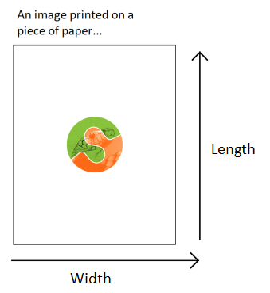
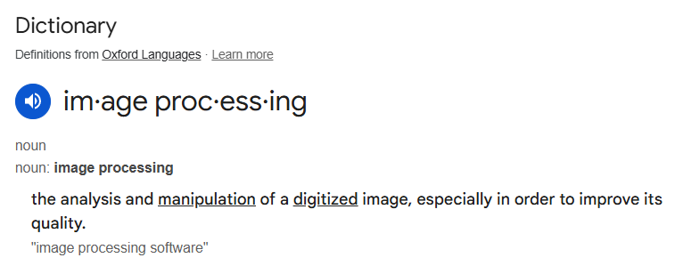

---
jupyter:
  jupytext:
    formats: ipynb,Rmd
    text_representation:
      extension: .Rmd
      format_name: rmarkdown
      format_version: '1.2'
      jupytext_version: 1.17.3
  kernelspec:
    display_name: Python 3 (ipykernel)
    language: python
    name: python3
---

# Images as NumPy arrays

This page explores how images can be represented as NumPy arrays. To get
started, let's think about the meaning of the word "image".  The *intuitive
meaning* is roughly "a picture of something", or perhaps more broadly "a
visual representation of something". This is the familiar meaning which
applies to images we encounter in everyday life, like advertisement posters,
paintings, drawings, photographs and so on.

An image - in scientific computing - is *an array that has at least two dimensions*. Depending on your background and familiarity with the topic, this definition may sound more or less strange. We assure you that the two meanings are consistent with one other. However, each meaning refers to different, but overlapping, sets of things.

Imagine an image — in the intuitive sense — printed on a piece of paper. The
image has two dimensions, one dimension runs along the *length* of the paper
and one runs along the *width* of the paper. Now imagine the *computer file*
that was used to print the image onto the paper (e.g. the image file that was
sent to a run-of-the-mill printer to produce the printed image). The computer
file must contain information which tells the printer what to put where, along
each dimension of the piece of paper. For instance, consider some location in
the middle of the image.  Should that location contain black, white, grey or
a colour? By controlling these things, the information contained in the file
will ultimately determine the look of the printed image (e.g. what it is
a picture *of*).



The file and resulting printed image might depict an object that was not
originally created on a computer. The image may be of a oil painting, for
example. Things like paintings fall under the intuitive meaning of "image",
but, until they are represented on a computer, they do not fall under the
technical meaning of "image". A painting is not an array of numbers, but
the computer file which represents it is. The technical meaning of "image"
refers to the computer representations of these things (e.g. a scan or
photograph of a painting), as well as to other inherently digital images like
digital photographs, CT scans, MRI scans etc. (more on these
[later](2_skimage_intro)).

Normally, we take an image (in the intuitive sense) and *then* represent it on
a computer (by taking a digital photograph or scanning it etc.). This can be
referred to as *digitizing* an image. When digitizing, we take an image in the
intuitive sense and convert it to an image in the technical sense, by
representing it as an at least two-dimensional array of numbers.

To get a deeper understanding of the computer representation of images, let's
create an image, in the technical sense of a two-dimensional array, and then
*view it* as an image, in the intuitive sense, as a visual representation that
we can look at as we would any picture.


## The simplest images

First, we will import some Python libraries:

```{python}
# Library imports.
# The Numpy library stores and manipulates arrays.
import numpy as np
# The Matplotlib library can display arrays as images.
import matplotlib.pyplot as plt
```

Let's create a two-dimensional array using the familiar NumPy syntax. Notice
that we specify the `dtype` — the type the numbers we store in the array. For
reasons we will discuss later, when dealing with images it is best to manually
control the `dtype` we use, rather than letting NumPy or other libraries
decide it for us:

```{python}
# A two-dimensional numpy array of 1's and 0's.
two_D_ones_and_zeros = np.array([[1, 0,],
                                 [0, 1,]],
                                 dtype=float)

two_D_ones_and_zeros
```

Look at the output of the cell above. This is how NumPy shows us the contents of the array. For the rest of these tutorial pages, we will refer to this as the "raw" view of the array e.g. the default view that we see when we inspect the contents of the array without any fancy visualisation.

This array is small enough that we can easily see its dimensionality. If we so wish, we can also use the `.shape` attribute to confirm the dimensions:

```{python}
# The `.shape` attribute
two_D_ones_and_zeros.shape
```

As you know, the output of the cell above means that the
`two_d_ones_and_zeros` array has 2 rows and 2 columns. In virtue of having two
dimensions, *this array is an image in the technical sense*. In fact, we will
use the terms "array", "image" and "image array" interchangeably throughout
this tutorial series, where we are referring to arrays of two-dimensions or
more.

::: {note}
:class: dropdown

**On rows and columns**

You'll notice that we used "rows" and "columns" above.

*Row* and *column* can mean different things in different contexts.  We will
always use these terms to refer to the first (row) and second (column) axis of
the *array* that represents the image.  Therefore the first row of this image,
in our sense, is given by (here) `two_D_ones_and_zeros[0]`, and the first
column is given by `two_D_ones_and_zeros[:, 0]`.  That is, if you are looking
at the display of the array values, you read the first row from left to right,
and the first column from top to bottom.  We might call this *the Numpy convention* for referring to rows and columns.

Please keep this in mind, because it is also relatively common in imaging
papers and textbooks to use rows and columns in the exact opposite sense — to
mean, respectively, the second and first axis of the array.  This is the *imaging* convention for rows and columns.

To repeat and rephrase, when we refer to *row* `i`, we mean the values from
`arr[i]` (where `arr` is an image array).  When we refer to column `j`, we
mean the values from `arr[:, j]`.  The first axis is the *row* axis, and the
second axis is the *column* axis.  We are therefore following the Numpy
convention for the meaning of "row" and "column".

:::

You may (understandably) be thinking "that array does not look much like an
image...". This is a reasonable thought. So how can we view our array as an
image in the intuitive sense — as a picture we can look at and appreciate with
our high society friends at a gallery opening? One way is to use
`plt.matshow()`, a function from the [Matplotlib
library](https://matplotlib.org). The function name `plt.matshow()` stands for
`mat`rix `show`. The function has this name because arrays are
a representation of
[matrices](https://en.wikipedia.org/wiki/Matrix_(mathematics)), where *matrix*
is the mathematical name for a two-dimensional array. As the name implies, it
will display a two-dimensional array graphically.

Let's see how our `two_D_ones_and_zeros` looks when we pass it as an argument
to `plt.matshow()`. We will use `plt.axis('off')` to avoid some distracting
labels on the image *axes*.  In our case the image axes are on the left and at
the top of the image.

```{python}
# Show the array using `plt.matshow()`.
plt.matshow(two_D_ones_and_zeros)
plt.axis('off');
```

Well, now it certainly is an image in the intuitive sense, albeit a strange
one! Let's break down what we see here.

Each element of the array is shown as a coloured square. The exact colour of
the square is determined by the number at the corresponding element of the
array. Compare the "raw" array to the plot above - you'll see that the yellow
squares correspond to 1's in the original array, and the blue squares
correspond to 0's:

```{python}
# Show the array ("raw" NumPy output).
two_D_ones_and_zeros
```

We will now create the same visualisation, but will allow Matplotlib to show
us the default axis ticks, as we will not use `plt.axis('off')` to clear the
axes of the plot:

```{python}
# Show the array via `plt.matshow()`
plt.matshow(two_D_ones_and_zeros);
```

We can see the numbers 0 and 1 on the axes. These numbers refer to the
integer index location of each element. For instance, the element in the
top-left corner is at row/column coordinate (0, 0), the element in the
top-right corner is at (0, 1) and so on:

```{python}
# Get the element in the top-left (0, 0) location
two_D_ones_and_zeros[0, 0]
```

```{python}
# Get the element in the top-right (0, 1) location
two_D_ones_and_zeros[0, 1]
```

Also notice that for now we are dealing with the `float64` `dtype`. You will
find other `dtypes` in image arrays, and this has a variety of important
implications for how the image is displayed by Matplotlib. For now we will
just deal with these `float64` numbers, and we will return to the topic of
`dtype`s [later](1_colour_images_as_numpy_arrays).


## Pixels, pixel coordinates and interpolation

So far we have seen that each element in the image array controls what will be seen in each square of the image displayed by `plt.matshow()`. We can refer to each element in our image array as a *pixel*. This is an abbreviation of *picture element*. An image array, then, is a collection of pixels.

Our image contains as many pixels as there are elements in the array. Since
our image array contains 4 elements, it therefore has 4 pixels. Each pixel has
either a 1 or a 0 value, in the `float64` `dtype`. This type of image, because
it contains only values of 0 and 1, is called a *binary image*. When this
array is displayed by `plt.matshow()`, by default, 1's are shown as yellow
squares and 0's are shown as blue squares.

It is important to distinguish between what we will call *array pixels* and
*display pixels*. *Array pixels* are the pixel values in the image, considered
as a two-dimensional array of numbers. However, the screen (display) you are
reading this tutorial on has a certain number of tiny "dots" which can be
coloured in different ways. The image you see on the display is determined by
the precise configuration and colouring of these dots. These dots are also
called "pixels", and because they are dots on the *display*, rather than in
the original array, we will refer to them as *display pixels*.

When we *visualise*, *render* or *display* an array image, our computer
interprets our *array pixels* and then shows them as *display pixels*.
*Visualise*, *render* and *display* are synonyms here for the process of
taking an image, in the technical sense of an two-dimensional array, and
showing it graphically using a visualisation tool like Matplotlib.

Astute readers might reasonably say "hang on...if *display pixels* are tiny
dots on my screen, then the image from `plt.matshow()` looks bigger than four
pixels!". This is correct. Matplotlib is drawing an image with many more
pixels on your display screen than the array has values. Our image array
contains 4 *array pixels*, but if Matplotlib displayed it with just 4 *display
pixels*, the resulting visualisation would be tiny on your screen.  For
example, the display on the (at time of writing) 13 inch Macbook Air laptop
has 2560 pixels from left to right and 1664 from bottom to top, giving 224
pixels per inch.  If we displayed our 2 by 2 array pixels as 2 by 2 display
pixels, the displayed image would be $\frac{1}{112}$ of an inch in each
direction, and would be very difficult to see.

Thus, when our small (or *low-resolution*) image array is displayed/visualised
on your screen by something like `plt.matshow()`, Matplotlib has to:

1. work out what size the displayed image should be *on the monitor*;
2. work out how many *monitor pixels* this will be.  In our case, with a tiny
   input array (2 x 2), there will be many more monitor pixel values than
   input array values;
3. calculate the monitor pixels corresponding to make this much larger
   displayed image, and
4. display the *monitor pixels* on the monitor.

In working out the monitor pixels, Matplotlib is doing something called *image
interpolation*. This is defined as ["a technique by which a low-resolution
image can be scaled up to a high-resolution image without degrading the visual
quality"](https://www.sciencedirect.com/topics/computer-science/image-interpolation#:~:text=Image%20interpolation%20is%20a%20technique,without%20degrading%20the%20visual%20quality.).
We will [go this process in more detail later in this tutorial
series](3_skimage_processing_from_numpy_and_scipy).

To give a glimpse of the kind of thing that has happened behind the scenes we
can ask Matplotlib to do the same process of creating an output display image,
by *saving* the image to a new [Portable Network Graphics
(PNG)](https://en.wikipedia.org/wiki/PNG) file, using `plt.savefig()`.  In
doing so Matplotlib will do the same process as it did in displaying to the
screen, but in this case, for saving to an output file.  Matplotlib will:

1. work out what size the displayed image should be *as stored in the file*,
   in physical units, such as inches;
2. work out how many *pixels* this will be — in doing this, Matplotlib makes
   use of a setting called DPI (dots per inch — pixels per inch);
3. calculate the saved pixels corresponding to make this much larger displayed
   image, and
4. save the *output image pixels* to the image file.

For example, in our case, we can work out (in ways that we won't show here)
that the desired (default) size will be 4.8 by 4.8 inches, that the DPI
setting is 100, and therefore, the number of pixels in each dimension is 4.8
x 100 = 480.

We have saved the file in the following path in the directory this notebook is
stored in: `images/two_D_ones_and_zeros_from_plot.png`.

```{python}
# Show the image.
plt.matshow(two_D_ones_and_zeros)

# Save the image.
plt.savefig("images/two_D_ones_and_zeros_from_plot.png")
```

We will now read this new `.png` image back into this notebook as a NumPy
array, to view its `shape` attribute.

Loading files using Scikit-image (`skimage`) will be covered on [later pages](2_skimage_intro), but for now we import the `.imread()` function from the input/output (`io`) module of `skimage`  to load the `.png` filter that we just saved via the code cell above.

*Note*: for reasons that will become clear later, we set the `as_gray` argument to `True` to ensure the image has the same number of dimensions as our original array.

```{python}
# Import the input/output module from `skimage`.
from skimage import io

# Read in the image from the file we just saved.
from_file = io.imread("images/two_D_ones_and_zeros_from_plot.png",
                      as_gray=True)

# Show the shape of the image file.
from_file.shape
```

You can see that the image we have saved, and then loaded back into this notebook, has a `shape` of `(480, 480)`. This is much larger than our original `(4, 4)` image array. We displayed our original 2-by-2 *array image* (`two_D_ones_and_zeros`) using Matplotlib.  When saving this image to an image (PNG) file with `plt.savefig()`, Matplotlib decided this should be saved as a 480 by 480 array.  Because it was upscaled for the purposes of display, the display image contains many more pixels than the original `two_d_ones_and_zeros` array.


## More on array pixels vs display pixels

We have used `plt.matshow()` so far on this page. Perhaps more commonly, you will see another Matplotlib function used to visualise/display/render image arrays. This more commonly seen function is called `plt.imshow()` (for `im`age `show`). It is a more general purpose function than `plt.matshow()` and can be used to display a wider variety of image arrays. See the documentation for each function [(matshow) here](https://matplotlib.org/stable/api/_as_gen/matplotlib.pyplot.matshow.html) and [(imshow) here](https://matplotlib.org/stable/api/_as_gen/matplotlib.pyplot.imshow.html).

Using the (more common) `plt.imshow()` can lead to some different and potentially slightly confusing default axis tick labels, for very small (e.g. low-resolution) image arrays:

```{python}
# Visualize our array with `plt.imshow()`
plt.imshow(two_D_ones_and_zeros);
```

When using `plt.imshow()` we now see some (possibly strange-seeming) information on the axes. The `plt.matshow()` function, by default shows us the integer index of each element in the array. For the new display output from `plt.imshow()` we see axis tick labels ranging from -0.5 to 1.5.

These numbers refer to the scaled *display pixel coordinates* of the displayed
image, where, for example, 0.50 on the left-right (x) axis refers to the
display coordinate value half way between 0 (corresponding to the center of
the first column in the original array) and 1 (corresponding to the center of
second column in the original array).  In contrast, `plt.matshow` labels the
axes with the *array pixel coordinates*. Compare the output from the cell
below (from `plt.matshow()`) to the output of the cell above (from
`plt.imshow()`) to see the difference in the default axis values:

```{python}
# Use `plt.matshow()` - the axis ticks now show the array pixel coordinates
# which are the integer indexes of each value in the image array
plt.matshow(two_D_ones_and_zeros);
```

For the rest of this tutorial, for small arrays we will use `plt.matshow()`, to keep the axes labels more intuitively interpretable.


## Shades of gray and colourmaps

Why does our image array display in vibrant purple and yellow, you may ask? This is because both `plt.matshow()` - and its cousin `plt.imshow()` - have a default *colourmap*. This is a mapping between the numbers in the array, and the colours that the plot will depict each number with when the array is visualised. The default colourmap is called [`viridis`](https://matplotlib.org/3.5.3/api/_as_gen/matplotlib.pyplot.viridis.html). This default colourmap maps low array pixel values to purple, and high array pixel values to yellow.

We can adjust the colour by changing the `cmap` argument of `plt.matshow()` - for instance, we can change the plot to visualise the array using a greyscale map:

```{python}
# Show the array, change the colourmap.
plt.matshow(two_D_ones_and_zeros,
            cmap="gray"); # Specify the colourmap
```

So far so good. We have hand-crafted an image of something which looks like a very small chessboard. Using the `gray` colourmap, each number in the array is now mapped to a shade between black and white. We can call this the *grey-level* of each element. This is a technical term, and may seem a bit odd given that the image shows only black or white squares. This helpful image makes things clearer:


(Image from [here](https://www.pythoninformer.com/computer-science/colour/grey-colour)).

Personally, we think a better term here would be "white-level", but the term "grey-level" is already established...

Our image array so far contains only 1's and 0's; you might naturally ask "what happens if we use other numbers, how does this affect the colour/grey-level of the display image?". To demonstrate, in the cell below, we create a new two-dimensional array which contains decimal numbers 0 and 1.

```{python}
# A two dimensional numpy array of numbers between 0 and 1.
two_D_other_numbers= np.array([[0,  1],
                               [0.5, 0.3]])

two_D_other_numbers
```

These numbers are again of the `float64` `dtype`:

```{python}
# Show the `dtype`.
two_D_other_numbers.dtype
```

Let's show this image using the greyscale colourmap:

```{python}
# Show the new array (using Matplotlib).
plt.matshow(two_D_other_numbers,
           cmap="gray");
```

You can compare this visualisation of the image to the "raw" array output from the cell below. You'll notice that *larger* numbers are represented with *lighter* squares, and *smaller* numbers are represented with *darker* squares. When we are using `float64` data, as we are here, you can think of each pixel value (0, 1 or in between) as specifying the grey-level as a percentage - with 1 being 100%, 0 being 0%, 0.5 being 50% and so on:

```{python}
# Show the new array (from the NumPy output).
two_D_other_numbers
```

This "larger numbers as lighter shades, lower numbers as darker shades" principle will also apply if we use larger integer numbers:

```{python}
# Make 'em bigger!
two_D_other_numbers_bigger = two_D_other_numbers * 100
two_D_other_numbers_bigger
```

Using larger numbers, the *maximum* number will be coloured lightest, and the *minimum* number will be coloured darkest:

```{python}
# Visualise the array containing the larger numbers.
plt.matshow(two_D_other_numbers_bigger,
            cmap="gray");
```

We can make the colour mapping more explicit and interpretable by using the [`plt.colorbar()`](https://matplotlib.org/stable/api/_as_gen/matplotlib.pyplot.colorbar.html) function:

```{python}
# Add a colourbar.
plt.matshow(two_D_other_numbers,
          cmap="gray")
plt.colorbar(); # Show a helpful colourbar.
```

The colourbar on the right of the image now shows us which number in the array - which *array pixel* - is mapped to which shade on the rendered image.

Importantly, both our image arrays contain only *one numeric value per array pixel*. For each colourmap (`viridis` vs `gray`) each single numeric value maps to a darker or lighter display colour. Let's view the plots side-by-side with each colourmap, for comparison:

```{python}
# Show the plots side-by-side.
plt.subplot(1, 2, 1) # Creat the first subplot.
plt.matshow(two_D_other_numbers,
            fignum=0) # This is needed to allow `matshow` to work as a subplot.
plt.colorbar() # Show the colourbar.
plt.subplot(1, 2, 2) # Repeat the above for the second subplot.
plt.matshow(two_D_other_numbers,
            fignum=0,
            cmap='gray')
plt.colorbar();
```

We will talk more about colour in the [next tutorial](1_colour_images_as_numpy_arrays). For now, you can think of these plots as showing the same array pixel information, just using a different colour gradient. The single numeric value in each array pixel location determines *pixel intensity*. This is the brightness or darkness with which that pixel will be displayed when the image is displayed by something like Matplotlib. The `viridis` colourmap maps these pixel intensities to a gradient of purple-yellow; the `gray` colourmap maps these pixel intensities to a gradient of black-grey-white.

We can change the default colourmap for the rest of the plots we create in this session by using the code in the cell below. See [here](https://matplotlib.org/stable/tutorials/introductory/customizing.html) for more information on how to change Matplotlib's default behaviour across every session:

```{python}
# Set 'gray' as the default colormap
plt.rcParams['image.cmap'] = 'gray'
```

You now understand the fundamentals of the computer representation of images! Before moving on, let's recap where we are:

* We know that an image (in the technical sense) is a numeric array of at least two dimensions - often but not necessarily containing information about, or depicting, something in the world.

* We know that the number at each element of the array tells a computer what pixel intensity (e.g. grey-level) to show at that array pixel location. These pixel intensities determine the colour of the corresponding display pixels in the rendered image. In the arrays we have seen, colour is determined in accordance with the `colormap` we use for plotting.

* We know what happens when an image array contains fewer pixels than the rendered image e.g. using interpolation, the image will be upscaled to be displayed using more *display pixels* than there are *array pixels* in the original image array.

* We have seen how changing the elements in an array can change how the image looks when it is displayed.

# (Slightly) more complex images

Let's dive deeper by using some new two-dimensional image arrays with more complex array pixel arrangements. First, we make an array with 15 rows and 8 columns. **Please inspect the contents of the array carefully!**:

```{python}
# Another array.
mostly_blank_canvas = np.array([[0, 0, 0, 0, 0, 0, 0, 0],
                                [0, 0, 0, 1, 0, 0, 0, 0],
                                [0, 0, 0, 0, 0, 0, 0, 0],
                                [0, 0, 0, 0, 0, 0, 0, 0],
                                [0, 0, 0, 0, 0, 0, 0, 0],
                                [0, 0, 0, 0, 0, 0, 0, 0],
                                [0, 0, 0, 0, 0, 0, 0, 0],
                                [0, 0, 0, 0, 0, 0, 0, 0],
                                [0, 0, 0, 0, 0, 0, 0, 0],
                                [0, 0, 0, 0, 0, 0, 0, 0],
                                [0, 0, 0, 0, 0, 0, 0, 0],
                                [0, 0, 0, 0, 0, 0, 0, 0],
                                [0, 0, 0, 0, 0, 0, 0, 0],
                                [0, 0, 0, 0, 0, 0, 0, 0],
                                [0, 0, 0, 0, 0, 0, 0, 0]],
                                dtype=float)
mostly_blank_canvas
```

```{python}
# Show the shape.
mostly_blank_canvas.shape
```

```{python}
# Show the `dtype`.
mostly_blank_canvas.dtype
```

From looking at the "raw" array (from the NumPy output of the cell above the last two cells), what do you think this array will look like when we visualise it with `plt.imshow()`? There is a clue in the variable name...

*Note:* this array is now large enough that we get interpretable index labels with `plt.imshow()` e.g. labels which show the integer index location of each array pixel.

```{python}
# Show the newest array.
plt.imshow(mostly_blank_canvas);
```

As you probably expected, the image is mostly of a uniform colour, aside from the single array pixel location which contains a 1 rather than a 0.

You can see that this is an image in the intuitive sense. It is a *picture* by a loose definition, though arguably it does not *represent* anything.

What about the array below? What do you think this will show when we visualise it? Try to make your prediction from looking at the "raw" numbers:

```{python}
what_is_it = np.array([[0, 0, 0, 0, 0, 0, 0, 0],
                       [0, 0, 0, 1, 1, 0, 0, 0],
                       [0, 0, 0, 1, 1, 0, 0, 0],
                       [0, 0, 0, 0, 0, 0, 0, 0],
                       [0, 0, 0, 1, 1, 0, 0, 0],
                       [0, 0, 0, 1, 1, 0, 0, 0],
                       [0, 0, 0, 1, 1, 0, 0, 0],
                       [0, 0, 0, 1, 1, 0, 0, 0],
                       [0, 0, 0, 1, 1, 0, 0, 0],
                       [0, 0, 0, 1, 1, 0, 0, 0],
                       [0, 0, 0, 1, 1, 0, 0, 0],
                       [0, 0, 0, 1, 1, 0, 0, 0],
                       [0, 0, 0, 1, 1, 0, 0, 0],
                       [0, 0, 0, 1, 1, 0, 0, 0],
                       [0, 0, 0, 0, 0, 0, 0, 0]],
                       dtype=float)
what_is_it
```

Let's see how good your prediction was:

```{python}
# Show the array.
plt.imshow(what_is_it);
```

We hope you agree that this image is a pretty good representation of the English letter "i". We now have an image which represents a *symbol* e.g. as opposed to representing a visual scene or object. For any image, which is to say on any array of at least two dimensions, we can do something called *image manipulation*. This might sound like we are deceiving someone about our appearance or character, but in fact what it means is that we *do something which changes the numbers inside the array, and therefore changes the corresponding visual image*.

Let's use the helpfully named NumPy function [`np.flip()`](https://numpy.org/doc/2.1/reference/generated/numpy.flip.html). This function, by default, will "flip" an array along the rows. Somewhat biblically, the first row will become the last row, and the last row will become the first row. Let's apply this function to our present image, and inspect the corresponding "raw" output:

```{python}
# Flip the array.
flipped_array = np.flip(what_is_it)

# Show the flipped array.
flipped_array
```

What do you think the array now depicts? How will it look when we visualise it with `plt.imshow()`?

Let's take a look:

```{python}
# Show the flipped array graphically.
plt.imshow(flipped_array);
```

<!-- #region -->
We hope you'll agree that the image now better represents the exclamation mark symbol ("!") than the English letter "i". This change was achieved through altering the location of the numbers in the image array.

Applying changes such as these to the numbers in the array is the fundamental mechanism of *image processing* - which can be defined as:



So, remember this maxim: *"image processing" is when we do something which changes the numbers inside the image array, and therefore changes the corresponding visual image*. Such image processing operations are carried out by popular software, including that used to edit images for various social media platforms. They are also carried out in a scientific context in fields like medical imaging, where they are applied to the image arrays we get from CT scans and MRI scans, for example.


## Even more complex images

All of the principles we have seen apply both to the very small, low-resolution images we looked at above, and also to more complex images. The cell below loads in a picture of a Xenomorph (a creature from the [Alien film franchise](https://en.wikipedia.org/wiki/Alien_(franchise))). We show the image with `plt.imshow()`:
<!-- #endregion -->

```{python}
# Load in and `imshow` the image, with a colourbar.
xeno = io.imread("images/xenomorph.jpg", as_gray=True)
plt.imshow(xeno)
plt.colorbar();
```

(Photo by
[Stockcake](https://stockcake.com/i/alien-head-close-up_1354662_1093149)).

Scary stuff. This image will seem slightly less intimidating when we see that it is, in fact, nothing by a 2D NumPy array of pixel intensity values. We promise it cannot hurt you:

```{python}
# Show the NumPy "raw" view of the `xeno` array
xeno.round(2) # We round the numbers for display, to make them nicer to view.
```

These same principles apply to images of any complexity, including those produced by complex imaging eqauipment like [functional brain imaging](https://en.wikipedia.org/wiki/Functional_neuroimaging) devices.


::: {exercise-start}
:label: you-are-an-artist
:class: dropdown
:::

Now over to you to create some [computer art](https://en.wikipedia.org/wiki/Computer_art). Your job is to recreate the (slightly terrifying) image in the output of the cell below, **using only a NumPy array and `plt.matshow()`.** Run the cell to show the image.

```{python}
# Importing a custom function to create the image.
from smiley import create_smiley

# Create and show the image.
create_smiley();
```

The array you create should have `.shape` of (11, 8) - so 11 rows and 8 columns.

*Hint*: Remember that the axis tick numbers show the integer index location of each cell in the two-dimensional array. You can use this knowledge along with your knowledge from the previous sections, to work out what pixel values need to be at each location in your array.

*Hint 2*: You may also want to investigate placing [`plt.grid()`](https://matplotlib.org/stable/api/_as_gen/matplotlib.pyplot.grid.html) in the last line of the cell above, and re-running the cell, in order to make it easier to identify row/column coordinates...

```{python}
# YOUR CODE HERE
...
```

::: {exercise-end}
:::

::: {solution-start} you-are-an-artist
:class: dropdown
:::

You only need an array of 1's and 0's to create this image. From looking at the numbers on the axes of the plot in the output of the cell above, you can see that "eyes" need to begin on the 3rd row, and the corners of the mouth need to begin on the 6th row, and so on. Likewise the column locations can be read from the vertical axis. Here is the array which will exactly recreate the image:

```{python}
# The image array.
smiley = np.array([[0, 0, 0, 0, 0, 0, 0, 0],
                   [0, 0, 0, 0, 0, 0, 0, 0],
                   [0, 0, 1, 0, 0, 1, 0, 0],
                   [0, 0, 1, 0, 0, 1, 0, 0],
                   [0, 0, 0, 0, 0, 0, 0, 0],
                   [0, 1, 0, 0, 0, 0, 1, 0],
                   [0, 1, 1, 0, 0, 1, 1, 0],
                   [0, 0, 1, 1, 1, 1, 0, 0],
                   [0, 0, 0, 1, 1, 0, 0, 0],
                   [0, 0, 0, 0, 0, 0, 0, 0],
                   [0, 0, 0, 0, 0, 0, 0, 0]],
                   dtype=float)

# Display the array.
plt.matshow(smiley);
```

Run the cell below to show the exact integer index locations of the 1's (all other locations should be 0's).

```{python}
# Print the (row, column) coordinates of the array pixels with the value "1"
print("Row/column coordinates of 1's in the `smiley` array:")
for val_1, val_2 in zip(np.where(smiley)[0], np.where(smiley)[1]):
    print(f"({val_1}, {val_2})")
```

::: {solution-end}
:::


## Summary

On this page we have examined the fundamental components of computer images:

* Images are (at least) two-dimensional arrays of numbers.

* For small/low-resolution arrays, the values in the array will be displayed on more pixels than there are values in the array.

* The number at each location in an image array determines the pixel intensity (grey-level) in a 2D array. We have seen that different `colormap`s can display this information using different colour gradients.

* These principles apply both to very simple and very complex images.

On the [next page](1_colour_images_as_numpy_arrays), we will look at the representation of colour in NumPy image arrays.


## References

Adapted from:

* [Scientific Python Lecture Notes - image
  processing](https://lectures.scientific-python.org/advanced/image_processing)
* [Scientific Python Lecture Notes
  - scikit-image](https://lectures.scientific-python.org/packages/scikit-image/index.html)
* [Nipraxis course - arrays and
  images](https://textbook.nipraxis.org/arrays_and_images.html)
* [Nipraxis course - three-dimensional
  arrays](https://textbook.nipraxis.org/arrays_3d.html)

with further inspiration from `skimage` tutorials.
