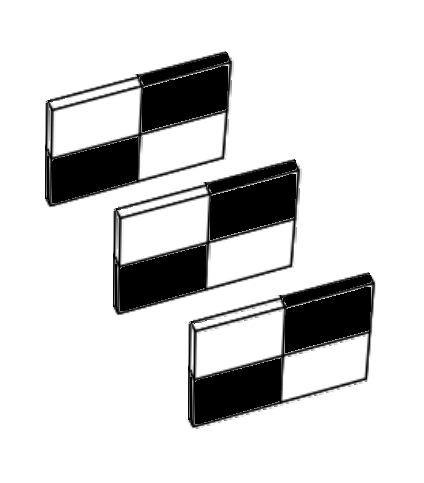

---
jupyter:
  jupytext:
    formats: ipynb,Rmd
    text_representation:
      extension: .Rmd
      format_name: rmarkdown
      format_version: '1.2'
      jupytext_version: 1.18.1
  kernelspec:
    display_name: Python 3 (ipykernel)
    language: python
    name: python3
---

# What about color?


All of the arrays we have encountered [so far](0_images_as_numpy_arrays)
contain just one value at each array pixel location. This page will look at
image arrays with more than one value per pixel, and show how this can encode
color information, giving us beautiful color images, that create deep
aesthetic experiences, like this one:


(Photo by
[Stockcake](https://stockcake.com/i/alien-head-close-up_1354662_1093149)).

First, some library imports:

```{python}
# Library imports.
import numpy as np
import matplotlib.pyplot as plt

# Set 'gray' as the default colormap.
plt.rcParams['image.cmap'] = 'gray'

# Import a custom function to give hints for some exercises.
# This is a function we wrote for the tutorial.
from skitut import hints
```

Below, we create some small 2D image arrays, with which to explore color
representation:

```{python}
# A two-dimensional numpy array of 1's and 0's.
two_D_ones_and_zeros = np.array([[1, 0,],
                                 [0, 1,]],
                                 dtype=float)

# A two dimensional numpy array of numbers between 0 and 10.
two_D_other_integers = np.array([[0, 10],
                                 [5, 3]],
                                 dtype=float)

# Another image array.
smiley = np.array([[0, 0, 0, 0, 0, 0, 0, 0],
                   [0, 0, 0, 0, 0, 0, 0, 0],
                   [0, 0, 1, 0, 0, 1, 0, 0],
                   [0, 0, 1, 0, 0, 1, 0, 0],
                   [0, 0, 0, 0, 0, 0, 0, 0],
                   [0, 1, 0, 0, 0, 0, 1, 0],
                   [0, 1, 1, 0, 0, 1, 1, 0],
                   [0, 0, 1, 1, 1, 1, 0, 0],
                   [0, 0, 0, 1, 1, 0, 0, 0],
                   [0, 0, 0, 0, 0, 0, 0, 0],
                   [0, 0, 0, 0, 0, 0, 0, 0]],
                 dtype=float)
```

In our humble `two_D_ones_and_zeros` image array, each pixel is either a 1 or 0 in the `float64` `dtype`:

```{python}
# Show the array
two_D_ones_and_zeros
```

```{python}
# Display array on screen.
plt.matshow(two_D_ones_and_zeros)
plt.colorbar();
```

Conversely, the array `two_D_other_integers` contains values other than 0 and
1.  Note that, though these *numbers* themselves are integers, they are
represented by NumPy as `float64` values, because we specified the `float` data type.

```{python}
# Another image from earlier.
two_D_other_integers
```

```{python}
plt.matshow(two_D_other_integers)
plt.colorbar();
```

The first image - with black and white squares only, no gray - is a *binary image*. This is an image where each array pixel contains only one of two values. In this case the two values are 0 or 1.  The "gray" colormap tells Matplotlib to display the minimum value (0) as black pixels and the maximum value (1) as white.

The second image - black, white and gray squares - is a *monochrome image*.
This image contains more than two unique values. It has black pixels (the
lowest pixel values, 0); white pixels (the highest pixel values, 1); and gray
pixels (intermediate pixel values, > 0 but < 1).

::: {attention}

For two-dimensional arrays like these, each array pixel is just a *single
number*. Because of this, we can refer to both of these arrays as
*single-channel image arrays*.  By *single channel*, we mean there is just one
value for each pixel.  Each individual array pixel value determines the
*intensity* of that pixel, e.g. the brightness or darkness of that pixel.

Later we will see three-dimensional arrays, where we think of the last axis as
giving different channels of information, for each pixel.  These channels
allow us to specify color as well as intensity.

:::

As we saw on the [last page](0_images_as_numpy_arrays), a colormap (e.g.
`viridis` or `gray`) maps each single-valued pixel intensity onto a gradient
(a map) of colors/shades. This map is black (low intensity)-gray (medium
intensity)-white (high intensity) for the `gray` colormap.  For the viridis colormap, low intensity gives a purple color and high intensity gives a yellow color, with intermediate intensities giving intermediate colors.

The colormap *translates* (maps) the intensity values to colors, where the
`gray` colormap simply maps intensity to intensity of white, and the `viridis`
colormap maps intensity to a color from the purple to yellow.

We can think of the `gray` colormap as a straightforward map of image
intensity to white intensity, whereas  `viridis` maps intensity to a range of
color. The plot below shows both arrays, with both colormaps, for comparison:

```{python}
# An image from earlier (using the `gray` colormap)
plt.figure(figsize=(8, 8))
plt.subplot(2, 2, 1)
plt.matshow(two_D_ones_and_zeros,
            fignum=0)
plt.title('`gray` colormap \n(binary image)')
plt.colorbar()
plt.subplot(2, 2, 2)
# Another image from earlier (using the `gray` colormap)
plt.matshow(two_D_other_integers,
            fignum=0)
plt.title('`gray` colormap \n(monochrome image)')
plt.colorbar();

# Show with pseudocolor using the `viridis` colormap
plt.subplot(2, 2, 3)
plt.matshow(two_D_ones_and_zeros,
            cmap='viridis',
            fignum=0)
plt.title('`viridis` colormap \n(binary image)')
plt.colorbar()
plt.subplot(2, 2, 4)
plt.matshow(two_D_other_integers,
            cmap='viridis',
            fignum=0)
plt.title('`viridis` colormap \n(monochrome image)')
plt.colorbar()
plt.tight_layout();
```

The original image arrays only contain one values-worth of information in
their pixel values; they cannot themselves specify color information. **This
will be true of any two-dimensional image array**, because there is only one
value per pixel, and both of these image arrays are two-dimensional:

```{python}
# Show the shape of our binary image array.
two_D_ones_and_zeros.shape
```

```{python}
# Show the shape of our grayscale image array.
two_D_other_integers.shape
```

A two-dimensional image has one value per pixel, so we will call this a *single-channel* image.

However, it is common to have images that have three values per pixel — and
these are *three-channel* images.  The three values represent the intensity of
red, the intensity of green and the intensity of blue (RGB).  By giving the
intensity of the three primary colors, the three pixel values encode the color
at that pixel.

To hammer this point home — although single-channel images can be displayed in
color, the single value per pixel cannot itself specify the color; grayscale
and binary images displayed with the `viridis` colormap do not contain color
information in their array pixel values. Instead Matplotlib is *displaying*
binary and intensity information using colors. To *specify* color at each
pixel, we need at least three values.  To store the three values for each
pixel, we need a spooky third dimension...


## Color from 3D

Sounds Sci-Fi! But what does it mean?

Let's focus on our lowly 4-pixel binary array (4 *array pixels*, that is):

```{python}
# Show the array.
two_D_ones_and_zeros
```

We visualise this array with Matplotlib:

```{python}
# Our 4-pixel, binary array.
plt.matshow(two_D_ones_and_zeros);
```

Now, picture this array as a physical object, like a tray, standing on one
side, in physical space:


Now, imagine "stacking" another copy of this array *behind* the first, like this:


Let's refer to each of these trays as a *slice*. So we have two slices in the
image above, one in the foreground, and one in the background.

We can do the equivalent of this three-dimensional stacking — to our actual
binary arrays — using the helpfully named `np.stack()` function. We can use
`np.stack()` to — as the name implies — *stack* two 2D arrays into a 3D array,
as in the image shown above. To do this, we stack over the third axis using
the argument `axis=2`. This adds new arrays to the stack along the third
dimension, when we count the dimensions (axes) from 0, as we do in Python
indexing:

```{python}
# Stack the arrays in the third dimension.
three_D_stack_array = np.stack([two_D_ones_and_zeros,
                                two_D_ones_and_zeros],
                                axis=2)
three_D_stack_array
```

At first glance, the "raw" output from NumPy may not look like the "stacked"
slices in the image above, but please bear with us. Our 3D stacked array is of
the right shape:

```{python}
three_D_stack_array.shape
```

We can refer to each dimension in the `shape` of `(2, 2, 2)` as `(i, j, k)`.
`i` is the vertical (or *row*) dimension, `j` is the horizontal (*column*)
dimension, and `k` is the slice dimension.  (See the [note on rows and
columns](on-rows-and-columns) for some discussion).  These dimensions map to
the image as shown below:


We can read this shape as "two slices, each with two rows and two columns", which now clearly corresponds to the image.

Imagine being in the same physical space as these slices. Starting at the front of the image, you begin walking toward the first slice (nearest to the reader, in the foreground), then past it toward the second slice (furthest from the reader, in the background). So, in this imaginative exercise, you are walking along the $k$ dimension.

We can use indexing operations to create the experience of this walk, in "Python space". Because we are dealing with a three-dimensional array we use three elements for indexing, separated by commas. The first element is for rows, the second for columns, and the third for slices. We can retrieve the first slice using:

```{python}
# Get the first 2D slice from the 3D image.
# All rows, all columns, first slice.
three_D_stack_array[:, :, 0]
```

And we can grab the second slice using:

```{python}
# Get the second 2D slice from the 3D image.
# All rows, all columns, second slice.
three_D_stack_array[:, :, 1]
```

The image below shows these indexing operations represented in three-dimensional space:


So far we have two slices in the third dimension. We can easily add a third
slice, using `np.stack()`:

```{python}
# Add a third slice in the third dimension.
three_D_stack_array = np.stack([two_D_ones_and_zeros,  # first slice
                                two_D_ones_and_zeros,  # second slice
                                two_D_ones_and_zeros],  # third slice
                                axis=2)
three_D_stack_array
```

The `shape` of this new array now reads as "three slices, each with two rows and two columns":

```{python}
three_D_stack_array.shape
```

We can visualise this new array, in the same three-dimensional space:



Again, we can use indexing to "walk" through the slices, along the $k$ dimension:

```{python}
# First 2D slice of the stack.
three_D_stack_array[:, :, 0]
```

```{python}
# Second 2D slice of the stack.
three_D_stack_array[:, :, 1]
```

```{python}
# Third 2D slice of the stack.
three_D_stack_array[:, :, 2]
```


So far we have visualised these slices using a similar graphic to depicting an individual slice using the `gray` Matplotlib colormap. We can just as well visualise the slices using the numbers they contain:[^digits-decimal]


[^digits-decimal]: Remember, the actual numbers in each "slice" are of the
  `float64` `dtype` and so can (but here, do not) have digits after the
  decimal point. However, we will show the numbers just as 0 or 1, to keep the
  image uncluttered.

Above we said we wanted to introduce a third dimension to specify
color information in the image itself. Well, now we have three dimensions
surely plotting our image will render a vibrantly colored picture?:

```{python}
# Ooof...not what we wanted...
plt.matshow(three_D_stack_array);
```

::: {exercise-start}
:label: why-no-color
:class: dropdown
:::

Given what you've read above, why do you think that the image with the three channels is all white?

::: {exercise-end}
:::

::: {solution-start} why-no-color
:class: dropdown
:::

We've said above that the first channel (first slice) specifies intensity Red,
the second specifies Green, and the third specifies Blue (RGB).

All the values are 1.

An equal mix of Red, Green and Blue gives gray.  If the intensities are all maximum (1) then this gives white.

::: {solution-end}
:::

Ok, that is not what we wanted — nothing has changed! Interestingly though, the 3D image array still renders as a 2D display image:


What happens if we set every element, in every slice, to equal 0? To do this,
first we create a 2D, 4-pixel array containing only 0's:

```{python}
# Create a 4-pixel array containing only 0's.
two_D_zeros = np.zeros(two_D_ones_and_zeros.shape)
two_D_zeros
```

Then, we stack into three dimensions with `np.stack()`:

```{python}
# Stack three of these arrays, making a 3D array containing only 0's.
three_D_zeros = np.stack([two_D_zeros,
                          two_D_zeros,
                          two_D_zeros],
                          axis=2)
three_D_zeros
```

We can visualise this new 3D array as:


Next, we plot with Matplotlib:

```{python}
# Plot the 3D array which contains only 0s.
plt.matshow(three_D_zeros);
```

Ok, so now we have a fully black 2D display image, from our 3D array which
contains only 0's:


As an experiment, let's see what happens if we put 1's on the diagonal in the
*first slice only*. To do this, we will stack the `two_D_ones_and_zeros` array
as the first slice, and `two_D_zeros` as the other two slices:

```{python}
# Show the array (for the first slice).
two_D_ones_and_zeros
```

```{python}
# Show the array (for the second and third slices).
two_D_zeros
```

```{python}
three_D_stack_array_altered_first = np.stack([two_D_ones_and_zeros, # LOOK HERE!
                                              two_D_zeros,
                                              two_D_zeros],
                                              axis=2)
three_D_stack_array_altered_first
```

More intuitively visualised, our new three dimensional array looks like this:


You can see the values of 1 in the top-left and bottom-right elements of the first slice, all other elements are 0. Once more we can "walk" along the $k$ dimension, using indexing operations:

```{python}
# First 2D slice of the stack.
three_D_stack_array_altered_first[:, :, 0]
```

```{python}
# Second 2D slice of the stack.
three_D_stack_array_altered_first[:, :, 1]
```

```{python}
# Third 2D slice of the stack.
three_D_stack_array_altered_first[:, :, 2]
```

Now let's see what happens if we plot this new 3D array using Matplotlib:

```{python}
plt.matshow(three_D_stack_array_altered_first);
```

Great! We have now used the third dimension to introduce *color information*
into our image array. We can visualise this process using the graphic below:


Just to clarify, again our *array image* is three-dimensional, but our
*display image* — e.g. the image rendered/displayed by Matplotlib — is
two-dimensional, like the visualisations we saw earlier. In virtue of being
3D, the image array itself contains three values for each array pixel - with
one value in each "slice" in the third dimension.

To produce this red and black square, we altered the *first slice* of the 3D array, such that it contains 1's along its diagonal, but all other elements in the array are 0's.

The first slice of the third dimension - in our 3D image array - controls the
amount of red in the image. We can therefore (for now) call this slice the
*red slice*.

What happens if we alter only the *second slice* in the third dimension, so that only it contains 1's along its diagonal, and all other array elements equal 0?

```{python}
three_D_stack_array_altered_second = np.stack([two_D_zeros,
                                               two_D_ones_and_zeros, # LOOK HERE! Now we alter only the second slice.
                                               two_D_zeros],
                                               axis=2)
three_D_stack_array_altered_second
```

We can visualise this new 3D array as:


We can proceed with another "walk" through the image again, with the familiar indexing operations:

```{python}
# First 2D place of the stack.
three_D_stack_array_altered_second[:, :, 0]
```

```{python}
# Second 2D place of the stack.
three_D_stack_array_altered_second[:, :, 1]
```

```{python}
# Third 2D slice of the stack.
three_D_stack_array_altered_second[:, :, 2]
```

How does this 3D array look when we visualise it with Matplotlib?

```{python}
plt.matshow(three_D_stack_array_altered_second);
```

Here we have altered only the second slice, such that only it contains nonzero (1) values. We now see green squares in the display image:


Alterations to the second slice in the third dimension control the amount of green in the image - the second slice in the third dimension is therefore the *green slice*.

For completeness, let's change only the *third slice* in the third dimension:

```{python}
# Put 1 values in the third slice only.
three_D_stack_array_altered_third = np.stack([two_D_zeros,
                                              two_D_zeros,
                                              two_D_ones_and_zeros ], # LOOK HERE!
                                              axis=2)
three_D_stack_array_altered_third
```

Which gives us the following stacked slices:


...and the following "walk" through the slices, via array indexing:

```{python}
# First 2D slice of the stack.
three_D_stack_array_altered_third[:, :, 0]
```

```{python}
# Second 2D slice of the stack.
three_D_stack_array_altered_third[:, :, 1]
```

```{python}
# Third 2D slice of the stack.
three_D_stack_array_altered_third[:, :, 2]
```

Finally, when plotted, we get:

```{python}
plt.matshow(three_D_stack_array_altered_third);
```

So, this has given us:


## Color channels

What is happening here?

Recall that we referred to the 2D arrays that we used at the start of this tutorial as *single-channel image arrays*? The 3D arrays we just created are  *three-channel image arrays*. This means that each array pixel has three values, one in each slice of the 3D stacks we created. You can think of each slice as being one *color channel*. Each color channel controls the amount of a specific color in the image, depending on the values of the array pixels in that slice.

Using these three-channel arrays, when Matplotlib produces a two-dimensional *display image* (e.g. the matrix with colored squares along the diagonal and black squares elsewhere). However, behind this 2D display image there are three slices in the third dimension, each with the same number of rows and columns as the final 2D display image. Each pixel (e.g. each array element) in the display image gets its color information from a mix of the corresponding elements in each slice in the 3D image array.

As we have seen, the first slice is the red channel, the second slice is the green channel and the third slice is the blue channel. The intensities in each color channel are *mixed* to produce the rendered 2D image:


Now, despite the visualisations of our array containing only one primary color, the color channels are in fact being mixed together. However, because we have set two of the slices to contain only 0's, we are essentially "switching off" those color channels in the final mix (e.g. in the image displayed by Matplotlib).

Other non-primary colors can be created using different blends of the primary colors (red, green, blue) in each slice of the array. For `float64` image data, you can think of 0 as meaning 0% and 1 as meaning 100%, 0.5 meaning 50% and so on. So a 1 in the red slice means 100% red is mixed in for that pixel, along with the percentages from the other color channels (which in the arrays above, are 0's).

We can see this by choosing intensity values randomly for each color channel.
We will use the `uniform()` method of a Numpy random number generator to
supply us with three random decimal numbers between 0 and 1.

First we make a random number generator:

```{python}
rng = np.random.default_rng()
```

Now run the cell below a few times if you are using this tutorial
interactively, to see the random draw a few times:

```{python}
# Three random integers.
X1, X2, X3 = rng.uniform(size=3).round(2)

print(f"X1 = {X1}\nX2 = {X2}\nX3 = {X3}")
```

We will use the `X1` value from this random draw to set nonzero diagonal values in the *red* color channel (e.g. in the *first* slice of the stack).  In the same way we will use the `X2` value as the green value, and `X3` as the blue value.

We will then view the resulting display image. Again, if you are using this tutorial interactively, run the cell a few times to see multiple random mixes across the color channels:

```{python}
# Get three random integers between 0 and 255
X1, X2, X3 = rng.uniform(size=3).round(2)

# Display the values of the random integers.
print(f"Red (X1) = {X1}\nGreen (X2) = {X2}\nBlue (X3) = {X3}")

# Create a 3D stack, with the nonzero values in each slice set by the
# random integers.
three_D_stack_array_altered_blend= np.stack([two_D_ones_and_zeros * X1,
                                             two_D_ones_and_zeros * X2,
                                             two_D_ones_and_zeros * X3],
                                             axis=2)
# Visualise the 3D stack with Matplotlib
plt.matshow(three_D_stack_array_altered_blend);
```

So, each two-dimensional display image has a "hidden" three-dimensional array behind it. Each slice of the third dimension is a color channel. The mix of values at a given element in each color channel determines the color of that pixel in the rendered image. You may want to view this image in a new browser window, to see more clearly the exact mixes of the color channels, which are shown above each square on the right-hand side of the image:


You can view lots of random mixes across the color channels, as a grid of plots, by running the cell below:

```{python}
# A custom function to demonstrate many mixes of values across the three
# color channels.
from skitut.random_colors import random_color_array

random_color_array(8, 8)
```

We have now completed our perilous expedition into the third dimension... We
have seen that we can use 3D arrays to encode *color* information at each
pixel. The image array itself contains color information for each pixel.

Let's explore a color image of a real object. We will introduce Scikit-image (`skimage`) in more detail on the [next page](2_skimage_intro), but for now we will again use the straightforwardly named `imread()` function to load an image from a file:

```{python}
# Import the input/output module from skimage.
from skimage import io

# Load our image array.
coffee = io.imread("images/coffee.png")

# Show the "raw" array output.
coffee
```

```{python tags=c("remove-cell")}
# Write out image used above.
import skimage as ski
ski.io.imsave('images/coffee.png', ski.data.coffee())
```

Notice that the `coffee` image is nothing but a Numpy array.

The cell below defines a function to let us quickly view the attributes of any
image array. You'll notice that this function just uses NumPy attributes,
given that we are representing images as nothing but NumPy arrays:

```{python}
def show_attributes(img):
    """ Print some attributes of an image array `img`
    """
    print("Type:", type(img))
    print("dtype:", img.dtype)
    print("Shape:", img.shape)
    print("Max Pixel Value:", img.max().round(2))
    print("Min Pixel Value:", img.min().round(2))
```

```{python}
# Inspect the attributes of the `coffee` image array.
show_attributes(coffee)
```

We can see that this image has three dimensions, with three slices in the third dimension. We are therefore dealing with a *color* image with three color channels. We can also see that the image array represents the most intense pixel values with the number 255, and the least intense values with the number 0, in each color channel. The `dtype` is `uint8`, in contrast the `float64` `dtype` we have been using in our custom-made low-resolution image arrays.

Let's view the image with `imshow()`:

```{python}
# Show the array.
plt.imshow(coffee);
```

Looks great! Though at the time of writing one of the authors is on their third coffee today...


## Pixels and `dtype`

Why is the highest pixel value in the `coffee` image the bizarrely specific
integer value of 255? We will talk more about image data types
[later](2_skimage_intro), but other values/`dtypes` would work here as well.
The display conventions are:

- 0 - 1: where 0 is the least intense, 1 is the most intense (floating point
  arrays, such as `dtype=np.float64`;
- 0 - 255: where 0 is the least intense, 255 is the most intense (integer
  arrays, such as `dtype=np.uint8`).

You will see both conventions in images you encounter "in the wild", and
Scikit image supports both formats (as well as multiple other formats - see
the table below). Neglecting to pay attention to `dtype` is a very common
source of errors when dealing with image arrays, so keep track of it, and
deliberately specify it as often as possible!

The plot below shows how to get the primary colors (red, green, blue) using
both the `float64` and `uint8` convention for the maximum and minimum pixel
values:

```{python}
# Use a custom function to plot the maximum intensity values in the diagonals,
# for `int` and `float` data, using our familiar 1's and 0's array.
from skitut.random_colors import plot_int_float

plot_int_float();
```

::: {note}
:name: color-and-matplotlib

**Matplotlib, channels, and colors**

We haven't made this explicit yet, but it is Matplotlib that determines the
color from an image array.

That is, it is Matplotlib that looks at a three-channel floating point image,
and specifies that a color channel value of 1 is the maximum, and 0 is the
minimum. Therefore a pixel that is (1.0, 1.0, 1.0) displays as white, and
(0.0, 0.0, 0.0) displays as black.  Matplotlib considers <= 0 as 0, and >=
1 as 1, so a pixel value of (2.0, 1.0, 99.0) will also display as white, and
(-1.0, -99.0, 0) will display as black.

It is Matplotlib that says that three-channel integer image values of >=255
are the maximum, and <=0 are the minimum; (255, 255, 255) and (1000, 2000,
3000) (in an integer `dtype` that allows those values) display as white; (0,
0, 0) and (-1, -100, -1000) display as black.

Note that Matplotlib behaves differently with a single-channel integer or
floating point images.  It uses the colormap for single-channel images, mapping
the minimum value to the first value in the colormap, and the maximum value to
last.

:::

Ok, now we have clarified the mystical 255 pixel value, let's use a `for` loop
to extract each color channel of `coffee` image. What do you think Matplotlib
will show when we visualise each 2D slice of the 3D image separately?

```{python}
# The name of each color channel.
RGB_chan_names = ["Red Channel",
                  "Green Channel",
                  "Blue Channel"]

# Loop through, extract each channel as a 2D slice, and visualise.
plt.figure(figsize=(15, 5))
for i, chan_name in enumerate(RGB_chan_names):
    plt.subplot(1, 3, i+1)
    current_slice = coffee[:, :, i]
    plt.title(f"{chan_name}:")
    plt.imshow(current_slice)
    plt.xticks([])
    plt.yticks([])
    plt.xlabel(f"\n\nShape: {current_slice.shape}")
```

Now we are viewing each slice/color channel separately, we are again visualising 2D arrays — you can see the `.shape` of each slice below each image.

The image from each color channel, when visualised separately, is now
a single-channel image, and so Matplotlib is rendering it in grayscale. As we
know, we could also use the `viridis` colormap to allocate particular colors
to the intensity information in the images for the purposes of the display.
Though in this instance, `viridis` results in some slightly queasy-looking
images:

```{python}
# Pseudo-color with `viridis`.
plt.figure(figsize=(15, 5))
for i, chan_name in enumerate(RGB_chan_names):
    plt.subplot(1, 3, i+1)
    current_slice = coffee[:, :, i]
    plt.title(f"{chan_name}:")
    plt.imshow(current_slice, cmap='viridis')
    plt.xticks([])
    plt.yticks([])
    plt.xlabel(f"\n\nShape: {current_slice.shape}")
```

When we visualise the full 3D array however, then, as we have seen, each slice controls the amount of a specific color, and the resultant mix gives us our beautiful, full-color image:

```{python}
plt.imshow(coffee);
```

::: {exercise-start}
:label: true-blue
:class: dropdown
:::

Now over to you for some NumPy-fuelled color wizardry. Your job is take our binary `two_D_ones_and_zeros` array and to use numerical and/or NumPy operations **only** to manipulate the image so that it looks as follows, when displayed with `plt.matshow()`:


Start with an all-zeros array, of the same shape as `two_D_ones_and_zeros`:

```{python}
start_slice = np.zeros_like(two_D_ones_and_zeros)
start_slice
# YOUR CODE HERE
```

::: {exercise-end}
:::

::: {solution-start} true-blue
:class: dropdown
:::

The solution here is to `np.stack` a new three-channel array, where the first
channel is all zero (Red), the second is all zero (Green), and the third channel has all one (Blue).

```{python}
# Stack the color channels, where blue is all 1.
all_blue_solution = np.stack([start_slice,  # Red - all 0
                              start_slice,  # Green - all 0
                              start_slice + 1],  # Blue - all 1.
                              axis=2)

# Show the result.
plt.matshow(all_blue_solution);
```

::: {solution-end}
:::


::: {exercise-start}
:label: blood-smile
:class: dropdown
:::

Time for some more horrifying computer art. Your task now is to modify the `smiley` image from earlier, using only numerical and/or NumPy operations, to make a "blood smiley". The new "blood smiley" should have a black background, and a red face, meaning that Matplotlib will render it as:


Once more, your raw ingredients are in the cell below:

```{python}
# YOUR CODE HERE
blood_smiley = smiley.copy()
```

::: {exercise-end}
:::


::: {solution-start} blood-smile
:class: dropdown
:::

The solution here is simple. The background in the image is already black,
meaning that for those pixels, the array pixel values are already 0. When we
`np.stack()` the array into 3D, we just need to set the 1 values,
corresponding to the "face" pixels, to be 1's for the Red channel only, and
0's in the other channels (slices):

```{python}
# Horrific!
smiley_red_solution = np.stack([smiley * 1,
                                smiley * 0,
                                smiley * 0],
                                axis=2)

plt.imshow(smiley_red_solution);
```

::: {solution-end}
:::


::: {exercise-start}
:label: inverted-blood-smile
:class: dropdown
:::

When we "invert" the color of an image this means we reverse the intensity values. So the highest values become the lowest, and the lowest values become the highest.

Your job is to figure out how to produce this final result, again using only
numerical or NumPy operations on the `smiley` image.


```{python}
# YOUR CODE HERE
inverted_blood_smiley = smiley.copy()
```

::: {exercise-end}
:::

::: {solution-start} inverted-blood-smile
:class: dropdown
:::

Because `smiley` is a binary array, we can invert the values with a simple numerical operation: subtracting the array from 1.

Below is the solution to invert `smiley`:

```{python}
# Step 1 - invert the original array
inverted_smiley = 1 - smiley
inverted_smiley
```

```{python}
plt.imshow(inverted_smiley);
```

We can then stack the inverted array and "turn off" the green and blue
channels by multiplying their pixel values by 0:

```{python}
# Step 2 - add the color channels
inverted_blood_smiley_solution = np.stack([
    inverted_smiley,  # Red
    inverted_smiley * 0,  # Green
    inverted_smiley * 0],  # Blue
    axis=2)

plt.imshow(inverted_blood_smiley_solution);
```

::: {solution-end}
:::


::: {exercise-start}
:label: colorless-caffeine
:class: dropdown
:::

Ok, that was all scary. Now we need a coffee to relax (is coffee relaxing?!).

Your next task is to take the `coffee` image and use only numerical or NumPy operations to convert it to a single-channel (e.g. monochrome image):

```{python}
# YOUR CODE HERE
colorless_coffee = coffee.copy()
```

::: {exercise-end}
:::

::: {solution-start} colorless-caffeine
:class: dropdown
:::

There are several ways to do this. One way is to use the `.mean()` method of the `coffee` NumPy array, setting `axis=2` to average across the color channels in the third dimension.

The resulting output is 2D, and therefore single-channel/monochrome:

```{python}
# Solution 1
colorless_coffee_solution = coffee.mean(axis=2)

plt.imshow(colorless_coffee_solution);
```

Any computations (such as summing across the channels) which collapse the 3D color array into 2D will achieve a similar effect. We deem any of these as correct answers, so long as your output image is grayscale...

Another way is just to use NumPy indexing to extract one color channel slice:

```{python}
# Solution 2
colorless_coffee_solution = coffee.copy()[:, :, 0]

plt.imshow(colorless_coffee_solution);
```

Because the intensity values are different in each color channel slice, the slice we choose will change the resulting image:

```{python}
# Use a different slice.
colorless_coffee_solution = coffee.copy()[:, :, 2]

plt.imshow(colorless_coffee_solution);
```

...we will allow any slice as the correct solution, however, as they are all grayscale.


::: {solution-end}
:::


::: {exercise-start}
:label: corrupted-camera
:class: dropdown
:::

In image processing "signal" can very roughly be thought of as a meaningful visual representation of something, in pixel values. Conversely, noise can be thought of as meaningless randomness in pixel values.

One use of noise is to obscure or fuzz a part of the image.

In this case, let's assume that the person in the `camera` image wants to make it more difficult for someone to identify him from the image.  Accordingly, we are going to add some random noise to the region around his face.  To make that noise even more distracting, it should be random noise on all three color channels, to give a confusing mix of random color, added to the face area of the image.

Here is the original image:

```{python tags=c("hide-input")}
import skimage as ski

plt.imshow(ski.data.camera());
```

You should use NumPy and numerical operations only, to create something like
the following image (the exact image will depend on your random noise):


Your final image should have the following attributes (from the
`show_attributes` function):

```
Type: <class 'numpy.ndarray'>
dtype: uint8
Shape: (512, 512, 3)
Max Pixel Value: 255
Min Pixel Value: 0
```

*Hint 1*: We think that the face part of the image is from row (`i`)
coordinate 100 through 199, and column (`j`) coordinate 190 through 259.

*Hint 2*: This sort of noise is *random*, you can think about methods of the
Numpy random number generator (`rng` in the code so far) which might be of use
here...

*Hint 3*: Don't forget this is an *integer* image.

*Hint 3*: Run the function `hints.corrupted_camera()` for additional help...

```{python}
# Make a random number generator
rng = np.random.default_rng()

# Import the camera image.
camera = io.imread("images/camera.png")

# Show the attributes of `camera`/
show_attributes(camera)

# YOUR CODE HERE
noisy_camera = ...
```

::: {exercise-end}
:::

::: {solution-start} corrupted-camera
:class: dropdown
:::

The way we did this was by stacking `camera` into a 3D array. We then used NumPy indexing to isolate a region around the cameraman's face, and added some random integer noise to each channel in that region.  Bear in mind that the output image is an integer image, so Matplotlib interprets 255 as maximum intensity, and 0 as minimum.

```{python}
# Solution.
noisy_camera_solution = np.stack([camera,
                                  camera,
                                  camera],
                                  axis=2)
face = noisy_camera_solution[100:200, 190:260, :]
# In fact, `face` is a *view* onto the data in `noisy_camera_solution`
# so you can write the code below more simply, but to avoid confusion,
# let's do it long way.
noisy_camera_solution[100:200, 190:260, :] = face + rng.integers(-100, 100, size=face.shape)
# For neatness, you might also consider clipping the image to have min 0 and
# max 255 (< 0 set as 0, > 255 set as 255).
noisy_camera_solution = np.clip(noisy_camera_solution, 0, 255)
plt.imshow(noisy_camera_solution);
```

```{python tags=c("remove-cell")}
# We regenerate and store the output image for page generation, used above.
# Check this code against the solution code above.
# We have to regenerate the solution, because we need predictable randomness.
out_rng = np.random.default_rng(1939)  # Predictable output for predictable image.
out_sol = np.repeat(camera[..., None], 3, axis=2)  # Another way of generating 3D stack.
out_face = out_sol[100:200, 190:260, :]
# Use the fact that out_face is a view.
out_face[:] = out_face + out_rng.integers(-100, 100, size=out_face.shape)
plt.imshow(out_sol);
plt.savefig('images/corrupted_camera.png')
```

::: {solution-end}
:::

(brain-images)=

## More (actually) complex images

So far we have looked at simple images - 2D binary and grayscale low-resolution image arrays, like `smiley` - or more complex color images with three color channels (like `coffee`). However, the principles we have seen extend to even more complex images, like the image arrays generated by [brain imaging](https://en.wikipedia.org/wiki/Neuroimaging), for instance.

Here is an image of one "slice" of one of the authors' brains, which was captured by a [magnetic resonance imaging](https://en.wikipedia.org/wiki/Magnetic_resonance_imaging) scanner:

```{python}
# One author's own brain (a 2D slice).
brain = io.imread("images/pxr_brain.png")

plt.imshow(brain);
```

The physics of magnetic resonance imaging is very complicated, but the image
arrays that it produces, as with our very simple low-resolution arrays, are
nothing but arrays of numbers:

```{python}
# Show the attributes of the brain image.
show_attributes(brain)
```

Note that this image is 2D, and it is actually a relatively simple brain
image.  But of course, the scanner took many images (slices) like this, to
give a full 3D picture, from left ear to right ear. Of course the natural way
to store such an image is as a 3D Numpy array, and this reminds us that Numpy
arrays can and do use the third dimension to store information other than
color.  It is Matplotlib, our display library, that will interpret the third
dimension as color channels — which is why we will nearly always use the third
dimension of images to store color.  We will investigate this topic more on
the [next page](2_skimage_intro).


## Summary

On this page we have seen how color can be represented in NumPy array images:

* Images are (at least) two-dimensional arrays of numbers. Multiple `dtype`s
  in image arrays are supported by Scikit image.
* We have seen images where the number at each array pixel location determines
  the gray-level (in a 2D array) or color (in a 3D array) of that location
  when the image is displayed. For 3D color arrays the number in each
  slice/channel determines the intensity of Red of Green or Blue, and the
  resulting color intensities combine to determine the color in the 2D
  displayed image.
* These methods of color encoding can apply to both to very simple and very
  complex images. Some types of image (e.g. brain images) use
  third and higher dimensions (axes) to encode information other than color.

On the [next page](2_skimage_intro) we will formally introduce Scikit-image,
which uses NumPy image arrays as its fundamental representation of images.

(color-references)=

## References

Adapted from:

* [Scientific Python Lecture Notes - image
  processing](https://lectures.scientific-python.org/advanced/image_processing)
* [Scientific Python Lecture Notes: scikit-image](https://lectures.scientific-python.org/packages/scikit-image/index.html)
* [Nipraxis course - arrays and
  images](https://textbook.nipraxis.org/arrays_and_images.html)
* [Nipraxis course - three-dimensional
  arrays](https://textbook.nipraxis.org/arrays_3d.html)

with further inspiration from [`skimage`](https://github.com/scikit-image/skimage-tutorials) [tutorials](https://scipy-2024-image-analysis.github.io/tutorial/01_images_are_arrays.html).
