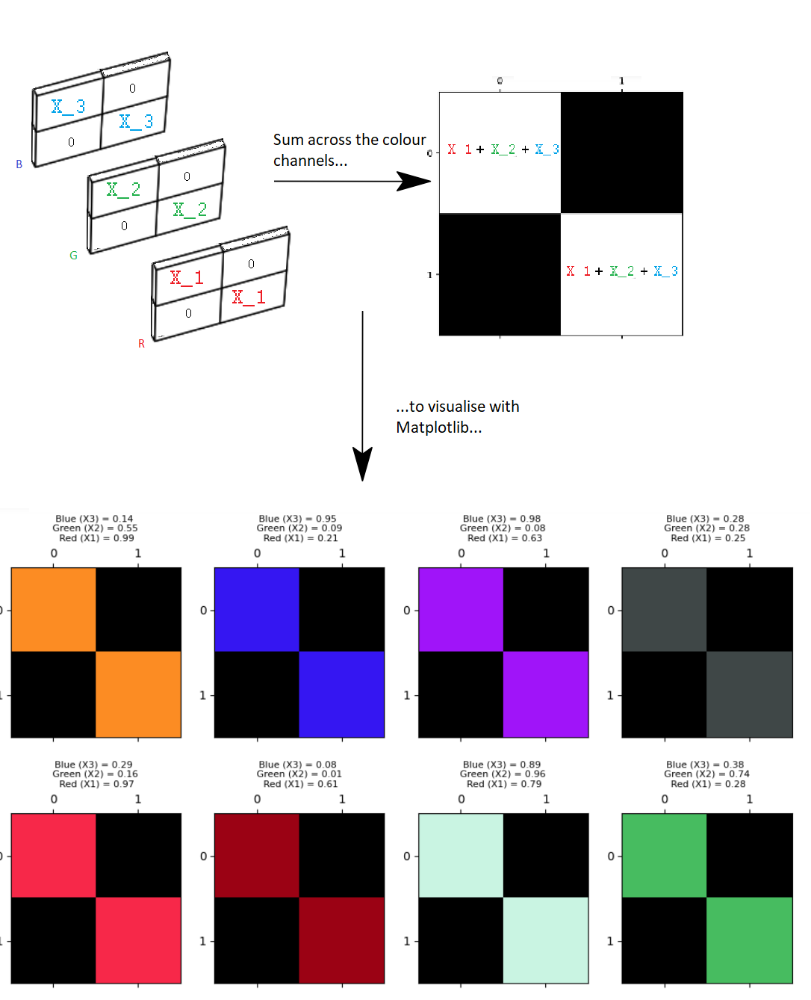
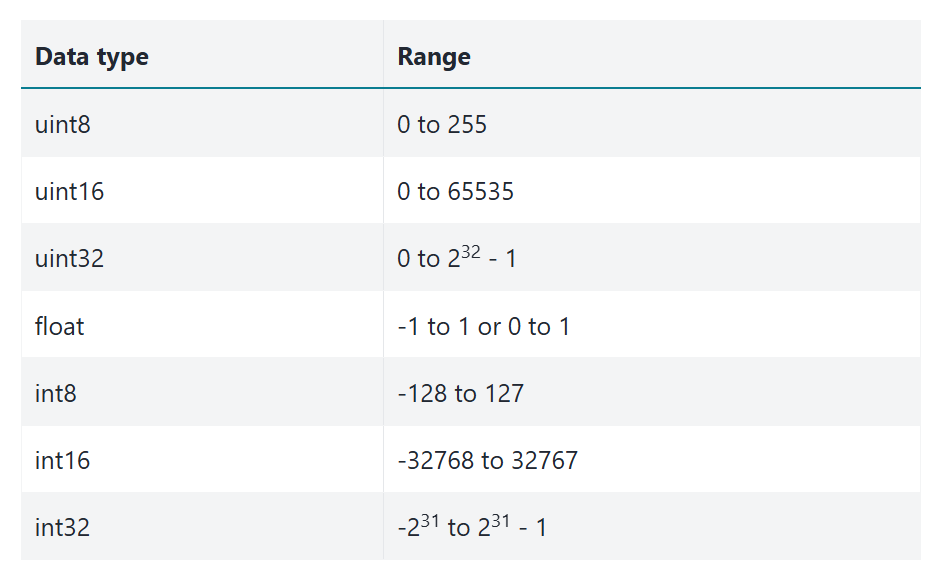
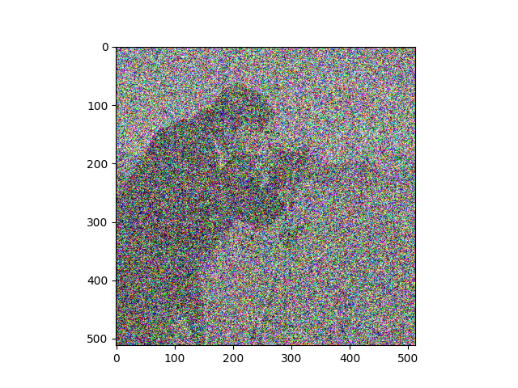
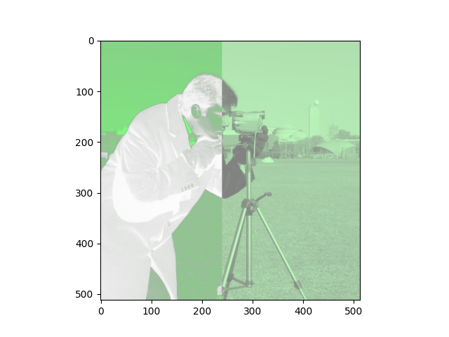

---
jupyter:
  jupytext:
    formats: ipynb,Rmd
    text_representation:
      extension: .Rmd
      format_name: rmarkdown
      format_version: '1.2'
      jupytext_version: 1.17.3
  kernelspec:
    display_name: Python 3 (ipykernel)
    language: python
    name: python3
---

# Introducing Scikit-image

[Scikit-image](https://scikit-image.org) (`skimage`) is a powerful image processing package which is built in a large part from NumPy and SciPy, and uses NumPy arrays as its fundamental image representation. This page will show some foundational aspects of `skimage`, focusing on its coherence with the NumPy image array concepts we saw on the last two pages.


## Images are arrays, arrays are images

As we have seen, we can think of *any (at least) two-dimensional array* as an
image — call this an *image array*.  We know that each element of an image
array (an "array pixel") contains information about the intensity or color of
that element. Perhaps obviously, these fundamental principles apply equally to
Scikit-image, given that it also represents images as NumPy arrays. The table
below outlines how images are represented in `skimage` - you'll notice it is
identical to the principles we have seen for representing images in NumPy:

|||
|:---|:---|
|Image|`np.ndarray`|
|Pixels|array values e.g. `img_arr[2, 3]`|
|Image Array `dtypes` |(`np.uint8`, `np.float`, many others)|

Before exploring how `skimage` works, let's start by building some image objects to perform image manipulations on. As normal, we begin by importing some libraries:

```{python}
# Import libraries.
import numpy as np
import matplotlib.pyplot as plt

# Set the default colormap for this session.
plt.rcParams['image.cmap'] = 'gray'

# Import a custom function to give hints for some exercises.
from hints import hint_cat, hint_camera

# A custom function to quickly report array image attributes.
from show_attributes import show_attributes
```

We can use some simple NumPy functions and the familiar array indexing syntax to create our familiar, exceedingly artistic, image array:

```{python}
# Create an image array.
squares = np.array([[1, 0,],
                    [0, 1,]],
                   dtype=float)

# Show the array ("raw" output from NumPy)
squares
```

```{python}
# Display the array as an image with Matplotlib
plt.matshow(squares);
```

You will recall that this array — in virtue of being 2D and having only one
numeric value per array pixel — is a single-channel array. This means that it
contains only information about pixel intensity (representable, for example,
with gray-level), and gives no information about color.

To include color information, our array must be of *at least* three dimensions. A three-dimensional color image array typically has three "slices" in the third dimension. Each element of each slice contains a number between 0 and 1 (for `float64` data), or between 1 and 255 (for `uint8` data). For the standard RGB (Red-Green-Blue) format the number in each element of each slice in the third dimension tells that array pixel what color to be (e.g. a mix of red, green and blue, across the three slices). Hence these slices, in the third dimension, are called "color channels".



As we saw previously, we can control the amount of color in the image by manipulating each channel in the third dimension:

```{python}
# Using `np.stack()` to create a multi-channel array.
red_squares = np.stack([squares, # 1's are only present in the red channel.
                        squares * 0, # The green channel is "switched off".
                        squares * 0], # The blue channel is "switched off".
                        axis=2)
show_attributes(red_squares)
plt.matshow(red_squares);
```

We show this principle again below, for each color channel. The top row of the plot shows the channels for `uint8` data with 255 as the maximum pixel intensity value. The second row of the plot shows each channel for `float64` data, using 1 as the maximum pixel intensity value:

```{python}
# Use a custom function to plot the maximum intensity values in the diagonals, for `int` and `float` data,
# using our familiar 1's and 0's array.
from random_colors import plot_int_float

plot_int_float();
```

These are the basic aspects of images represented as NumPy arrays. Other ways of representing color exist and are supported by `skimage`, and indeed, not all 3D arrays representing images contain color information (e.g. structural brain images, as we saw for [brain images](brain-images)). We will look at these concepts in later sections, but `skimage` can work with these images as easily as the basic colored squares we have just made — all these images *are just NumPy arrays* and can be handled just as any NumPy array.


## Going `ski`-ing : arrays as arguments

So far so good, we have an image array to experiment with. Let's import `skimage` itself. The convention for importing `skimage` (and the convention you will see in most other peoples' code) is to name the import `ski`:

```{python}
# Import statement for Scikit-image and the conventional shorthand.
import skimage as ski
```

Because Scikit-image represents images as NumPy arrays, *the majority of Scikit-image functions take NumPy `ndarray`s as arguments.* For instance, the `rgb2gray()` function from the `ski.color` module can take a multi-channel array, and convert it to a single channel, grayscale image. We will show this with the `red_squares` array from above:

```{python}
# Show the original `red_squares` array
show_attributes(red_squares)
plt.matshow(red_squares);
```

Now, we just pass the `squares` array to `ski.color.rgb2gray()` as an argument:

```{python}
# Convert the `red_squares` array to grayscale.
back_to_black = ski.color.rgb2gray(red_squares)
show_attributes(back_to_black)
plt.matshow(back_to_black);
```

Many Scikit-image functions work like this - they take a NumPy array as input, do something to the array pixel values, then return an altered image array. As we mentioned above, under the hood `skimage` is often using NumPy and SciPy functions to do the image manipulation, something we will explore in more detail on the [next page](3_skimage_processing_from_numpy_and_scipy).

You may ask why the maximum pixel values are now 0.21, rather than 1? This is because of the [formula](https://stackoverflow.com/questions/596216/formula-to-determine-perceived-brightness-of-rgb-color) that `rgb2gray()` uses to do the conversion. We will show this in detail in the *Colorspaces* section later in this tutorial.


## Scikit-image ships with built-in images

Conveniently, `skimage` ships with example image arrays included. It should come as no surprise that these are also NumPy arrays. We can access all of the built-in images through the `ski.data` module. Here we use `dir()` to show all of the available module attributes, most of which are example image arrays:

```{python}
dir(ski.data)
```

Here we will load the `coffee` image from `ski.data`:

```{python}
# Load in the image.
coffee = ski.data.coffee()

# Show the image array.
coffee
```

```{python}
# Inspect the attributes of the image.
show_attributes(coffee)
```

```{python}
# Show the image with Matplotlib.
plt.imshow(coffee);
```

Because these images are nothing but NumPy arrays, we can use standard array slicing to interact with them. For instance, we can use slicing to ruin the `coffee` image by placing a huge green square over it:

```{python}
ruined_coffee = coffee.copy()
ruined_coffee[100:300, 200:400, :] = [0, 255, 0]  # [Red channel, Green channel, Blue channel]
plt.imshow(ruined_coffee);
```

Remember our [maxim](ip-maxim)?  stating that *"image processing" is when we do something that analyzes or changes the numbers inside the image array*.

When we explore different image processing operations, using smaller arrays often makes it easier to understand what a given processing operation is doing to individual array pixels. However, in larger, more complex arrays, it is often easier to appreciate the "global" visual/perceptual effect of an image processing operation.

As such, we will use a variety of simple arrays (like `squares`) along with a variety of more complex images from `skimage.data`, like `coffee`, to show the effect of different `skimage` manipulations, as well as their constituent `numpy` and `scipy` operations.


## Input/output and `dtype`s in `skimage`

Before manipulating and processing images, we will need to load them into memory. After we are finished with our high concept digital art, we will want to save our creations. To help us with this, input and output (e.g. loading and saving image files) is handled by the `skimage.io` module.

We have already met this module on [earlier pages](0_images_as_numpy_arrays) but we will discuss some of its finer details here. `skimage` supports multiple image `dtypes` (e.g. the types of numbers within the image array), and loading and saving files can require close attention to, or even conversion of, the image `dtype`, as we will see shortly.

For now, let's use `ski.io.imread()` to load a `.png` of the terrifying smile we hand-crafted in the earlier tutorials:

```{python}
# Read in an image file, as a single-channel image.
smiley_from_file = ski.io.imread("images/smiley.png",
                                 as_gray=True)

# Show the "raw" NumPy output
smiley_from_file
```

```{python}
# Show the array (graphically).
plt.imshow(smiley_from_file);
```

```{python}
# Show the attributes of the image.
show_attributes(smiley_from_file)
```

No less terrifying than when we first saw it...

Note that `ski.io.imread()` loads image files as NumPy arrays by default. This is not the case with some other python image libraries (like [`pillow`](https://pillow.readthedocs.io/en/stable/reference/Image.html)) which have their own ways of representing images.

Now, a lot of `skimage` functions serve specific purposes — like improving the quality or clarity of an image. Others are just there to look cool. The `ski.transform.swirl()` function falls into the latter category. According to the [documentation](https://scikit-image.org/docs/0.25.x/auto_examples/transform/plot_swirl.html), this function performs a non-linear deformation creating a whirlpool effect. Because `skimage` has loaded `smiley.png` as a NumPy array, we can pass the image straight to the `swirl` function:

```{python}
#  Swirl the `smiley_from_file` array.
smiley_swirled = ski.transform.swirl(smiley_from_file,
                                     center=(3, 6), # Central pixel coordinate.
                                     radius=10)  # Extent of the `swirl`
                                                 # (in number of pixels)
# Show the "raw" NumPy output.
smiley_swirled
```

```{python}
# Show the swirled array (graphically).
plt.matshow(smiley_swirled);
```

`smiley` only gets more terrifying with each manipulation, it seems...

What `swirl` has done here is, well, swirled the pixels around a central point, resulting in this crooked, wonky smile. Now, if we want to save our persistently terrifying creation, we can use `ski.io.imsave()` to save images...

```{python tags=c("raises-exception")}
# OUCH!
ski.io.imsave("images/smiley_swirled.png", # Path to save image to.
              smiley_swirled)              # Image array to save.
```

Oh dear, what a horrible looking error for such a simple request. What has happened here? The error message is cryptic...

`OSError: cannot write mode F as PNG`

...but it is telling us that there is an issue with the `dtype` of the array we are trying to save:

```{python}
smiley_swirled.dtype
```

`skimage` [supports the following `dtypes`](https://scikit-image.org/docs/0.25.x/user_guide/data_types.html):



However, although `skimage` supports all these `dtype`s, the [PNG image format](https://en.wikipedia.org/wiki/PNG) does not.  In particular, PNG does not support floating point image values, such as `float64`.

Issues like these are common, and as such `skimage` has a variety of functions
to address them.

In this case, we can convert our image array from `float64` to `uint8` using the `ski.util.img_as_ubyte()` function:

```{python}
smiley_swirled = ski.util.img_as_ubyte(smiley_swirled)

smiley_swirled.dtype
```

This format *is* supported for `.png` files, and we can painlessly save our image using `ski.io.imsave()`:

```{python}
# Saving our image (successfully).
ski.io.imsave("images/smiley_swirled.png", # Path to save image to.
              smiley_swirled)              # Image array to save.
```

We can now use `ski.io.imread()` to read the file we just saved back into memory:

```{python}
# Load the file back in.
load_back_in = ski.io.imread("images/smiley_swirled.png")

# Show the file.
plt.imshow(load_back_in);
```

We can see that the `dtype` of the freshly saved, freshly loaded image is indeed `uint8`:

```{python}
show_attributes(load_back_in)
```

Another option here, is just to save to another image format, like `.jpg`. Below we save the original `smiley_swirled` array as a `.jpg` file, avoiding the ugly error message:

```{python}
# Save as `.jpg`.
ski.io.imsave("images/smiley_swirled.jpg", # Path to save image to.
              smiley_swirled)              # Image array to save.
```

Issues with `dtype` can be a source of errors, so it is important to be aware of what `dtype` your image arrays are using. Fortunately, as we have seen, to help remedy or avoid such errors, `skimage` makes it easy to convert between `dtypes`, where such errors do occur.

*Note*: you should prefer the `ski.util` conversion functions to using the NumPy `ndarray.astype()` method, when altering image `dtype`s. This is because the `skimage` functions will respect the min/max pixel intensity value conventions shown in the table above, where `.astype()` may not. Here is a list of the `skimage` conversion functions - you will need them!:

```{python}
# Show the `skimage` `dtype` conversion functions.
[func for func in dir(ski.util) if func.startswith('img')]
```

## Small image arrays, big image arrays

Before we move on, a note on `swirl` — we said earlier that it is easier to understand a manipulation at the array pixel-level using a small (low-resolution) array, but easier to appreciate its global visual effect on a larger (high-resolution) image. We saw the effect of `swirl` on `smiley_swirled`, but the nature of the visual effect can be seen more clearly when we apply it to `coffee`:

```{python}
# `swirl` the coffee image
plt.imshow(ski.transform.swirl(coffee, strength=100));
```

Pretty trippy...

::: {exercise-start}
:label: noisy-camera
:class: dropdown
:::

Now investigate the use of `ski.util.random_noise()` to add extra noise to an image. Remember that in the context of image processing, noise is *randomness*. Here is the original `camera` image from `ski.data`:

```{python}
camera = ski.data.camera()
plt.imshow(camera);
```

Try to recreate something like the image below, by adding noise to the image with `ski.util.random_noise()`. Like most `skimage` functions, `random_noise()` takes a NumPy image array as an argument, and adds random quantities to the array pixel values. To match the target image below, you will need to adjust an optional argument, see if you can work out which argument it is by reading the [documentation](https://scikit-image.org/docs/0.25.x/api/skimage.util.html#skimage.util.random_noise).



Make sure you pay attention to the *colors* (RGB) of the noise...

Your new image should have the following attributes:

```
Type: <class 'numpy.ndarray'>
dtype: float64
Shape: (512, 512, 3)
Max Pixel Value: 1.0
Min Pixel Value: 0.0
```

```{python}
# YOUR CODE HERE
```

::: {exercise-end}
:::

::: {solution-start} noisy-camera
:class: dropdown
:::

The solution here is to `np.stack()` the `camera` image, to introduce color channels. (You could also use `np.repeat`). We then pass our 3D array to `ski.util.random_noise()`, manipulating the `var` argument to control the "level" of the noise. Specifically, `var` will control the range of the changes. Higher values of `var` means bigger absolute random values can potentially be added/subtracted from each pixel:

```{python}
# Stack to 3D.
camera_with_noise  = np.stack([camera,
                               camera,
                               camera],
                               axis=2)

# Add noise to every color channel.
camera_with_noise = ski.util.random_noise(camera_with_noise, var=3)

# Show the result.
plt.imshow(camera_with_noise)
show_attributes(camera_with_noise);
```

```{python tags=c("remove-cell", "hide-output")}
# We regenerate and store the output image for page generation, used above.
# Check this code against the solution code above.
out_rng = np.random.default_rng(1939)  # Predictable output for predictable image.
out_sol = np.repeat(camera[..., None], 3, axis=2)  # Another way of generating 3D stack.
# Generate noise predictably.
out_sol = ski.util.random_noise(out_sol, var=3, rng=out_rng)
plt.imshow(out_sol);
plt.savefig('images/noisy_camera.png')
```

::: {solution-end}
:::


## Colorspaces

Colorspaces are different ways of mapping values to colors.

So far we have looked primarily at binary/monochrome single-channel image arrays and three-channel Red-Green-Blue (RGB) color image arrays. We can use the `shape` conventions from NumPy to think about these image types. Single channel images have a `shape` of `(n, m)` where `n` is the number of rows and `m` is the number of columns.  RGB images have a shape of `(n, m, 3)`, so `n` rows, `m` columns and `3` slices (the color channels).

RGB is a common standard, but color images of shape `(n, m, 3)` can use different representations of color to the RGB method we have seen. We call these different color representation formats *colorspaces*. `skimage` supports many of them, and contains many functions for converting image arrays between colorspaces. These functions are contained in the `ski.color` module:

```{python}
# Show the functions in `ski.color`.
dir(ski.color)
```

Let's load in the `cat` image from `ski.data`, to look at a different colorspace:

```{python}
# Load the image and show it.
cat = ski.data.cat()
show_attributes(cat)
plt.imshow(cat);
```

On the [previous page](1_color_images_as_numpy_arrays) we manually converted color images to grayscale, using NumPy operations. As we saw earlier on the present page, functions from the `ski.color` module, like `ski.color.rgb2gray()`, can do this more elegantly, with less code:

```{python}
# From RGB to grayscale.
gray_cat = ski.color.rgb2gray(cat)
show_attributes(gray_cat)
plt.imshow(gray_cat);
```

This grayscale conversion is achieved by calculating the luminance of the image via a weighted sum of the information in each color channel:

$$
L = 0.2126R + 0.7152G + 0.0722B
$$

This has the effect of removing the color channels, so the output array is 2D. Why do we use these specific numbers? You could go and knock on the door of your physicist friend to ask (don't worry, they'll be in...), or you can see [this page](https://stackoverflow.com/questions/596216/formula-to-determine-perceived-brightness-of-rgb-color) for a detailed explanation of where the weights come from.

::: {exercise-start}
:label: no-color-cat
:class: dropdown
:::

Re-color the `cat` image using the luminance formula provided above. Your output image should have the following attributes:

```
Type: <class 'numpy.ndarray'>
dtype: float64
Shape: (300, 451)
Max Pixel Value: 1.0
Min Pixel Value: 0.0
```

*Hint:* you may want to investigate `ski.exposure.rescale_intensity()` to help ensure that you match the attributes of the target image, above ...

The `cat` image array is copied for you in the cell below:

```{python}
# YOUR CODE HERE
cat_for_exercise = cat.copy()
```

::: {exercise-end}
:::

::: {solution-start} no-color-cat
:class: dropdown
:::

This is a very simple operation! We can just "plug" each color channel of the
`cat` array into the formula, using NumPy array indexing:

```{python}
# Apply the formula.        Red channel.           Blue channel.          Green channel.
cat_manual_gray = 0.2126 * cat[:, :, 0] + 0.7152 * cat[:, :, 1] + 0.0722 * cat[:, :, 2]
# Or the same result using Numpy broadcasting.
cat_manual_gray - np.sum(cat * [[[0.2126, 0.7152, 0.0722]]], axis=2)
plt.imshow(cat_manual_gray);
```

However, this leaves our image with a not-standard pixel intensity range,
given the `dtype`:

```{python}
show_attributes(cat_manual_gray)
```

It is fairly standard in `skimage` for `float64` images to have a pixel
intensity range between 0 and 1 (or -1 to 1, but we digress).  Among other
things, this matches the conventions that Matplotlib uses to display images;
as [we have seen](color-and-matplotlib), Matplotlib will render single-channel
images with any value range, using the colormap.  However, values outside the
standard integer (0..255) or float (0, 1) range may be unexpected for
subsequent processing operations. We can use
`ski.exposure.rescale_intensity()` to ensure our image adheres to the
`skimage` (0, 1) convention:

```{python}
# Ensure the correct pixel intensity range.
cat_manual_gray = ski.exposure.rescale_intensity(cat_manual_gray,
                                                 out_range=(0, 1)) # Set the desired pixel intensity range.

# Show the result.
show_attributes(cat_manual_gray)
plt.imshow(cat_manual_gray);
```

::: {solution-end}
:::


We can also convert an image into a different colorspace (e.g. not grayscale).
`ski.color.rgb2hsv()` will convert an RGB image to an image in the HSV
colorspace. HSV stands for [Hue, Saturation,
Value](https://en.wikipedia.org/wiki/HSL_and_HSV).  To get a feel for how HSV
specifies color, have a look at the Wikipedia page link, and try the [HSV
color picker](https://www.selecolor.com/en/hsv-color-picker).

```{python}
# Convert `cat` to the HSV colorspcae
hsv_cat = ski.color.rgb2hsv(cat)
show_attributes(hsv_cat)
plt.imshow(hsv_cat);
```

Psychedelic! Maybe this is how cats look, from the perspective of other cats (e.g. from within their "[umwelt](https://en.wikipedia.org/wiki/Umwelt)"), but sadly this is probably not the case...

Let's extract the individual channels with some array indexing operations. Each channel is 2D, and therefore will render as a grayscale image when displayed with Matplotlib:

```{python}
# Extract the HSV channels.
hue_slice = hsv_cat[:, :, 0]
saturation_slice = hsv_cat[:, :, 1]
value_slice = hsv_cat[:, :, 2]

# Plot them for comparison.
plt.figure(figsize=(12, 7))
plt.subplot(2, 2, 1)
plt.imshow(cat)
plt.title('Original (RGB)')
plt.subplot(2, 2, 2)
plt.imshow(hue_slice)
plt.title('Hue Channel')
plt.subplot(2, 2, 3)
plt.imshow(saturation_slice)
plt.title('Saturation Channel')
plt.subplot(2, 2, 4)
plt.imshow(value_slice)
plt.title('Value Channel')
plt.tight_layout();
```

## Colorspaces 2: transparency in the 3rd dimension

Now, other colorspaces involve arrays of different `shape`s. For instance, some image arrays are `(n, m, 4)` - so that's `n` rows, `m` columns and `4` slices in the third dimension.

When we have four values in the third dimension, we can interpret these as
Red-Green-Blue-Alpha (RGBA), where Alpha is the opacity of the color.

Let's see what that extra slice does, using our tried and true `squares` image array:

```{python}
# Show the array.
plt.matshow(squares);
```

Let's `np.stack()` this image array into 4-D, and set only the 1st and 4th channels to have nonzero values (e.g. so all values in the other, green and blue, channels are 0's):

```{python}
# Create an array with 4 channels (e.g. 4 slices in the third dimension).
four_channel_stack = np.stack([squares,
                               squares * 0, # All 0's in the green channel.
                               squares * 0, # All 0's in the blue channel.
                               squares], # Add a fourth slice in the third dimension.
                               axis=2)

plt.matshow(four_channel_stack);
```

Ok, so we just get red nonzero pixels. So what does the 4th channel do?

It controls *transparency*. Setting it to 1 gives maximum *opacity* e.g.
solid, non-see through color.

Let's set it lower:

```{python}
four_channel_stack[:, :, 3] = four_channel_stack[:, :, 3] * 0.25     # Fourth slice nonzero values to equal .25

plt.matshow(four_channel_stack);
```

This new transparency channel is called an *alpha channel*. Let's add one to our `cat` image. We'll duplicate the first slice of the third dimension, as the fourth slice:

```{python}
four_channel_stack_cat = np.stack([cat[:, :, 0],
                                   cat[:, :, 1],
                                   cat[:, :, 2],
                                   cat[:, :, 0]], # Duplicate the first slice as the fourth slice...
                                   axis=2)

plt.imshow(four_channel_stack_cat);
```

Pretty ghostly...maybe *this* is how cats look to one another...


::: {exercise-start}
:label: shoegaze
:class: dropdown
:::

Your task now, is to manipulate `camera` to make it look like the target image below. Use whatever `numpy`, `skimage` and numerical operations you need, based on what you have seen on this page and the previous pages. Here is the original `camera` image:

```{python}
camera = ski.data.camera()
plt.imshow(camera)
```

The original image has the following attributes:

```
Type: <class 'numpy.ndarray'>
dtype: uint8
Shape: (512, 512)
Max Pixel Value: 255
Min Pixel Value: 0
```

Here is your target image:



Your final image array should have the following attributes:

```
Type: <class 'numpy.ndarray'>
dtype: float64
Shape: (512, 512, 4)
Max Pixel Value: 1.0
Min Pixel Value: 0.0
```

Here are some things to pay attention to, in the target image, to help you think about what operations you need here:

- the `shape` of the target image.
- the color of the target image in different regions.
- the `dtype` of the target image.

*Hint 1:* run the function `hint_camera()` for some additional help if you get stuck.

```{python}
# YOUR CODE HERE
```

::: {exercise-end}
:::

::: {solution-start} shoegaze
:class: dropdown
:::

There are several steps here - this was not an easy task! First, we need to convert our image to the `float64`. We need the `ski.util.img_as_float()` function to do this. If you tried to use the NumPy `.astype(float)` method, you will have encountered a thorny error (more on this below).

If you look at the target image, you will notice that it has a green-ish tone, but not so green as we would get if the other color channels were "switched off". As such, you can get the correct effect by reducing the impact of the red and blue channels, in fact by halving their values.

The left-hand side of the image has variance in *transparency* - pixels where the image is darker are *more transparent*. This is because, in the target image, the alpha channel is a copy of the original 2D image.

The distinction between the left-hand side and right-hand side of the image is that in the right-hand side, the transparency channel values are all uniform, though less than maximum opacity, giving a hazy effect. This can be achieved by NumPy array indexing, and setting values in the alpha channel in the right-hand side of the image to all equal 0.5:

```{python}
# Solution.

# Convert the image to `float64`.
camera_as_float = ski.util.img_as_float(camera)

# Create a 4-D stack. Halve the values in the Red and Blue channels.
# Duplicate the 2D image to get the alpha channel.
camera_4D = np.stack([camera_as_float * 0.5,  # Red
                      camera_as_float,        # Green
                      camera_as_float * 0.5,  # Blue
                      camera_as_float],       # Alpha
                      axis=2)

# Set roughly half of the pixels to have a uniform transparency value.
camera_4D[:, 240:512, 3] = 0.5

# Show the result.
show_attributes(camera_4D)
plt.imshow(camera_4D);
```

```{python tags=c("remove-cell", "hide-output")}
# We regenerate and store the output image for page generation, used above.
# Check this code against the solution code above.
# Another way of generating the 3D stack.
c_4d = np.repeat(camera_as_float[..., None], 4, axis=2)
# Scale red and blue using broadcasting
c_4d = c_4d * [[[0.5, 1, 0.5, 1]]]
# Halve alpha (opacity) for right half of image.
c_4d[:, 240:512, 3] = 0.5
plt.imshow(c_4d)
plt.savefig('images/shoegaze.png')
```

Now, if you tried to do the `float64` conversion using the `numpy` `.astype()` method, things will seem OK at first:

```{python}
# DO NOT DO THIS!
camera_as_float_error = camera.astype(float)
show_attributes(camera_as_float_error)
```

BUT the original `camera` image is `dtype` `unit8`, with a maximum array value of 255. You can see the maximum value of 255.0 in the printout from the cell above.

This maximum value violates the conventions, in `skimage` and `matplotlib` for `float64` images. We can again `np.stack()` and manipulate this mutant array, without error at first...

```{python}
camera_4D_error = np.stack([camera_as_float_error * 0.5,
                            camera_as_float_error,
                            camera_as_float_error * 0.5,
                            camera_as_float_error],
                            axis=2)
camera_4D_error[:, 240:512, 3] = 0.5
show_attributes(camera_4D_error)
```

...until we try to display it with Matplotlib:

```{python}
plt.imshow(camera_4D_error);
```

Matplotlib complains that the maximum values (255.0) violate the required 0 to 1 range of `float64` images. It tries to clip the data to the valid range, but with horrible visual results. Use `skimage` conversion functions, to ensure the proper pixel intensity range for the current `dtype`, to avoid these sorts of errors...


::: {solution-end}
:::


## Not all 3D images are in color...

We noted [earlier](brain-images) that it is important to know that not all 3D images contain color information. What sort of images are these?  One set of examples are images obtained during [medical imaging](https://en.wikipedia.org/wiki/Medical_imaging) scans, like brain imaging. The "slices" in the third dimension, for these images, are literally slices of a 3D object (like a brain, chest, arm or leg!) rather than color channels.

To show this, below we use `ski.io.imread()` to load an image in one of these formats. The image is an X-ray of the head of a desert [iguana](https://github.com/neurolabusc/niivue-images/tree/main).

*Note:* here we are loading in a `.png` image, this is a highly atypical format to store medical images, but we use it just for illustration of a 3D image that does not contain color, using a familiar image format... The original image file, in the more standard [Nifti format](https://brainder.org/2012/09/23/the-nifti-file-format), is [here](https://github.com/neurolabusc/niivue-images/blob/main/Iguana.nii.gz).

```{python}
# Read in the `iguana` image, show its attributes.
iguana = ski.io.imread("images/brainy.png")
show_attributes(iguana)
```

We can see now that there are 179 slices in the third dimension - however, we do not have 179 color channels! Each "slice" is a different literal "slice" of the iguana's head. Below, we "walk" through the slices, showing those early in the stack (`iguana[:, :, 10]`) as well as those in the middle (`iguana[:, :, 84]`) and at the end (`iguana[:, :, 178]`):

```{python}
# Show multiple slices of the iguana's head...
plt.figure(figsize=(16, 6))
for count, i in enumerate(np.linspace(10, iguana.shape[2]-1, num=10, dtype=int)):
    plt.subplot(2, 5, count+1)
    plt.imshow(iguana[:, :, i])
    plt.title(f"`iguana[:, :, {i}]`")
    plt.axis('off')
```

You can see that we are walking through the iguana's head, in the vertical direction.

Because this image file contains information about a literal 3D object (e.g. an iguana's head), we can refer to it as a *volumetric* image. In such images, the third dimension contains *spatial information*, and not *color information*.

If you try and display these images that have more than four elements on the
third dimension, Matplotlib will complain, because there too many elements for
the third dimension values to function as color channels.

```{python tags=c("raises-exception")}
plt.imshow(iguana)
```

## Summary

On this page we have seen that:

- `skimage` represents images as NumPy arrays.
- Many `skimage` functions take NumPy arrays as arguments.
- The `ski.io` module handles input and output (e.g. reading and saving image
  files).
- `skimage` supports multiple `dtypes` in image arrays, and contains
  convenience functions for converting between `dtypes`.
- `skimage` supports multiple colorspaces — ways of mapping array values to
  colors.
- Matplotlib supports both three-channel color image arrays with shape `(n, m,
  3)` and four-channel color image arrays with shape `(n, m, 4)`, where an
  extra channel codes for transparency/opacity.
- Some 3D images are volumetric, and do not contain color channels, despite
  having a third dimension. `skimage` supports these image formats as well,
  but you will often have to slice these images to display them in Matplotlib.

On the [next page](3_skimage_processing_from_numpy_and_scipy) we will look at
how image processing can be performed using NumPy, SciPy and Scikit-image.

## References

* [Scientific Python Lecture Notes - image
  processing](https://lectures.scientific-python.org/advanced/image_processing)
* [Scientific Python Lecture Notes:
  scikit-image](https://lectures.scientific-python.org/packages/scikit-image/index.html)

with further inspiration from and [`skimage`](https://github.com/scikit-image/skimage-tutorials) [tutorials](https://scipy-2024-image-analysis.github.io/tutorial/01_images_are_arrays.html).
