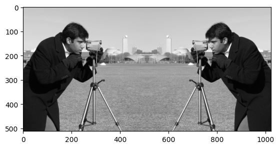

---
jupyter:
  jupytext:
    formats: ipynb,Rmd
    text_representation:
      extension: .Rmd
      format_name: rmarkdown
      format_version: '1.2'
      jupytext_version: 1.17.3
  kernelspec:
    display_name: Python 3 (ipykernel)
    language: python
    name: python3
---

# (Scikit-) Image processing, via NumPy and SciPy

This page will explore foundational image processing techniques, as operations
on the values in a NumPy image array. First, we will explore how to achieve
specific effects using NumPy and SciPy. We will demonstrate what these
operations are doing to an image at the level of the array pixels. After that,
we will show how more sophisticated extensions of these techniques can be
implemented with Scikit-image. We will focus on the way that Scikit image
often uses NumPy and SciPy operations "under the hood".

[Remember that](ip-maxim) *"image processing" is when we do something that
analyzes or changes the numbers inside the image array*? Well, in fact, all
that even the fanciest image processing software is doing is changing the
pixel values inside image arrays, in various ways. This is true for image
processing software with a graphical user interface, like [Adobe
Photoshop](https://www.adobe.com/th_en/products/photoshop) and [the GNU Image
Manipulation Program](https://www.gimp.org), as well as for code-based image
processing software like Scikit-image.

Let's again build a simple image array, and look at the ways we can use NumPy alone to achieve some pretty radical changes to the original image. We will then look at the specific purposes that such changes are used for, with more complex images.

First, we create do our usual imports, and create our image array:

```{python}
import numpy as np
import matplotlib.pyplot as plt
import skimage as ski

# Import a custom function to give hints for some exercises.
from hints import hint_split_i, hint_cryptic_camera

# Set precision for float numbers
# %precision 2

# Set 'gray' as the default colormap
plt.rcParams['image.cmap'] = 'gray'

# A custom function for showing image attributes.
from show_attributes import show_attributes

# Create our image array.
i_img = np.array([[0, 0, 0, 0, 0, 0, 0, 0],
                  [0, 0, 0, 1, 1, 0, 0, 0],
                  [0, 0, 0, 1, 1, 0, 0, 0],
                  [0, 0, 0, 0, 0, 0, 0, 0],
                  [0, 0, 0, 1, 1, 0, 0, 0],
                  [0, 0, 0, 1, 1, 0, 0, 0],
                  [0, 0, 0, 1, 1, 0, 0, 0],
                  [0, 0, 0, 1, 1, 0, 0, 0],
                  [0, 0, 0, 1, 1, 0, 0, 0],
                  [0, 0, 0, 1, 1, 0, 0, 0],
                  [0, 0, 0, 1, 1, 0, 0, 0],
                  [0, 0, 0, 1, 1, 0, 0, 0],
                  [0, 0, 0, 1, 1, 0, 0, 0],
                  [0, 0, 0, 1, 1, 0, 0, 0],
                  [0, 0, 0, 0, 0, 0, 0, 0]],
                  dtype=float)

# Show the image array.
plt.imshow(i_img);
```

We have [already encountered](np-flip) the use of `np.flip()` as a tool for
rudimentary image manipulation. We use it to, well, flip an image array on its
head:

```{python}
# Flip the array.
flipped_i = np.flip(i_img)

# Show the "raw" array pixel values.
flipped_i
```

```{python}
# Display the array with Matplotlib.
plt.imshow(flipped_i);
```

## Resizing by repeating

Now, *any operation that changes the numbers in the array* is a form of image manipulation. The term *image processing* generally means we are applying image manipulations *to achieve a specific purpose* - such as improving image quality or clarity.

Let's say we want to *resize* our image array. Using NumPy, there are many
ways to this same destination. Provided we want to *double* (or triple, or
quadruple) the size along a given dimension, we can achieve what we want using
`np.repeat()`.

```{python}
# Double the image, by repeating each row.
doubled_i_rows = np.repeat(i_img,
                           repeats=2,
                           axis=0)

# Show the "raw" array pixel values.
doubled_i_rows
```

```{python}
# Display the array with Matplotlib.
plt.imshow(doubled_i_rows);
```

We can compare the attributes, including the `shape` of each array, using a custom function we defined in the first cell of this notebook:

```{python}
show_attributes(i_img)
```

```{python}
show_attributes(doubled_i_rows)
```

We can see that we have twice the number of rows in the `doubled_i_rows` image.

We can also double along the columns, by setting `axis=1`:

```{python}
# Double along the columns.
doubled_i_cols = np.repeat(i_img,
                           repeats=2,
                           axis=1)
doubled_i_cols
```

```{python}
plt.imshow(doubled_i_cols);
```

```{python}
# Indeed, the columns have doubled.
show_attributes(doubled_i_cols)
```

By combining these operations, we can double along both the rows and the columns:

```{python}
# Double the whole image.
doubled_i =  np.repeat(i_img,
                       repeats=2,
                       axis=0)
double_doubled_i =  np.repeat(doubled_i,
                              repeats=2,
                              axis=1)
double_doubled_i
```

```{python}
plt.imshow(doubled_i);
```

```{python}
# The original image size was (15, 8).
show_attributes(double_doubled_i)
```

::: {exercise-start}
:label: i-!
:class: dropdown
:::

Use NumPy operations *only* to create the following image array, using the
`i_img` array as your starting point:


Your final array should have the following attributes:

```
Type: <class 'numpy.ndarray'>
dtype: float64
Shape: (30, 8)
Max Pixel Value: 1.0
Min Pixel Value: 0.0
```

*Hint*: you may want to investigate NumPy functions for combining arrays

```{python}
i_exclam = i_img.copy()
# YOUR CODE HERE
```

::: {exercise-end}
:::

::: {solution-start} i-!
:class: dropdown
:::

You can do this in one line of code by using a combination of `np.concat()`, `np.flip()` and `plt.imshow()`. Notably,`np.concat()` will "stick" (concatenate) arrays together, rather than `np.repeat()`-ing the values... 

Combined with `np.flip()` we can produce the desired result in one line of code:

```{python}
# Combine the two `i_img` arrays, flip the second.
plt.imshow(np.concat([i_img, np.flip(i_img)]));
```

::: {solution-end}
:::


::: {exercise-start}
:label: split-i
:class: dropdown
:::

Here again is the `i_img` array, and a printout of its attributes:

```{python}
plt.imshow(i_img)
show_attributes(i_img);
```

Your task is to find a way, again using only NumPy, to alter the `i_img` array so it becomes this target image:


The output image should have the following attributes:

```
Type: <class 'numpy.ndarray'>
dtype: float64
Shape: (15, 7)
Max Pixel Value: 1.0
Min Pixel Value: -1.0
```

*Note*: notice how we have lost a column, relative to the original `i_img` array...  We also now have -1 values in the array. Have a think about which colors in the displayed image you think that these negative values will correspond to.

*Hint:* there are various ways to do this, but the most efficient way we could think of is one short line of Numpy processing.  You might consider having a look at [Functions on arrays](https://inferentialthinking.com/chapters/05/1/Arrays.html#functions-on-arrays) for inspiration.

*Hint:* run the function `hint_split_i()`, which was imported at the beginning
of this notebook, to see a helpful hint.

```{python}
# YOUR CODE HERE
split_i = ...
```

::: {exercise-end}
:::

::: {solution-start} split-i
:class: dropdown
:::

The target image can be created using the `np.diff()` function, which calculates the difference between adjacent values in an array. By default `np.diff()` operates in steps of 1 across the columns:

```{python}
# Calculate the difference between values along the columns, in steps of 1.
split_i_solution = np.diff(i_img)

# Show the "raw" NumPy array.
print(split_i_solution)

# Display the image.
plt.imshow(split_i_solution);
```

Why is the background now gray? Well, [remember that](color-and-matplotlib),
for a single-channel image, colors arise from applying the current colormap.
Visualised with the `gray` colormap: the most intense (highest value) pixels
are white, and the least intense (lowest value) pixels are black, and
intermediate values are a shade of gray.

When we subtract along the column, with `np.diff()` the third value is subtracted from the fourth value etc., and so the resulting differences are calculated as:

- `1 - 0 = 1` for 1 values on the left-hand side of the original image, and...

- ...`0 - 1 = -1` for 1 values on the right-hand side of the original image...

- ...and `1 - 1 = 0` for adjacent 1's; `0 - 0 = 0` for adjacent 0's.

Essentially we are detecting *edges* (big changes in intensity between adjacent pixels) in the horizontal direction (e.g. within each row, along the columns):

```{python}
# Show before/after applying `np.diff()` to the image array.
print(f'\nBefore:\n {i_img}')
print(f'\nAfter:\n {split_i_solution}')
```

So our highest values are now 1, our lowest values are -1, and our intermediate values are 0 (e.g. where the difference between elements was calculated from `1 - 1 = 0` or `0 - 0 = 0`, indicating no change in the *gradient* of pixel intensity). A range from -1 to 1 is still supported in `skimage` for the `float64` `dtype`.

White areas (pixel = 1) indicate a change between pixels in the horizontal direction (moving left-to-right) from black-to-white, in the original image. Black areas (pixel = -1) indicate a change in the horizontal direction from white-to-black. Grey areas indicate no change (pixel = 0).

We can detect big changes (edges) in the *vertical* direction by telling `np.diff()` to operate along the rows, rather than along the columns:

```{python}
vertical_gradients = np.diff(i_img,
                             axis=0) # Subtract along the rows, not the columns.

plt.imshow(vertical_gradients);
```

::: {solution-end}
:::


## Resizing an image with `skimage`

The `ski.transform` module contains a function called `resize`.  Somewhat
obviously, `ski.transform.resize()` takes an input image and a requested image
shape, and returns an output image of the requested size.  Because all
computer images are at least 2D arrays, this involves changing the shape of
the image. Let's demonstrate this with the following image array:

```{python}
# Create an image array.
squares = np.array([[1, 0,],
                    [0, 1,]],
                   dtype=float)

# Show the array ("raw" output from NumPy)
squares
```

```{python}
# Show the array, visualised with Matplotlib
plt.matshow(squares);
```

What happens if we resize `squares` to (10, 10)? We will use the optional Boolean `preserve_range` argument for forward compatibility with the next big release of the Scikit-image package.  It has the effect of preventing some automatic processing of the range of values in the image array on input.

```{python}
# Pass our `squares` array to the `ski.transform.resize()` function.
squares_ten_by_ten = ski.transform.resize(squares,
                                          output_shape=(10, 10),
                                          preserve_range=True)

# Show the resized array.
squares_ten_by_ten
```

```{python}
# Show the image attributes.
show_attributes(squares_ten_by_ten)
```

```{python}
# Display the image.
plt.imshow(squares_ten_by_ten);
```

Well, that is certainly more artistic than the original!

We now have many more `unique` values in the output array than there were in the input array (the input array contained only 0's and 1's), because `skimage` is *interpolating* for many new pixels.  *Interpolation* is the process of estimating values for the new pixels which fall in between the array pixels from the original array image, based on the weighted average of the values of the original pixels to which they are nearest.

```{python}
# Show the `unique` values.
np.unique(squares_ten_by_ten)
```

The array pixels highlighted in red are the original pixels from the `(2, 2)`
original array:


All the other pixels have been added by `skimage` during the `resize`-ing process. Pixels closer to the original pixels share closer intensity values to the original pixel (meaning they are more black or more white, depending on the original pixel). Images further from the original pixels become more gray.

We can control the type of interpolation that `skimage` uses by changing the
(somewhat cryptically named) `order` argument. Setting `order=0` will activate
[nearest neighbor
interpolation](https://en.wikipedia.org/wiki/Nearest-neighbor_interpolation).
This method of interpolation (estimation) merely uses the nearest existing
pixel to give the value for any new pixel in the output image.

```{python}
# Pass our `squares` array to the `ski.transform.resize()` function.
squares_ten_by_ten = ski.transform.resize(squares,
                                          output_shape=(10, 10),
                                          preserve_range=True,
                                          order=0) # Nearest neighbor

# Show the resized array.
plt.imshow(squares_ten_by_ten);
```

This seems much closer to what we want when we `resize` the image. However, the results of image processing are highly context-dependent, and there may be images for which the default interpolation setting works better...


## Rotation

Another common image manipulation we may want to do is to rotate an image.

### Rotations in 90 degree increments

Should we only want to rotate by increments of 90 degrees, we can use the
helpfully named `np.rot90()` function:


```{python}
# Rotate the image.
rotated_i = np.rot90(i_img)
rotated_i
```

```{python}
plt.imshow(rotated_i);
```

We can control the number of rotations with the `k` argument:

```{python}
# Rotate the image, twice!
rotated_i_180 = np.rot90(i_img,
                         k=2) # Two 90 degree rotations.
rotated_i_180
```

```{python}
plt.imshow(rotated_i_180);
```

Rotating in increments of 90 degrees will not change the *size* (e.g. number of pixels) in the array, however it will change the integer index location of the pixel values:

```{python}
# Show the shape of the original image and both 90 degree rotated images.
plt.subplot(1, 3, 1)
plt.title(f"`.shape` = {i_img.shape}")
plt.imshow(i_img)
plt.subplot(1, 3, 2)
plt.title(f"`.shape` = {rotated_i.shape}")
plt.imshow(rotated_i)
plt.subplot(1, 3, 3)
plt.title(f"`.shape` = {rotated_i_180.shape}")
plt.imshow(rotated_i_180);
```

```{python}
# Original image and 90 degree rotations all have the same number of elements (15*8 = 120)
i_img.size == rotated_i.size == rotated_i_180.size
```

### Rotations by arbitrary angles with Scipy

To rotate an image by more flexible increments than 90 degrees, we need to
bring in SciPy, another foundation library for Scikit-image. The SciPy
function `ndimage.rotate()` offers more flexible rotation. However, rotating
by other angles will alter both the `shape` and `size` of the output image:

```{python}
# Import SciPy using the conventional name (`sp`).
import scipy as sp

# Rotate the image by 193 degrees.
rotated_i_193 = sp.ndimage.rotate(i_img,
                                  angle=193) # Specify the rotation angle.

# Show the "raw" array.
rotated_i_193
```

```{python}
# Render the image graphically.
plt.imshow(rotated_i_193);
```

```{python}
# Show the attributes of the rotated image.
show_attributes(rotated_i_193)
```

The cell below will loop through some different rotation angles, the `shape` of each image is shown below each plot:

```{python}
# A for loop to show multiple rotations, and the effect on
# the shape of the resultant image array.
plt.figure(figsize=(12, 4))
for i, i_2 in enumerate(np.arange(361, step=45)):
    plt.subplot(1, 9, i+1)
    current_rot = sp.ndimage.rotate(i_img, 
                                    angle=i_2)
    plt.imshow(current_rot)
    plt.title(f"{i_2}°")
    plt.xlabel(f"{current_rot.shape}")
    plt.xticks([])
    plt.yticks([])
```

By default, the `shape` is altered so that the rotated original array is shown
within the output array. SciPy uses interpolation to estimate the values of
the pixels it adds, where the `shape` of the output image is larger than the
`shape` of the input image.

We can disable this behaviour by settings `reshape=False`, however, this means that we will clip any parts of the array that have been rotated out of the field of view of the original array shape.

```{python}
# A for loop to show multiple rotations, and the effect on
# the shape of the resultant image array, but this time
# we do not allow SciPy to reshape the output arrays.
plt.figure(figsize=(12, 4))
for i, i_2 in enumerate(np.arange(361, step=45)):
    plt.subplot(1, 9, i+1)
    current_rot = sp.ndimage.rotate(i_img,
                                    angle=i_2,
                                    reshape=False) # Don't reshape output.
    plt.imshow(current_rot)
    plt.title(f"{i_2}°")
    plt.xlabel(f"{current_rot.shape}")
    plt.xticks([])
    plt.yticks([])
```

## Rotating with `skimage`

Let's now look now at how rotating image arrays is handled in `skimage`. Image rotation, which we saw above using `np.rot90` and `scipy.ndimage.rotate()` can be achieved using the straightforwardly named `ski.transform.rotate()`, and the syntax works identically to `scipy.ndimage.rotate()`. All this rotating has left us thirsty and caffeine-deprived, so let's get some `coffee`:

```{python}
# Import and show an image.
coffee = ski.data.coffee()
plt.imshow(coffee);
```

We can achieve easy and flexible rotation with `ski.transform.rotate()`:

```{python}
# Rotate the `coffee` image with `skimage`.
# resize=True ensures all the original image fits inside the output.
rotated_coffee = ski.transform.rotate(coffee,
                                      angle=75,
                                      resize=True)

plt.imshow(rotated_coffee);
```

The cell below plots a variety of rotations, using `skimage.transform.rotate()` to perform each rotation, this time disabling resize of the output to fit the rotated input.

```{python}
# Many rotations...
plt.figure(figsize=(16, 10))
for i, i_2 in enumerate(np.arange(361, step=45)):
    plt.subplot(3, 3, i+1)
    current_rot = ski.transform.rotate(coffee,
                                       angle=i_2,
                                       resize=False)
    plt.imshow(current_rot)
    plt.title(f"{i_2}°")
    plt.xticks([])
    plt.yticks([])
```

## Rotation compared to flips and transpos

Rotating is a different operation that flipping the image with `np.flip`.  Flipping causes a reflection in the image around its center.  The difference between rotation and applying a flip becomes obvious with an image that is not left-right symmetrical.

The cell below demonstrates `np.flip`-ping an image, as well as `np.rot`-ating an image by 180 degrees:

```{python}
# Load in `camera`
camera = ski.data.camera()

# Rotate, flip 'n' plot!
plt.figure(figsize=(14, 4))
plt.subplot(1, 3, 1)
plt.imshow(camera)
plt.title('Original')
plt.subplot(1, 3, 2)
plt.imshow(np.rot90(camera, k=2))
plt.title('np.rot90(k=2)')
plt.subplot(1, 3, 3)
plt.imshow(np.flip(camera))
plt.title('np.flip()');
```

Similarly, rotations differ from transpose operations on the array.

Specifically for 90 degree rotations, you might be tempted to use a NumPy shortcut, and use the `.T` (transpose) method. This however, will do something different to rotation. The cell below demonstrates the `.T` method, with the `camera` image:

```{python}
# Transpose `camera`.
camera_transposed = camera.T
show_attributes(camera_transposed)
plt.imshow(camera_transposed)
plt.title("camera.T");
```

We now show a 90 degree rotation, using `ski.transform.rotate()`

```{python}
# Rotate by 90 degrees.
plt.imshow(ski.transform.rotate(camera, 
                                angle=90))
plt.title('ski.transform.rotate()');
```

We can see that the cameraman is facing a different direction in each image (taking a photo of the bottom of the image for the `.T` method, and taking a photo of the top of the image for a 90 degree rotation via `skimage`).

The difference here is that transposing an image switches the rows and columns, such that the first row becomes the first column etc. Conversely, `skimage.transform.rotate()` pivots the pixels around a central point. Essentially, transposing gives a *mirroring effect* which is different from a rotation.

Pay attention to the location of the spoon in the `coffee` image. First, we `ski.transform.rotate()` it by 90 degrees. Then, we show it `.transpose`d, switching the rows and columns. As `coffee` is a 3D image, the `.T` method will produce an error, because the color channels will be moved into the wrong dimension - to avoid this we use the `.transpose` method, to keep the color channels in the third dimension, whilst switching the rows and columns:

```{python}
# The `shape` of the original `coffee` image.
coffee.shape
```

```{python}
# Why we cannot use the `.T` method. We get an array which
# is the wrong `shape` for a color image!
coffee.T.shape
```

```{python}
# Move the columns into the rows, the rows into the columns, and leave the
# color channels in the third dimension.
coffee_transposed = coffee.transpose((1, 0, 2))
plt.imshow(coffee_transposed)

# Show the attributes (not that the `shape` is still correct for a color
# image).
show_attributes(coffee_transposed)
```

Compare this to a 90 degree rotation via `skimage`; pay attention to the
spoon!

```{python}
# Show the difference between rotating and transposing.
plt.subplot(1, 2, 1)
plt.imshow(ski.transform.rotate(coffee, angle=90, resize=True))
plt.title("ski.transform.rotate()")
plt.axis('off')
plt.subplot(1, 2, 2)
plt.imshow(coffee_transposed)
plt.title(".transpose()")
plt.axis('off');
```

Unless you specifically want a mirroring transformation, then use `.rotate()`!


::: {exercise-start}
:label: look-at-me
:class: dropdown
:::

Your mission now is to transform `camera` into this slightly brain-bending image:



For comparison, here is the original `camera` image and its attributes:

```{python}
camera = ski.data.camera()
plt.imshow(camera)
```

```{python}
show_attributes(camera)
```

Your final image should have the following attributes:

```
Type: <class 'numpy.ndarray'>
dtype: uint8
Shape: (512, 1024)
Max Pixel Value: 255
Min Pixel Value: 0
```

*Hint*: if you did not complete the earlier exercise involving combining two
`i_img` arrays, then you may want to investigate NumPy functions for combining
arrays together to complete the current exercise...

*Caution:* you may run into some errors/odd outcomes because of `dtype`s
here... so use the `ski.util` conversion functions if you need to...

```{python}
# YOUR CODE HERE
look_at_me = ski.data.camera()
```

::: {exercise-end}
:::

::: {solution-start} look-at-me
:class: dropdown
:::

Here we need a transpose operation, followed by a rotation, followed by a concatenation.

That is a mouthful, let's break it down. First we transpose the `camera` array, we can use `.T` here rather than `.transpose` as we are dealing with a 2D grayscale image:

```{python}
# Transpose `camera`.
camera = ski.data.camera()
mirror_camera = camera.T
plt.imshow(mirror_camera);
```

Now the image is transposed, we have achieved our "mirror" effect. To get this mirrored cameraman to look the other guy in the eye, we now need to rotate the image 270 degrees, for which we use `ski.transform.rotate()`:

```{python}
# Rotate and show.
rotated_mirror_camera = ski.transform.rotate(mirror_camera,
                                             angle=270,
                                             resize=True) # Preserve shape.
plt.imshow(rotated_mirror_camera);
```

Now, we must combine the images, using `np.concat()`, combining along the columns (`axis = 1`). First, however, we need to ensure the `dtype`s match! If we don't we get an unexpected result:

```{python}
# Combine the images, non-matching `dtype`s...
look_at_me = np.concat([camera, rotated_mirror_camera], axis=1)
plt.imshow(look_at_me);
```

Oops. This has occurred because `ski.transform.rotate()` has converted the image to the `float64` dtype, whereas the original is `uint8`:

```{python}
# The attributes of the original image (look at the `dtype`).
show_attributes(camera)
```

```{python}
# The attributes of the rotated mirror image (look at the `dtype`).
show_attributes(rotated_mirror_camera)
```

Using `ski.util.img_as_ubyte()` will ensure that the pixel values match, giving us our final, surreal result:

```{python}
# Ensure matching `dtype`s.
rotated_mirror_camera = ski.util.img_as_ubyte(rotated_mirror_camera)

# Combine the images and show the result.
look_at_me = np.concat([camera, rotated_mirror_camera], axis=1)
plt.imshow(look_at_me);
```

If in doubt, check the `dtype`!

::: {solution-end}
:::


::: {exercise-start}
:label: yellow-fellow
:class: dropdown
:::

For this exercise, you should load in the `cat` image from `ski.data`. Here is the original `cat` image:

```{python}
cat = ski.data.cat()
plt.imshow(cat)
```

The original image has the following attributes:

```{python}
show_attributes(cat)
```

Now, using only `numpy` and `skimage`, try to recreate this target image:


...poor cat!

Your output image should have the following attributes:

```
Type: <class 'numpy.ndarray'>
dtype: float64
Shape: (30, 30, 3)
Max Pixel Value: 0.76
Min Pixel Value: 0.0
```

*Hint*: Note the yellow tinge to the image.  You can achieve this tinge by modifying the weights of the colors in the image.

```{python}
# YOUR CODE HERE
```

::: {exercise-end}
:::

::: {solution-start} yellow-fellow
:class: dropdown
:::

The solution here again involves multiple steps. First we load in the `cat` image:

```{python}
# Load in and show the `cat` image.
cat_solution = ski.data.cat()
show_attributes(cat_solution)
plt.imshow(cat_solution);
```

Next, to replicate the yellow-y tone of the target image, we "switch off" the blue color channel (because red + green = yellow):

```{python}
# Make it yellow!
cat_solution[:, :, 2] = 0
plt.imshow(cat_solution);
```

The target image has the `.shape` (30, 30, 3); the original image has the `.shape` (300, 451, 3).

To get the correct output image size, we must *downscale* the image. To do this, we can use `ski.transform.resize()`:

```{python}
# Downscale the image.
cat_solution = ski.transform.resize(cat_solution,
                                    output_shape=(30, 30, 3))
# Show the result.
show_attributes(cat_solution)
plt.imshow(cat_solution);
```

You'll notice that downsizing the image has seriously downgraded the quality. This makes sense, because the original high-resolution image utilized its many pixels to depict intricate details. After resizing to a lower-resolution, this detail is lost, because now we are trying to show the same image using substantially fewer pixels. `skimage` has done some averaging behind the scenes, to work out what should go in the remaining pixels. At least we can still see the image is of a cat...

Now, we can see that the target image requires a rotation, through good judgment, or just trial and error, we can work out that this needs to be 45 degrees. We can also see that the image of the downscaled cat does not "fit" inside the final image. As such, we need to rotate *without resizing* the image. By default, `resize=False` so we can leave it on the default setting:

```{python}
# Rotate and show the result.
cat_solution = ski.transform.rotate(cat_solution,
                                    angle=45)
show_attributes(cat_solution)
plt.imshow(cat_solution);
```

We will leave it to you to use this image as a logo for your "Pixel Cat" [meme coin](https://en.wikipedia.org/wiki/Meme_coin).

```{python tags=c("remove-cell", "hide-output")}
# We regenerate and store the output image for page generation, used above.
# Check this code against the solution code above.
cat_out = ski.data.cat()
cat_out[:, :, 2] = 0  # Apply yellow tinge.
small_cat = ski.transform.resize(cat_out, output_shape=(30, 30, 3))
rot_cat = ski.transform.rotate(cat_solution, angle=45)
plt.imshow(rot_cat);
plt.savefig('images/poor_cat.png')
```

::: {solution-end}
:::


## Cropping

The process of *cropping* is the removal of areas of pixels from an image.

Because our images are just NumPy arrays, cropping is just NumPy indexing
(duh!). As such, we can crop images just with indexing operations, without
using specific NumPy (or `skimage`) functions.

For instance, we can "shave" our `i_img` array in half, along the columns by slicing along the columns:

```{python}
# Cut in half.
half_i = i_img[:, 4:8]
half_i
```

```{python}
plt.imshow(half_i);
```

Likewise along the rows (albeit the number of rows is odd!):

```{python}
plt.imshow(i_img[0:8, :]);
```

::: {exercise-start}
:label: cropped-camera
:class: dropdown
:::

Take the original `camera` image:

```{python}
camera = ski.data.camera()
plt.imshow(camera)
```

...and crop it down to this target image, using only NumPy indexing:


These are the attributes that your final image should possess:

```
Type: <class 'numpy.ndarray'>
dtype: uint8
Shape: (30, 80)
Max Pixel Value: 250
Min Pixel Value: 23
```

*Hint:* using `plt.grid()` might be of use here...

```{python}
# YOUR CODE HERE
camera_crop_exercise = camera.copy()
plt.imshow(camera);
```

::: {exercise-end}
:::

::: {solution-start} cropped-camera
:class: dropdown
:::

This is a simple task once you know what indices you need. Using `plt.grid()` can make this information easier to obtain:

```{python}
# Show `camera`, with a helpful grid.
plt.imshow(camera)
plt.grid();
```

The exact indices we used are here:

```{python}
# Solution.
plt.imshow(camera[130:160, 240:320]);
```

```{python}
# Solution (attributes).
show_attributes(camera[130:160, 240:320])
```

::: {solution-end}
:::


## Masks

In image processing, a mask is an array where the elements express weights or binary (0 or 1) values to select areas in another image (array).

A mask is "placed" on an image, and one typically then applies operations to
the pixels indicated by the mask.  For example, one might use the mask with an
image array to replace pixels indicated by the mask with a specific value.
Let's demonstrate with a real image — a grayscale version of the standard
`coffee` image:

```{python}
# Make coffee RGB image into single-channel image.
coffee_gray = ski.color.rgb2gray(ski.data.coffee())
show_attributes(coffee_gray)
plt.imshow(coffee_gray);
```

In this case we are going to create a new mask image, that corresponds to the
`coffee_gray` image (has the same shape), but where we will create the mask
values with a mathematical formula using the row and column indices.  In fact
we'll do this to create a circular mask.  Bear with us, all should be come
clear as we go.

```{python}
# Unpack and store the number of rows and number of columns.
dim_0, dim_1 = coffee_gray.shape
dim_0, dim_1
```

We are going to create a circular mask, using the formula for a circle.

That formula needs the `i` (row) and `j` coordinates for each pixel, the center coordinate of the circle, and the radius `r` of the desired circle.

Call the row and column center coordinates $c_i, c_j$ respectively.

We can tell if a particular pixel at (`i`, `j`) is _outside_ the circle by testing whether the Euclidean distance of the pixel position (`i`, `j`) from the center is greater than $r$.

$$
\sqrt{(i - c_i)^2 + (j - c_j)^2} > r
$$


First we use the Numpy `meshgrid` function to return two arrays, one containing all the `i` (row) coordinates at each pixel, and another containing all the `j` (column) coordinates at each pixel.

```{python}
# indexing='ij' tells meshgrid to return `i` and `j` coordinates.  There are other modes, not relevant here.
i_coords, j_coords = np.meshgrid(np.arange(dim_0), np.arange(dim_1), indexing='ij')
# i coordinate for each element.
i_coords
```

```{python}
# j coordinate for each element.
j_coords
```

```{python}
# The image center in pixels
c_i, c_j = dim_0 / 2, dim_1 / 2
# Radius
r = 275
```

We can then use the formula above to generate a 2D array where True (== 1) means outside the circle and False (== 0) means inside the circle.

```{python}
# Create a circular mask.
mask = np.sqrt((i_coords - c_i) ** 2 + (j_coords - c_j) ** 2) > r
show_attributes(mask)
plt.imshow(mask);
```

Once we have our mask - which is just a Boolean array - it is just a matter of Boolean indexing to set all the pixel values in the image to the same value, where there is a True in the corresponding element in the mask:

```{python}
# Apply the mask.
coffee_gray_masked = coffee_gray.copy()
coffee_gray_masked[mask] = 0

plt.matshow(coffee_gray_masked);
```

::: {exercise-start}
:label: masked-man
:class: dropdown
:::


Start with the `camera` image:

```{python}
camera = ski.data.camera()
plt.imshow(camera);
```

Now consider this formula, where $p$ is some constant:

$$
((i - c_i)^3 + (j - c_j)^3)^{1/3} > p
$$

(where $x^{1/3}$ is the cube-root of $x$).

Use that formula, with some suitable value for `p`, and masking as above, to create the following image:


::: {exercise-end}
:::

::: {solution-start} masked-man
:class: dropdown
:::

We apply the formula above to the `i` and `j` coordinates of the `camera`
image:

```{python}
# Solution pt 1.
cam_c_i, cam_c_j = np.array(camera.shape) / 2
p = 55  # By experiment.
i_camera, j_camera = np.meshgrid(np.arange(camera.shape[0]), np.arange(camera.shape[1]))
# Apply formula to make mask.
mask_camera = ((i_camera - cam_c_i) ** 3 + (j_camera - cam_c_j) ** 3) ** (1 / 3) > p
plt.imshow(mask_camera);
```

```{python}
# Solution pt 2.
camera_masked_solution = camera.copy()
camera_masked_solution[mask_camera] = 1
plt.imshow(camera_masked_solution);
```

```{python tags=c("remove-cell", "hide-output")}
# Regenerate and store the output image for page build, used above.
plt.imshow(camera_masked_solution);
plt.savefig('images/masked_camera.png')
```

::: {solution-end}
:::


# Inverting image colors

We saw *color inversion* on an [earlier page](0_images_as_numpy_arrays). This is where all the pixel values in an image are, shockingly, inverted: high numbers become low numbers and vice versa:

For a binary image, this involves swapping 1s and 0s...

```{python}
# Original image
print(i_img)
plt.imshow(i_img);
```

...which can be accomplished with some simple numeric operations:

```{python}
inverted_i = (i_img * -1) + 1
print(inverted_i)
plt.imshow(inverted_i);
```

What about a color image? 

```{python}
# Read in a color image.
colorwheel = ski.io.imread("images/colorwheel.png")
show_attributes(colorwheel)
plt.imshow(colorwheel);
```

The numerical trick that we used with the binary image will not work for a color image like this, because the pixel values range from 0 to 255. -255 is not allowed within the acceptable range for `uint8` image data and will produce an error!

```{python tags=c("raises-exception")}
# Shortcut will not work for color images
plt.imshow(colorwheel * -1)
```

But remember that inversion means we, well, "invert" the pixel values. Because the maximum value is now 255, we can subtract each array pixel value in each color channel from 255 to "reverse" the values:

```{python}
# Invert the color image, manually.
inverted_colorwheel = colorwheel.copy()
for i in np.arange(3):
    inverted_colorwheel[:, :, i] = 255 - inverted_colorwheel[:, :, i] 
    
plt.imshow(inverted_colorwheel);
```

# Inverting colors with `skimage`

`ski.util.invert()` handles color inversion, we simply pass it a color NumPy image array and voilà!:

```{python}
# Invert the color image, with `skimage`.
invert_colorwheel_with_skimage = ski.util.invert(colorwheel)
plt.imshow(invert_colorwheel_with_skimage);
```

::: {exercise-start}
:label: inv-brick
:class: dropdown
:::

Now over to you. Your task here is to load the `brick` image from `ski.data.image`.

You should then invert every 2nd element on even numbered rows...

So on *even* numbered rows (row 0, 2, 4, 6, etc.), if you went through the elements in pairs along the row, the *second* element in each pair should be inverted, vs the original image.

The original `brick` image looks like this:


The original image has the following attributes:

```
Type: <class 'numpy.ndarray'>
dtype: uint8
Shape: (512, 512)
Max Pixel Value: 207
Min Pixel Value: 63 
```

Your final image should look like this:


Your new image should have the following attributes:

```
Type: <class 'numpy.ndarray'>
dtype: uint8
Shape: (512, 512)
Max Pixel Value: 207
Min Pixel Value: 48 
```

Use only NumPy indexing and Scikit-image functions to do this...

*Hint:* remember that smaller NumPy arrays indexed out of larger NumPy arrays are still NumPy arrays, and so can be passed as arguments to most `skimage` functions.

```{python}
# YOUR CODE HERE
```

::: {exercise-end}
:::

::: {solution-start} inv-brick
:class: dropdown
:::


The solution here is just to use slicing to select the elements we need, and `ski.util.invert()` just these elements, using array indexing.

To get every 2nd element on even numbered rows, we can use `brick[0::2, 1::2]`.

This is easier to appreciate in a smaller array:

```{python}
small_arr = np.zeros((8, 8))
small_arr
```

```{python}
# Get every second element, on even numbered rows.
small_arr[0::2, 1::2] = 1
small_arr
```

```{python}
# Show the small array (0 elements are now gray).
plt.imshow(small_arr);
```

We can invert just the pixel values at these locations, by passing the slices to `ski.util.invert()`:

```{python}
# Solution.
brick_solution = ski.data.brick()

brick_solution[0::2, 1::2] = ski.util.invert(brick_solution[0::2, 1::2])

show_attributes(brick_solution)
plt.imshow(brick_solution);
```

::: {solution-end}
:::

::: {exercise-start}
:label: inverted-purple
:class: dropdown
:::

Again using the `cat` image, try to recreate the following target image, using only `numpy` and `skimage`:


Your output image should have the following attributes:

```
Type: <class 'numpy.ndarray'>
dtype: uint8
Shape: (300, 451, 3)
Max Pixel Value: 255
Min Pixel Value: 24
```

```{python}
# YOUR CODE HERE
cat = ski.data.cat()
plt.imshow(cat);
show_attributes(cat)
```

::: {exercise-end}
:::

::: {solution-start} inverted-purple
:class: dropdown
:::

The target image *cannot* be created using just `ski.util.invert()` on the whole `cat` image array:

```{python}
cat_solution_2 = ski.data.cat()
plt.imshow(ski.util.invert(cat_solution_2));
```

This looks cool - if anything *cooler* than the target image - but it is not what we want.

To recreate the target image, we must "switch" off the green color channel *before* we invert the colors:

```{python}
cat_purple = cat_solution_2.copy()
cat_purple[:, :, 1] = 0
plt.imshow(cat_purple);
```

Now, when we invert the purple `cat` image, we get the target image:

```{python}
# Solution.
plt.imshow(ski.util.invert(cat_purple));
```

::: {solution-end}
:::

# Greyscale to binary conversion

Greyscale to binary conversion can be achieved using comparison operators (`<`, `>`, `<=`, `>=`, `==`). The resulting Boolean array will always be binary.

Let's demonstrate with a grayscale image:

```{python}
# Create a grayscale image.
np.random.seed(10)
random_check = np.array([[1, 0, 1, 0], 
                         [0, 1, 0, 1],
                         [1, 0, 1, 0],
                         [0, 1, 0, 1]], dtype=int)
random_check[random_check == 1] = np.random.randint(low=3,
                                                    high=11,
                                                    size=np.sum(random_check == 1))
plt.matshow(random_check);
```

```{python}
# Convert to a binary image:
binary_check = random_check > np.median(random_check)
print(binary_check)
plt.matshow(binary_check);
```

We can also easily achieve this conversion in `skimage` - see the [filtering page](5_mean_filter) for more detail. For now, we can use the `ski.filters.threshold_minimum()` function. This supplies us a recommended threshold value to attempt to divide the array pixels into two classes e.g. two classes where the pixels in each class are maximally different from pixels in the other class:

```{python}
# Get a recommended threshold from `skimage`.
threshold = ski.filters.threshold_minimum(random_check)
threshold
```

We can then use this threshold to create a binary array, successfully binarizing our grayscale image:

```{python}
# Binarize the array, based on the threshold.
binary_check_from_ski = random_check > threshold
show_attributes(binary_check_from_ski)
plt.matshow(binary_check_from_ski);
```

# Color to grayscale conversion

To downgrade a color image to grayscale we can use a brute force method of taking the mean of the three color channels, to produce a 2D monochrome image array:

```{python}
gray_wheel = np.mean(colorwheel, 
                     axis=2)

plt.imshow(gray_wheel);
```

A better option here, that we encountered on the [previous page](2_skimage_intro), is to use the *luminance formula*:

$$
Y = 0.2126R + 0.7152G + 0.0722B
$$

This "collapses" a 3D color image into a 2D grayscale image via a weighted sum of the channels.

::: {exercise-start}
:label: gray-wheel
:class: dropdown
:::

Here is the original `colorwheel` image:


It has the following attributes:

```
Type: <class 'numpy.ndarray'>
dtype: uint8
Shape: (370, 371, 3)
Max Pixel Value: 255
Min Pixel Value: 0
```

Using the luminance formula, and any other required `numpy`, `scipy` or `skimage` operations, recreate the target image below, starting from the `colorwheel` array:


Your final image should have the following attributes:

```
Type: <class 'numpy.ndarray'>
dtype: uint8
Shape: (370, 371)
Max Pixel Value: 255
Min Pixel Value: 0
```

Try to use `np.dot()` rather than slicing, when you complete this exercise.

*Hint*: you may need to rescale the intensity values to match the target image attributes. You may recall there is a `ski.exposure` function which can help you do this...

```{python}
# YOUR CODE HERE
```

::: {exercise-end}
:::

::: {solution-start} gray-wheel
:class: dropdown
:::

The solution here requires some close attention to `dtype`. To apply the luminance formula using `np.dot()` is pretty straightforward:

```{python}
# Solution pt 1.

# Luminance formula coefficients
weights = np.array([0.2126, 0.7152, 0.0722])

# Run the numbers...
gray_wheel = np.dot(colorwheel, weights)

# Show the result.
show_attributes(gray_wheel)
plt.imshow(gray_wheel);
```

But this gives us min/max pixel intensity values which are illegal for the `float64` dtype, and will generate an error when we try to convert to `uint8` to match the target image:

```{python tags=c("raises-exception")}
# Ouch!
ski.util.img_as_ubyte(gray_wheel)
```

The `ski.exposure.rescale_intensity()` function can save us again here. First, we make the values legal for a `float64` image (`np.dot()` left us with float values, as the weights in the luminance formula are decimal numbers):

```{python}
# Rescale the pixel intensity values into a legal range, for the current `dtype`.
gray_wheel = ski.exposure.rescale_intensity(gray_wheel,
                              out_range=(0, 1))

show_attributes(gray_wheel)
```

Now, we can painlessly convert to `uint8`. Finally, to match the target image, we must `ski.transform.invert()` our depressingly dreary colorwheel:

```{python}
# Convert to `uint8` `dtype`.
gray_wheel = ski.util.img_as_ubyte(gray_wheel)

# Invert the color and show the result.
gray_wheel =  ski.util.invert(gray_wheel)
show_attributes(gray_wheel)
plt.imshow(gray_wheel);
```

::: {solution-end}
:::


# Color to grayscale conversion with `skimage`

As always, the `ski.color` module has us covered here with the `rgb2gray()` function. We simply pass it the color array that we want to convert to grayscale, without the direct need for the luminance formula:

```{python}
# Convert color to grayscale.
gray_colorwheel_from_ski = ski.color.rgb2gray(colorwheel)
show_attributes(gray_colorwheel_from_ski)
plt.imshow(gray_colorwheel_from_ski);
```

# Summary

This page has shown how to implement some fundamental image processing operations with NumPy, SciPy and Scikit-image. The next page will delve into [image filtering](5_mean_filter).


# References

Gulati, J. (2024) *NumPy for Image Processing*. KDnuggets. Available from: https://www.kdnuggets.com/numpy-for-image-processing 

Adapted from:

* [Scientific Python Lecture Notes - image
  processing](https://lectures.scientific-python.org/advanced/image_processing)
* [Scientific Python Lecture Notes: scikit-image](https://lectures.scientific-python.org/packages/scikit-image/index.html)

with further inspiration from [`skimage`](https://github.com/scikit-image/skimage-tutorials) [tutorials](https://scipy-2024-image-analysis.github.io/tutorial/01_images_are_arrays.html).
