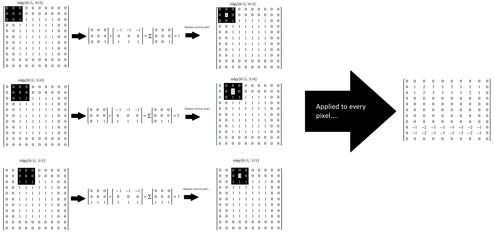

# Image filtering II

On the previous filtering page we looked at filters which use threshold values or convolution kernels to perform their filtering. This page will explore additional, foundational types of filters, implementing them first with NumPy and SciPy, and then with Scikit-image.

```{python}
# Library imports.
import numpy as np
import matplotlib.pyplot as plt
import scipy.ndimage as ndi
import skimage as ski
from mpl_toolkits.mplot3d import Axes3D

# Set 'gray' as the default colormap
plt.rcParams['image.cmap'] = 'gray'

# Set NumPy precision to 2 decimal places
np.set_printoptions(precision=2)

#  Custom functions for illustrations, and to quickly report image attributes.
from noise_illustration import generate_image, original_image
from gaussian_illustration import make_gaussian_kernel
from show_attributes import show_attributes
```

# Gaussian filter

A further important kernel-based filter with, let's be honest, a pretty cool name is the *Gaussian filter*. You may recognise the name from the famous [Gaussian distribution](https://en.wikipedia.org/wiki/Normal_distribution), which we plot below:

```{python}
# Plot a normal/Gaussian distribution.
plt.hist(np.random.normal(0, 10, 500000), 
         bins=128)
plt.xlabel('X value')
plt.ylabel('Probability')
plt.xticks([])
plt.yticks([]);
```

This is the well-known normal distribution, which is sometimes described as having a "bell-shape". We will talk in more detail further down the page about why the Gaussian filter has its name. For now, take a look at this fancy [kernel]( https://www.geeksforgeeks.org/deep-learning/types-of-convolution-kernels):

```{python}
# A fancy kernel.
gaussian_like_kernel = 1/16 * np.array([[1, 2, 1],
                                         [2, 4, 2],
                                         [1, 2, 1]])
gaussian_like_kernel
```

Imagine this kernel plotted in a 3D space. It is in the `shape` of `(3, 3)`, so imagine that the "floor" of the 3D plot is a 3-by-3 grid, with the integer index labels shown in the horizontal ($x$ and $y$-axis) directions. Imagine further that we plot the kernel element values in the vertical direction, on the $z$-axis. 

So on this plot, in the vertical direction, our graph will be highest where the kernel values are highest (e.g. for the centrel element of 0.25), and lowest where the kernel elements are lowest (e.g. in the corners for the values of 0.06).

Such a plot is shown below. A red surface connects the space in between each kernel value, to make the pattern between the individual elements clearer. The kernel values themselves are shown as dark blue text. The axis ticks show the integer index location of the kernel values, in the `gaussian_like_kernel` NumPy array:

```{python}
# Plot the fancy kernel, with a convenience function.
def kernel_plot(kernel, surface=True, elev=30, azim=-45, text=True):
    x = np.arange(kernel.shape[0])
    y = np.arange(kernel.shape[1])
    X, Y = np.meshgrid(x, y)
    Z = kernel
    fig = plt.figure(figsize=(9,9))
    ax = fig.add_subplot(111, projection='3d')
    if surface == True:
        ax.plot_surface(X, Y, Z, color='red')
    else:
        ax.plot_wireframe(X, Y, Z, color='red')
    ax.set_xticks(x)
    ax.set_yticks(y)
    ax.set_xlabel('Integer Index (axis = 0)')
    ax.set_ylabel('Integer Index (axis = 1)')
    ax.set_zlabel('Kernel Element Value', labelpad=1)
    ax.view_init(elev=elev, azim=azim) 
    if azim == 0:
        ax.set_zlabel("")
        ax.set_zticks([]) 
    if text == True:
        for i in np.arange(kernel.shape[0]):
            for j in np.arange(kernel.shape[1]):
                ax.text(i, j, kernel[i, j], 
                        str(kernel[i, j].round(2)), 
                        color='darkblue')
# Make the plot.            
kernel_plot(gaussian_like_kernel);
```

Now, it may not be immediately apparent to some readers what this plot has to do with a Gaussian distribution. For now let's use "Gaussian" very loosely - for the moment all we will take from it is that, like a Gaussian distribution, at the center the kernel has high values, then the values fall off as we get nearer to the sides. 

The kernel is shown, via the "raw" NumPy output, in the cell below. Compare this to the plot, to make sure you understand the visualisation. Remember that the numbers on the axis are the integer index locations of the NumPy array; the vertical height of the red surface is the value of the kernel element at each row/column intger index location:

```{python}
# Show the kernel again, in NumPy, for comparison to the plot.
gaussian_like_kernel
```

If you prefer, you can view the kernel with prettier graphics below:


Just as final comparison between the kernel NumPy array and the plot, here is the "red mountain" viewed from directly above, with the NumPy array kernel, in its pretty form, shown to its right hand side:


Remember that the kernel has only 9 values (shown as blue text on the plot), so there are no values in between the array values. If you prefer, we can visualise the kernel using a wireframe, to make it clearer that there are no values in between the kernal elements (e.g. in between the blue text):

```{python}
# Plot the fancy kernel.
kernel_plot(gaussian_like_kernel, surface=False)
```

Let's refer to the highest point on this kernel surface as the ["crimson peak"](https://en.wikipedia.org/wiki/Crimson_Peak). The crimson peak is the central kernel element of 0.25, at row/column integer index location `gaussian_like_kernel[1, 1]`:

```{python}
# The central kernel value (check that you can also see this on the graph above).
gaussian_like_kernel[1, 1]
```

Essentially, if we filter using this kernel, we "walk" this kernel through the image, with the top of the "crimson peak" centered on a given pixel. The central pixel value is then replaced with an average of the pixels in the neighbourhood, but *the other pixels in the neighbourhood are weighted by the height of the "red mountain" at that kernel value*. 

So array pixels which fall under higher points of the kernel's "red mountain" will exert more influence on the weighted average, and pixels falling under lower points will exert a weaker influence. The central pixel, laying under the crimson peak, will exert the most influence on the weighted average.

Let's use this kernel to filter the following small image:

```{python}
# Make a small image array.
small_square = np.zeros((20, 20))
small_square[9:11, 9:11] = 1
print(small_square)
plt.imshow(small_square);
```

We use use `scipy.ndimage.correlate()` to "walk" our kernel over every pixel in the image, multiply each array pixel value under the kernel by the corresponding kernel value, then take the sum of the result to replace the central pixel value:

```{python}
# Apply the `gaussian_like_kernel` to filter the image.
gaussian_like_filtered_small_square = ndi.correlate(small_square,
                                               weights=gaussian_like_kernel)

# Plot comparison images.
plt.figure(figsize=(10, 4))
plt.subplot(1, 3, 1)
plt.title('Original')
plt.imshow(small_square)
plt.subplot(1, 3, 2)
plt.title('Gaussian-like Filter \n(3, 3) Kernel')
plt.imshow(gaussian_like_filtered_small_square);
```

Blurry! So to recap, we have averaged with a 3-by-3 pixel neightbourhood, replacing the central value of the kernel with a weighted average of all the pixel values in the neighbourhood. The weights are larger for pixels closer to the central value (e.g. closer to the center of the "crimson peak" on the plot above).

This type of filtering is called *Gaussian filtering* because the kernel element values are from, or in the case of `gaussian_like_kernel`, approximate a 2-D Gaussian function. This is the function for the familiar [normal distribution](https://en.wikipedia.org/wiki/Normal_distribution) in two dimensions. The plot of the kernel above, with the "red mountain" may not look much like the normal distribution to you at the moment, but bear with us.

To see the Gaussian nature of this filtering operation, let's take a look at another, larger kernel below - it has `shape` `(9, 9)`:

```{python}
# Another kernel.
big_gaussian_kernel = make_gaussian_kernel(9)

big_gaussian_kernel.round(2)
```
Can you see any pattern in the arrangement of the numbers? Where are the high numbers, where are the low numbers? The `big_gaussian_kernel` NumPy array is shown below, in prettier form, to aid your ruminations:


We will also plot this kernel in 3-D, as with the last kernel. Again, the integer index locations of the array form the horizontal ($x$ and $y$) axis values, and the values within the array are plotted on the vertical ($z$) axis. 

```{python}
# Show the new, bigger gaussian kernel.
kernel_plot(big_gaussian_kernel, text=False, azim=-45)
```

Again, if you prefer, we can view the kernel as a wireframe plot, which we show in the cell below. It looks messy when the kernel element values (blue text) are shown on the plot, but we show them for easy comparison to the `big_gaussian_kernel` NumPy array, which we also show again above the plot. If you are running interactively, you can set `text = False` in the plotting function and re-run the cell, to switch the blue numbers off:

```{python}
print("\n`big_gaussian_kernel` NumPy view:\n\n",big_gaussian_kernel.round(2))
kernel_plot(big_gaussian_kernel, surface=False, azim=-45)
plt.title('`big_gaussian_kernel` \nRed Mountain View:');
```

Again, to make the relationship between the NumPy array and the graph as clear as possible, here is the "red mountain" viewed from directly above, with the `big_gaussian_kernel` array shown to its right:


You  may (or may not) recognise the "red mountain", when we plot the `big_gaussian_kernel`, as a multi-dimensional [Gaussian distribution](https://en.wikipedia.org/wiki/Normal_distribution):


(Image from [here](https://stats.stackexchange.com/questions/102632/plot-two-dimensional-gaussian-density-function-in-matlab)).

Here is the plot of `big_gaussian_kernel` again:

```{python}
# Show the plot of `big_gaussian_kernel` again.
kernel_plot(big_gaussian_kernel, text = False)
```

For the smaller `gaussian_like_kernel` the 3D plot appeared more "spiky" as it has less array elements. In this bigger `(9, 9)` kernel, we can more see a smoother, more obviously Gaussian "mountain".

Both our `(3, 3)` kernel above, and the larger kernel we just plotted, are called a [gaussian blur kernels](https://www.geeksforgeeks.org/deep-learning/types-of-convolution-kernels). Let's look at the `gaussian_like_kernel` array again:


When comparing to the `big_gaussian_kernel`, shown below, you can see that the pattern in the numbers is the same. The biggest value occurs in the center of the array, the smallest values are in the corners of the array. For the bigger Gaussian kernel, it is apparent that kernel values *closer* to the center are larger, the values get smaller the further we get from the central pixel:


As we said above, if we filter using this Gaussian kernel, we "walk" the kernel through the image, with the top of the "mountain", the crimson peak, centered on a given pixel at each step. The central pixel value is then replaced with an average of the pixels in the neighbourhood, though these are weighted by how close they are to the central pixel e.g. by how close they fall to the crimson peak of the Gaussian surface we showed above. Pixels closer to the central pixel will exert more influence, pixels further away will exert a weaker influence.

Let's convolve `big_gaussian_kernel` with the `camera` image, using `ndi.correlate()`, as we used for the mean filter:

```{python}
# Appl the `big_gaussian_kernel` as a filter.
big_gaussian_filtered_small_square = ndi.correlate(small_square,
                                                   weights=big_gaussian_kernel)

# Plot comparison images.
plt.figure(figsize=(10, 4))
plt.subplot(1, 3, 1)
plt.title('Original')
plt.matshow(small_square, fignum=0)
plt.subplot(1, 3, 2)
plt.title('Gaussian filter \n(3, 3) Kernel')
plt.matshow(gaussian_like_filtered_small_square, fignum=0);
plt.subplot(1, 3, 3)
plt.title('Gaussian filter \n(9, 9) Kernel')
plt.matshow(big_gaussian_filtered_small_square, fignum=0);
```

It is apparent that the larger kernel has "spread" the intensity of higher-valued pixels further than the small kernel. This makes sense, because it is averaging across bigger pixel neighbourhoods. 

Both of these kernels, in relative terms, are quite small. As such, it is easier to see their effect in lower-resolution images. Higher resolution images will typically require larger kernels for the same results.

Below, we make a pixelated version of `camera`:

```{python}
# Pixelate the `camera` image.
camera = ski.data.camera()
pixelated_camera = ski.transform.rescale(camera, 0.2) # Rescale to 20% of original size.
plt.imshow(pixelated_camera);
```

Below, we filter with separately with `gaussian_like_kernel` and `big_gaussian_kernel`:

```{python}
# Filter with the small Gaussian kernel.
gaussian_like_filtered_pixelated_camera = ndi.correlate(pixelated_camera,
                                               weights=gaussian_like_kernel)

# Filter with the big Gaussian kernel.
big_gaussian_filtered_pixelated_camera = ndi.correlate(pixelated_camera,
                                               weights=big_gaussian_kernel)

# Plot comparison images.
plt.figure(figsize=(10, 4))
plt.subplot(1, 3, 1)
plt.title('Original (Pixelated)')
plt.matshow(pixelated_camera, fignum=0)
plt.subplot(1, 3, 2)
plt.title('Gaussian filter \n(3, 3) Kernel')
plt.matshow(gaussian_like_filtered_pixelated_camera, fignum=0);
plt.subplot(1, 3, 3)
plt.title('Gaussian filter \n(9, 9) Kernel')
plt.matshow(big_gaussian_filtered_pixelated_camera, fignum=0);
```

The smoothing effect is clear, with the larger kernel creating a more striking smoothing effect.


# Gaussian filters in `skimage`

This Gaussian filter is easiy to implement in `skimage`, let's try it with the `cat` image from `ski.data`:

```{python}
# Load the `cat` image.
cat = ski.data.cat()
show_attributes(cat)
plt.imshow(cat);
```

`ski.filters.gaussian()` implements the Gaussian filter. We can control the `sigma` parameter, which controls the spread of the Gaussian "mountain" in the kernel. Lower values will reduce the weight of pixel values far from the central pixel, weighting only those close to it highly. Conversely, higher values will give greater weight to pixels further away from the central pixel:


Let's apply the filter with a `sigma` of 3:

```{python}
# Gaussian filter `cat`, with `skimage`.
plt.imshow(ski.filters.gaussian(cat, 
                                sigma=3));
```

Different sigma values will introduce a blurrier effect, as for higher `sigma` values, pixels further from the central value within each kernel are exerting more influence in the averaging calculation:

```{python}
# Plot with different `sigma` values.
plt.figure(figsize=(14, 3))
for i, sigma in enumerate(np.arange(2, 12, 2)):
    plt.subplot(1, 5, i+1)
    plt.imshow(ski.filters.gaussian(cat, 
                                    sigma=sigma))

    plt.xticks([])
    plt.yticks([])
    plt.title(f"sigma = {sigma}")
plt.suptitle('skimage.filters.gaussian()')
plt.show()
```

ex krazy-kernel


## From meeting: move this exercise to later, becuase the explanation involves a discussion of integer overflow. Maybe show them the scaling, then the exercise purpose is to use `astype(float)` on the original array to avoid overflow. Have a hint about "255 + 1" and the effect on the image. Also discuss whether kernels need to sum to 1 (yes, if we want to preserve the scaling of the image e.g. if it sums to 100, all the pixel values will be times 100 etc.).

Here is another kernel which follows a Gaussian-like pattern (e.g. pixels closer to the center are weighted more heavily):


It is defined as a variable in the cell below:

```{python}
almost_gaussian_kernel = np.array([[1, 1, 1, 2, 2, 2, 1, 1, 1],
                                  [1, 1, 1, 2, 2, 2, 1, 1, 1],
                                  [1, 1, 1, 2, 2, 2, 1, 1, 1],
                                  [2, 2, 2, 4, 4, 4, 2, 2, 2],
                                  [2, 2, 2, 4, 4, 4, 2, 2, 2],
                                  [2, 2, 2, 4, 4, 4, 2, 2, 2],
                                  [1, 1, 1, 2, 2, 2, 1, 1, 1],
                                  [1, 1, 1, 2, 2, 2, 1, 1, 1],
                                  [1, 1, 1, 2, 2, 2, 1, 1, 1]])

almost_gaussian_kernel
```

When we filter `small_square` using this kernel, we get some strange results:

```{python}
# (Probably) not what we want...
almost_gaussian_filtered_camera = ndi.correlate(camera,
                                                weights=almost_gaussian_kernel)
                                                     
plt.matshow(almost_gaussian_filtered_camera);
```

```{python}
show_attributes(almost_gaussian_filtered_camera)
```

This may be a pretty cool effect, but it is not smoothing the image, as a Gaussian filter would do.

With a small modification to the kernel, however, we can get the following Gaussian-like smoothing on `pixelated_camera`:


Try to adjust the `almost_gaussian_kernel` to obtain this target image. **DO NOT** recreate the kernel array and "manually" modify the original numbers. Use `numpy`, `scipy` or `skimage` operations to do what you need.

*Hint*: you may want to investigate the `.sum()` of all of the kernels we have used hitherto...

```{python}
# YOUR CODE HERE
other_gaussian_kernel = ...
other_gaussian_filtered_small_square = ...
```


SOLUTION - scale the kernel to sum to 1. Multiply by the reciprocal of the sum of the kernel:


```{python}
# SOLUTION - scale the kernel to sum to 1
almost_gaussian_filtered_camera = ndi.correlate(camera,
                                               weights=1/almost_gaussian_kernel.sum() * almost_gaussian_kernel)
                                                     
plt.matshow(almost_gaussian_filtered_camera);
```


# Edge filtering 

### Link back to `np.diff()` exercise from processing page (e.g. as very simple edge detector)

In image processing and computer vision, an edge is a rapid change in intensity between pixels - e.g. there is a high *gradient* of change between the pixel values.

We can construct a kernel which will detect these intensity changes in the vertical (Y) direction:

```{python}
# from: https://scikit-image.org/skimage-tutorials/lectures/1_image_filters.html
vertical_edge_detection_kernel = np.array([[-1, -1, -1],
                                           [0, 0, 0],
                                           [1, 1, 1]])

vertical_edge_detection_kernel
```

Here we make an image array with very clear vertical edges - one edge is at the top of the white square, the other is at the bottom of the white square:

```{python}
edgy = np.array([ [0, 0, 0, 0, 0, 0, 0, 0, 0, 0],
                  [0, 0, 0, 0, 0, 0, 0, 0, 0, 0],
                  [0, 0, 1, 1, 1, 1, 1, 1, 0, 0],
                  [0, 0, 1, 1, 1, 1, 1, 1, 0, 0],
                  [0, 0, 1, 1, 1, 1, 1, 1, 0, 0],
                  [0, 0, 1, 1, 1, 1, 1, 1, 0, 0],
                  [0, 0, 1, 1, 1, 1, 1, 1, 0, 0],
                  [0, 0, 1, 1, 1, 1, 1, 1, 0, 0],
                  [0, 0, 1, 1, 1, 1, 1, 1, 0, 0],
                  [0, 0, 0, 0, 0, 0, 0, 0, 0, 0],
                  [0, 0, 0, 0, 0, 0, 0, 0, 0, 0]])

plt.imshow(edgy);
```

Convolving with our vertial edge detection kernel finds the vertical edges:

```{python}
edgy_vertical = ndi.correlate(edgy,
                              vertical_edge_detection_kernel)

plt.imshow(edgy_vertical);
```

Let's think about what has happened here at the level of the individual pixels. Three kernel locations from the top of the array are represented below:



You can see that, for a binary image, the vertical kernel convolution essential "counts" the number of 0-to-1 vertical changes in the kernel location.

Conversely, when the kernel hits the 1-to-0 vertical changes at the bottom of the array, we get a similar count but of negative numbers:

```{python}
edgy_vertical
```

We can "flip" our edge detection kernel to look for big changes in gradient in the horizontal (X) direction:

```{python}
# from: https://scikit-image.org/skimage-tutorials/lectures/1_image_filters.html
horizontal_edge_detection_kernel = vertical_edge_detection_kernel.T

horizontal_edge_detection_kernel
```

Now when applied to our `edgy` image array, it detects the changes in the horizontal direction (at the side edges of the square):

```{python}
# The original square.
plt.imshow(edgy);
```

```{python}
edgy_horizontal = ndi.correlate(edgy,
                                horizontal_edge_detection_kernel)

plt.imshow(edgy_horizontal);
```

Applied to more complex images, this can have some pretty cool effects:

```{python}
coffee_grey = ski.color.rgb2gray(ski.data.coffee())

# Plot the original image.
plt.imshow(coffee_grey);
```

```{python}
gradient_vertical_coffee_grey = ndi.correlate(coffee_grey,
                                              vertical_edge_detection_kernel)
plt.imshow(gradient_vertical_coffee_grey);
```

```{python}
gradient_horizontal_coffee_grey = ndi.correlate(coffee_grey,
                                               horizontal_edge_detection_kernel)
plt.imshow(gradient_horizontal_coffee_grey);
```

We can combine these two edge detection filters together to search for edges in both directions, by calculating the [Euclidean distance](https://www.kaggle.com/code/melisgokalp/edge-detection-example) between the arrays that result from searching for edges in either direction (horizontal ($G_{x}$) or vertical ($G_{y}$)):

$  d   = \sqrt {\left( G_{x}^2 + G_{y}^2\right) }  $

```{python}
edgy_horizontal_vertical_stack = np.stack([edgy_horizontal, edgy_vertical], axis=2)
edgy_horizontal_vertical_stack = np.abs(edgy_horizontal_vertical_stack).max(axis=2)
plt.imshow(edgy_horizontal_vertical_stack);
```

```{python}
# Search for both types of edge (with `edgy`).
plt.imshow(np.sqrt(edgy_horizontal**2 + edgy_vertical**2));
```

```{python}
# Search for both types of edge (with `coffee_grey`).

coffee_horizontal_vertical_stack = np.stack([gradient_horizontal_coffee_grey, gradient_vertical_coffee_grey], axis=2)
coffee_horizontal_vertical_stack = np.abs(coffee_horizontal_vertical_stack).max(axis=2)
plt.imshow(coffee_horizontal_vertical_stack);
#plt.imshow(np.sqrt(gradient_horizontal_coffee_grey**2 + gradient_vertical_coffee_grey**2));
```

```{python}
# Plot all the `edgy` images together.
both_edgy = np.sqrt(edgy_horizontal**2 + edgy_vertical**2)
plt.figure(figsize=(16, 6))
plt.subplot(1, 4, 1)
plt.title("Original")
plt.imshow(edgy)
plt.subplot(1, 4, 2)
plt.title("Vertical Edge Gradients")
plt.imshow(edgy_vertical)
plt.subplot(1, 4, 3)
plt.title("Horizontal Edge Gradients")
plt.imshow(edgy_horizontal)
plt.subplot(1, 4, 4)
plt.title("Both Combined")
plt.imshow(both_edgy);
```

```{python}
# Plot all the `coffee_grey` images together.
both_coffee = np.sqrt(gradient_horizontal_coffee_grey**2 + gradient_vertical_coffee_grey**2)
plt.figure(figsize=(16, 6))
plt.subplot(1, 4, 1)
plt.title("Original")
plt.imshow(coffee_grey)
plt.subplot(1, 4, 2)
plt.title("Vertical Edge Gradients")
plt.imshow(gradient_vertical_coffee_grey)
plt.subplot(1, 4, 3)
plt.title("Horizontal Edge Gradients")
plt.imshow(gradient_horizontal_coffee_grey)
plt.subplot(1, 4, 4)
plt.title("Both Combined")
plt.imshow(both_coffee);
```

# Median filter

### Add here: show median within a few kernels - but also mention it cannot be done via convolution

The median filter uses the same process of "walking" through the image with a kernel. However, instead of taking the mean of the kernel, takes the median value. The median filter is especially useful for removing noise from images, while preserving the "edges" in the image. We will demonstrate this with the `brick` image from `ski.data`:

```{python}
# Load in the `brick` image.
brick = ski.data.brick()
show_attributes(brick)
plt.imshow(brick);
```

We can easily implement a median filter using `ski.filters.median()`, again we supply a `footprint` argument to determine the kernel. We will also filter `brick` using a mean filter, with the same size kernel as the median filter:

```{python}
# Apply a median filter.
median_filtered_brick = ski.filters.median(brick, 
                                           footprint=np.ones((9,9)))

mean_filtered_brick = ski.filters.rank.mean(brick, 
                                            footprint=np.ones((9,9)))
# Plot both image to compare
plt.figure(figsize=(14, 4))
plt.subplot(1, 3, 1)
plt.title('Original Image')
plt.imshow(brick)
plt.subplot(1, 3, 2)
plt.title('Median Filtered')
plt.imshow(median_filtered_brick)
plt.subplot(1, 3, 3)
plt.title('Mean Filtered')
plt.imshow(mean_filtered_brick);
```

You can see that the edges in the images (transitions between pixels of very different intensities - in this case between the dark bricks and the lighter mortar lines) are less smoothed by the median filter than by the mean filter. This is considered a desirable property of the median filter.


# Sobel and Roberts filters

The Sobel and Roberts filters are other edge detection algorithms that also combine horizontal and vertical edge detection filters.

```{python}
# adapted from skimage docs
edge_roberts = ski.filters.roberts(edgy)
edge_sobel = ski.filters.sobel(edgy)

camera = ski.data.camera()
camera_roberts = ski.filters.roberts(camera)
camera_sobel = ski.filters.sobel(camera)

plt.figure(figsize=(12, 12))
plt.subplot(2, 2, 1)
plt.imshow(edge_roberts)
plt.title('Roberts Edge Detection')
plt.subplot(2, 2, 2)
plt.imshow(edge_sobel)
plt.title('Sobel Edge Detection')
plt.subplot(2, 2, 3)
plt.imshow(camera_roberts)
plt.title('Roberts Edge Detection')
plt.subplot(2, 2, 4)
plt.imshow(camera_sobel)
plt.title('Sobel Edge Detection')
plt.axis('off');
```

# Non-local filters

```{python}
camera_equalized = ski.exposure.equalize_hist(camera)

plt.figure(figsize=(10, 10))
plt.subplot(1, 2, 1)
plt.imshow(camera)
plt.subplot(1, 2, 2)
plt.imshow(camera_equalized);
```

# Summary

This page has showed how to use convolution kernels to filter images, using `numpy`, `scipy` and `skimage`.


# References

3.3.5 onward from: https://lectures.scientific-python.org/packages/scikit-image/index.html

Based on: https://scikit-image.org/skimage-tutorials/lectures/1_image_filters.html

Reference: https://www.kdnuggets.com/numpy-for-image-processing

Reference: https://setosa.io/ev/image-kernels

Reference: https://wiki.imindlabs.com.au/ds/aml/4_problem_domains/1-image-processing/3_edge_detectors

Reference: https://www.geeksforgeeks.org/deep-learning/types-of-convolution-kernels

Reference: skimage tutorials (check versions), scipy lecture notes

Reference: https://jni.github.io/i2k-skimage-napari/lectures/1_image_filters.html
