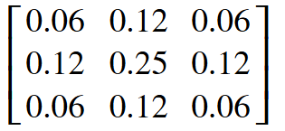
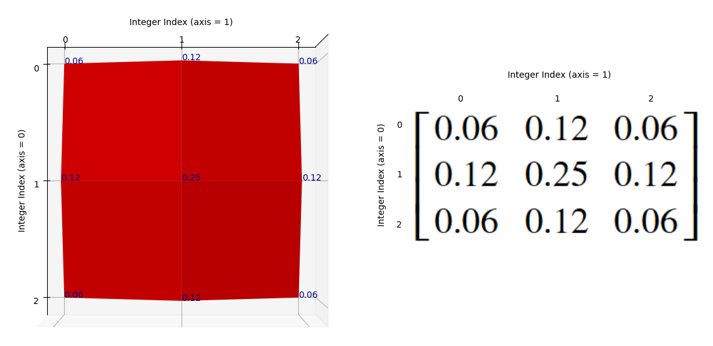
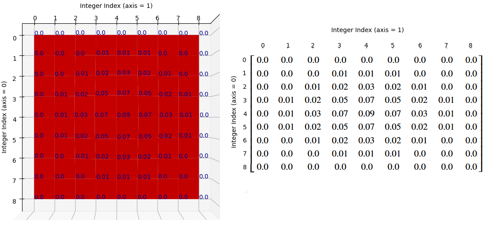
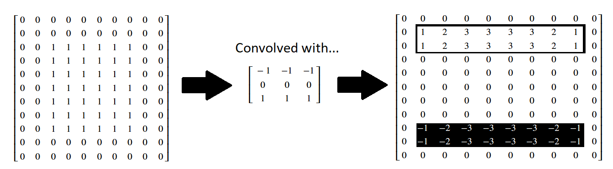
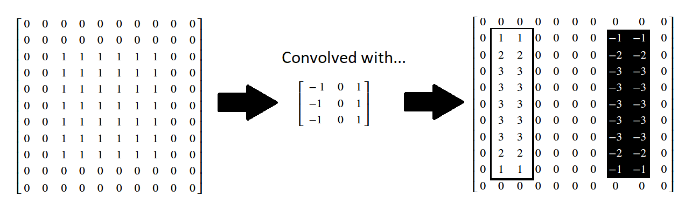

# Image filtering II

On the previous filtering page we looked at single and multi-value threshold filtering, as well as at filtering via convolutional kernels. This page will explore additional, foundational types of filters which use convolutional kernels, implementing them first with NumPy and SciPy, and then with Scikit-image.

```{python}
# Library imports.
import numpy as np
import matplotlib.pyplot as plt
import scipy.ndimage as ndi
import skimage as ski
from mpl_toolkits.mplot3d import Axes3D

# Set 'gray' as the default colormap
plt.rcParams['image.cmap'] = 'gray'

# Set NumPy precision to 2 decimal places
np.set_printoptions(precision=2)

#  Custom functions for illustrations, and to quickly report image attributes.
from gaussian_illustration import make_gaussian_kernel
from show_attributes import show_attributes
from hints import hint_krazy_kernel
```

# Gaussian filtering

An important kernel-based filter with, let's be honest, a pretty cool name is the *Gaussian filter*. You may recognise the name from the famous [Gaussian distribution](https://en.wikipedia.org/wiki/Normal_distribution), which we plot below:

```{python}
# Plot a normal/Gaussian distribution.
plt.hist(np.random.normal(0, 10, 500000), 
         bins=128)
plt.xlabel('X value')
plt.ylabel('Probability')
plt.xticks([])
plt.yticks([]);
```

This is the well-known normal distribution, which is sometimes described as having a "bell-shape". We will talk in more detail further down the page about why the Gaussian filter has its name. For now, take a look at this fancy [kernel]( https://www.geeksforgeeks.org/deep-learning/types-of-convolution-kernels):

```{python}
# A fancy kernel.
gaussian_like_kernel =  np.array([[0.06, 0.12, 0.06],
                                  [0.12, 0.25, 0.12],
                                  [0.06, 0.12, 0.06]])
gaussian_like_kernel
```

Imagine this kernel plotted in a 3D space. It is in the `shape` of `(3, 3)`, so imagine that the "floor" of the 3D plot is a 3-by-3 grid, with the integer index labels shown in the horizontal ($x$ and $y$-axis) directions. Imagine further that we plot the kernel element values in the vertical direction, on the $z$-axis. 

So on this plot, in the vertical direction, our graph will be highest where the kernel values are highest (e.g. for the centrel element of 0.25), and lowest where the kernel elements are lowest (e.g. in the corners for the values of 0.06).

Such a plot is shown below. A red surface connects the space in between each kernel value, to make the pattern between the individual elements clearer. The kernel values themselves are shown as dark blue text. The axis ticks show the integer index location of the kernel values, in the `gaussian_like_kernel` NumPy array:

```{python}
# Plot the fancy kernel, with a convenience function.
def kernel_plot(kernel, surface=True, elev=30, azim=-45, text=True):
    x = np.arange(kernel.shape[0])
    y = np.arange(kernel.shape[1])
    X, Y = np.meshgrid(x, y, indexing='ij')
    Z = kernel
    fig = plt.figure(figsize=(9,9))
    ax = fig.add_subplot(111, projection='3d')
    if surface == True:
        ax.plot_surface(X, Y, Z, color='red')
    else:
        ax.plot_wireframe(X, Y, Z, color='red')
    ax.set_xticks(x)
    ax.set_yticks(y)
    ax.set_xlabel('Integer Index (axis = 0)')
    ax.set_ylabel('Integer Index (axis = 1)')
    ax.set_zlabel('Kernel Element Value', labelpad=1)
    ax.view_init(elev=elev, azim=azim) 
    if azim == 0:
        ax.set_zlabel("")
        ax.set_zticks([]) 
    if text == True:
        for i in np.arange(kernel.shape[0]):
            for j in np.arange(kernel.shape[1]):
                ax.text(i, j, kernel[i, j], 
                        str(kernel[i, j].round(2)), 
                        color='darkblue')
# Make the plot.            
kernel_plot(gaussian_like_kernel);
```

Now, it may not be immediately apparent to some readers what this plot has to do with a Gaussian distribution. For now let's use "Gaussian" very loosely - for the moment all we will take from it is that, like a Gaussian distribution, at the center the kernel has high values, then the values fall off as we get nearer to the sides. Let's warmly refer to the graph as the "red mountain".

The kernel is shown, via the "raw" NumPy output, in the cell below. Compare this to the plot, to make sure you understand the visualisation. Remember that the numbers on each axis are the integer index locations of the NumPy array. And the vertical height of the red surface is the value of the kernel element at each row/column intger index location:

```{python}
# Show the kernel again, in NumPy, for comparison to the plot.
gaussian_like_kernel
```

If you prefer, you can view the NumPy array kernel with prettier graphics below:



Just as final comparison between the kernel NumPy array and the plot, here is the "red mountain" viewed from directly above, with the NumPy array kernel, in its pretty form, shown to its right hand side:




Remember that the kernel has only 9 values (shown as blue text on the plot), so there are no values in between the array values. If you prefer, we can visualise the kernel using a wireframe, to make it clearer that there are no values in between the kernal elements (e.g. in between the points where there is blue text):

```{python}
# Plot the fancy kernel.
kernel_plot(gaussian_like_kernel, surface=False)
```

Let's refer to the highest point on this kernel surface as the ["crimson peak"](https://en.wikipedia.org/wiki/Crimson_Peak). The crimson peak is the central kernel element of 0.25, at row/column integer index location `[1, 1]`:

```{python}
# The central kernel value, at the crimson peak - check that you can also see this on the graph above.
gaussian_like_kernel[1, 1]
```

Essentially, if we filter using this kernel, we "walk" this kernel through the image, with the top of the "crimson peak" centered on a given pixel. The central pixel value is then replaced with an average of the pixels in the neighbourhood, but the contribution of the other pixels in the neighbourhood to the averge is *weighted by the height of the "red mountain" at that pixel*. 

So array pixels which fall under higher points of the kernel's "red mountain" will exert more influence on the weighted average, and pixels falling under lower points will exert a weaker influence. The central pixel, laying under the crimson peak, will exert the most influence on the weighted average.

Let's use this kernel to filter the following small image:

```{python}
# Make a small image array.
small_square = np.zeros((20, 20))
small_square[9:11, 9:11] = 1
print(small_square)
plt.imshow(small_square);
```

We use use `scipy.ndimage.correlate()` to "walk" our kernel over every pixel in the image, multiply each array pixel value under the kernel by the corresponding kernel value, then take the sum of the result to replace the central pixel value:

```{python}
# Apply the `gaussian_like_kernel` to filter the image.
gaussian_like_filtered_small_square = ndi.correlate(small_square,
                                                    weights=gaussian_like_kernel)

# Plot comparison images.
plt.figure(figsize=(12, 4))
plt.subplot(1, 3, 1)
plt.title('Original')
plt.imshow(small_square)
plt.subplot(1, 3, 2)
plt.title('Gaussian-like Filter \n(3, 3) Kernel')
plt.imshow(gaussian_like_filtered_small_square);
```

Blurry! So to recap, we have averaged within a 3-by-3 pixel neightbourhood, replacing the central pixel value with a weighted average of all the pixel values in the neighbourhood. The weights are larger for pixels closer to the central value of the kernel (e.g. closer to the center of the "crimson peak" on the plot above).

This type of filtering is called *Gaussian filtering* because the kernel element values are from, or in the case of `gaussian_like_kernel`, approximate a 2-D Gaussian function. This is the function for the familiar [normal distribution](https://en.wikipedia.org/wiki/Normal_distribution) in two dimensions. The plot of the kernel above, with the "red mountain" may not look much like the normal distribution to you at the moment, but bear with us.

To see the Gaussian nature of this filtering operation, let's take a look at another, larger kernel below - it has `shape` `(9, 9)`:

```{python}
# Another kernel.
big_gaussian_kernel = make_gaussian_kernel(9)

big_gaussian_kernel.round(2)
```
Can you see any pattern in the arrangement of the numbers? Where are the high numbers, where are the low numbers? The `big_gaussian_kernel` NumPy array is shown below, in prettier form, to aid your ruminations:


We will also plot this kernel in 3-D, as with the last kernel. Again, the integer index locations of the array form the horizontal ($x$ and $y$) axis values, and the values within the array are plotted on the vertical ($z$) axis. 

```{python}
# Show the new, bigger gaussian kernel.
kernel_plot(big_gaussian_kernel, text=False)
```

Again, if you prefer, we can view the kernel as a wireframe plot, which we show in the cell below. It looks messy when the kernel element values (blue text) are shown on the plot, but we show them for easy comparison to the `big_gaussian_kernel` NumPy array. We show the NumPy view of the array again, above the plot. If you are running interactively, you can set `text = False` in the plotting function and re-run the cell, to switch the blue numbers off, if you wish:

```{python}
# Compare the NumPy array to the plot.
print("\n`big_gaussian_kernel` NumPy view:\n\n",big_gaussian_kernel.round(2))
kernel_plot(big_gaussian_kernel, surface=False)
plt.title('`big_gaussian_kernel` \nCrimson Peak View:');
```

Again, to make the relationship between the NumPy array and the graph as clear as possible, here is the "red mountain" viewed from directly above, with the `big_gaussian_kernel` array shown to its right:




You  may (or may not) recognise the "red mountain" - when we plot the `big_gaussian_kernel` - as a multi-dimensional [Gaussian distribution](https://en.wikipedia.org/wiki/Normal_distribution). Here is the a prototypical multi-dimensional Gaussian:


(Image from [here](https://stats.stackexchange.com/questions/102632/plot-two-dimensional-gaussian-density-function-in-matlab)).

Here is the plot of `big_gaussian_kernel` again, for comparison to the perfect Gaussian shown in the image above:

```{python}
# Show the plot of `big_gaussian_kernel` again.
kernel_plot(big_gaussian_kernel, text = False)
```

For the smaller `gaussian_like_kernel` the 3D plot appeared more "spiky" as it has less array elements. In this bigger `(9, 9)` kernel, we can see a smoother, more obviously Gaussian "mountain".

Both our `(3, 3)` kernel above, and the larger kernel we just plotted, are called [gaussian blur kernels](https://www.geeksforgeeks.org/deep-learning/types-of-convolution-kernels). Let's look at the `gaussian_like_kernel` array again, to compare it to `big_gaussian_kernel` directly:


When comparing to the `big_gaussian_kernel`, shown below, you can see that the pattern in the numbers is the same. The biggest value occurs in the center of the array, the smallest values are in the corners of the array. For the bigger Gaussian kernel, it is apparent that kernel values *closer* to the center are larger, the values get smaller the further we get from the central element:


As we said above, when we filter using these Gaussian kernels, we "walk" the kernel through the image, with the top of the "mountain", the crimson peak, centered on a given pixel at each step. The central pixel value is then replaced with an average of the pixels in the neighbourhood, but each pixels contribution to the average is weighted by how close it is to the central pixel. E.g. by how close it falls to the crimson peak of the Gaussian surfaces we showed above. Pixels closer to the central pixel, under the crimson peak, will exert more influence, pixels further away will exert a weaker influence.

Let's convolve `big_gaussian_kernel` with the `camera` image, using `ndi.correlate()`, as we used for the mean filter:

```{python}
# Appl the `big_gaussian_kernel` as a filter.
big_gaussian_filtered_small_square = ndi.correlate(small_square,
                                                   weights=big_gaussian_kernel)

# Plot comparison images.
plt.figure(figsize=(14, 4))
plt.subplot(1, 3, 1)
plt.title('Original')
plt.matshow(small_square, fignum=0)
plt.subplot(1, 3, 2)
plt.title('Gaussian filter \n(3, 3) Kernel')
plt.matshow(gaussian_like_filtered_small_square, fignum=0);
plt.subplot(1, 3, 3)
plt.title('Gaussian filter \n(9, 9) Kernel')
plt.matshow(big_gaussian_filtered_small_square, fignum=0);
```

It is apparent that the larger kernel has "spread" the intensity of higher-valued pixels further than the small kernel. This makes sense, because it is averaging across bigger pixel neighbourhoods. 

Both of these kernels, in relative terms, are quite small. As such, it is easier to see their effect in lower-resolution images. Higher resolution images will typically require larger kernels for the same results.

Below, we make a pixelated version of `camera`:

```{python}
# Pixelate the `camera` image.
camera = ski.data.camera()
pixelated_camera = ski.transform.rescale(camera, 0.2) # Rescale to 20% of original size.
plt.imshow(pixelated_camera);
```

Below, we filter with separately with `gaussian_like_kernel` and `big_gaussian_kernel`:

```{python}
# Filter with the small Gaussian kernel.
gaussian_like_filtered_pixelated_camera = ndi.correlate(pixelated_camera,
                                               weights=gaussian_like_kernel)

# Filter with the big Gaussian kernel.
big_gaussian_filtered_pixelated_camera = ndi.correlate(pixelated_camera,
                                               weights=big_gaussian_kernel)

# Plot comparison images.
plt.figure(figsize=(14, 4))
plt.subplot(1, 3, 1)
plt.title('Original (Pixelated)')
plt.matshow(pixelated_camera, fignum=0)
plt.subplot(1, 3, 2)
plt.title('Gaussian filter \n(3, 3) Kernel')
plt.matshow(gaussian_like_filtered_pixelated_camera, fignum=0);
plt.subplot(1, 3, 3)
plt.title('Gaussian filter \n(9, 9) Kernel')
plt.matshow(big_gaussian_filtered_pixelated_camera, fignum=0);
```

The smoothing effect is clear, with the larger kernel creating a more striking smoothing effect.

# Gaussian filters in `skimage`

This Gaussian filter is easy to implement in `skimage`, let's try it with the `cat` image from `ski.data`:

```{python}
# Load the `cat` image.
cat = ski.data.cat()
show_attributes(cat)
plt.imshow(cat);
```

`ski.filters.gaussian()` implements the Gaussian filter. We can control the `sigma` parameter, which controls the spread of the Gaussian "mountain" in the kernel. Lower values will reduce the weight of pixel values far from the central pixel, weighting only those close to it highly. Conversely, higher values will give greater weight to pixels further away from the central pixel:


Let's apply the filter with a `sigma` of 3:

```{python}
# Gaussian filter `cat`, with `skimage`.
plt.imshow(ski.filters.gaussian(cat, 
                                sigma=3));
```

Different sigma values will introduce a blurrier effect, because for higher `sigma` values, pixels further from the central value within each kernel are exerting more influence in the averaging calculation:

```{python}
# Plot with different `sigma` values.
plt.figure(figsize=(14, 3))
for i, sigma in enumerate(np.arange(2, 12, 2)):
    plt.subplot(1, 5, i+1)
    plt.imshow(ski.filters.gaussian(cat, 
                                    sigma=sigma))

    plt.xticks([])
    plt.yticks([])
    plt.title(f"sigma = {sigma}")
plt.suptitle('skimage.filters.gaussian()')
plt.tight_layout();
```

::: {exercise-start}
:label: krazy-kernel
:class: dropdown
:::

Here is another kernel which follows a Gaussian-like pattern (e.g. pixels closer to the center are weighted more heavily):


It is defined as a variable in the cell below:

```{python}
# Create the strange kernel.
almost_gaussian_kernel = np.array([[1, 1, 1, 2, 2, 2, 1, 1, 1],
                                   [1, 1, 1, 2, 2, 2, 1, 1, 1],
                                   [1, 1, 1, 2, 2, 2, 1, 1, 1],
                                   [2, 2, 2, 4, 4, 4, 2, 2, 2],
                                   [2, 2, 2, 4, 4, 4, 2, 2, 2],
                                   [2, 2, 2, 4, 4, 4, 2, 2, 2],
                                   [1, 1, 1, 2, 2, 2, 1, 1, 1],
                                   [1, 1, 1, 2, 2, 2, 1, 1, 1],
                                   [1, 1, 1, 2, 2, 2, 1, 1, 1]])

almost_gaussian_kernel
```

We plot this oddball kernel in 3D, in the cell below:

```{python}
# Super weird!
kernel_plot(almost_gaussian_kernel)
```

It looks like a late 90s games console graphics take on a Gaussian! When we filter the `camera` image using this kernel, we get some strange results. First, we show the original `camera` image:

```{python}
# Show the original `camera` image.
plt.imshow(camera);
```

Now, we filter with weird kernel:

```{python}
# Filter with the oddball kernel. (Probably) not the result we want...
almost_gaussian_filtered_camera = ndi.correlate(camera,
                                                weights=almost_gaussian_kernel)
                                                     
plt.matshow(almost_gaussian_filtered_camera);
```

```{python}
# Here are the attributes of the image which results of the filtering operation above.
show_attributes(almost_gaussian_filtered_camera)
```

This may be a pretty cool effect, but, because the kernel we used looks like the weird cousin of a Gaussian, we would maybe expect this kernel to do something closer to Gaussian smoothing than to totally psych out the image, as it has done here.

With a small modification somewhere in the pipeline, however, we can get the following Gaussian-like smoothing on `camera`, using the oddball `almost_gaussian_kernel`:


Try to make the relevant adjustments to obtain this target image. 

**DO NOT** recreate the kernel array and "manually" modify the original numbers, by editing them directly in the NumPy array. Use `numpy`, `scipy` or `skimage` functions to do what you need.

*Hint*: you may want to investigate the `.sum()` of all of the kernels we have used hitherto...

*Hint 2*: there are several ways to solve this, you can follow the previous hint, and you can also think about what might have caused the psychedelic error we see above...

*Hint 3*: run the `hint_krazy_kernel()` function for some additional help...

```{python}
# YOUR CODE HERE
my_new_kernel = almost_gaussian_kernel.copy()

# Load in and show camera.
camera = ski.data.camera()
show_attributes(camera)
plt.imshow(camera);
```


::: {exercise-end}
:::

::: {solution-start} krazy-kernel
:class: dropdown
:::
            
So, the problem here is *integer overflow*. Filtering `camera` with the `almost_gaussian_kernel` results in numbers that are too big for the `dtype` to handle. Let's remind ourselves of the kernel values:

```{python}
# Show the kernel.
almost_gaussian_kernel
```

Now, when the maximum value of the kernel gets multiplied by the maximum value in `camera`, we get:

```{python}
camera.max() * almost_gaussian_kernel.max()
```

This multiplication will surely happen, when the kernel is centered on the maximum valued pixel (remember that, in filtering, the kernel gets centered on every pixel in the image).

This value is too large for the `unit8` `dtype` of the original camera image, which can only range from [0 to 255](https://scikit-image.org/docs/0.25.x/user_guide/data_types.html).

```{python}
camera.dtype
```

This is what explains the strange result we saw above.

One solution to this is to scale the kernel to sum to 1. In fact, this is [common practice](https://dsp.stackexchange.com/questions/25130/why-should-the-sum-of-masks-kernel-filter-in-image-processing-be-one) with image filtering kernels because it ensures that they do not alter the average intensity values of the images to which they are applied. In this case, however, scaling the kernel so that it sums to 1 will also prevent integer overflow...

To ensure the kernel sums to 1, we just multiply the kernel by the reciprocal of the sum of the elements in the kernel, which in this case sum to 144:


```{python}
# Show the sum of the `almost_gaussian_kernel`.
almost_gaussian_kernel.sum()
```

```{python}
# Fixed, scaled kernel.
almost_gaussian_solution_1 = 1/almost_gaussian_kernel.sum() * almost_gaussian_kernel

almost_gaussian_solution_1
```

The kernel values now sum to 1:

```{python}
almost_gaussian_solution_1.sum()
```

But the kernel still has its original, idiosyncratic shape:

```{python}
# Plot the fixed, scaled kernel.
kernel_plot(almost_gaussian_solution_1);
```

Now, when we use this adjusted kernel to filter `camera`, we get the target image, which is the product of a filtering process much closer to Gaussian smoothing than the original attempt above:

```{python}
# Bingo!
almost_gaussian_filtered_camera = ndi.correlate(camera,
                                                weights=almost_gaussian_solution_1)                        
plt.matshow(almost_gaussian_filtered_camera);
```


Another option is to prevent the integer overflow by adjusting the `dtype` of `camera` prior to filtering - we told you `dtype`s are important!

We can use the trusty `ski.util.img_as_float()` function to do this. The filtering operation then proceeds, preventing the integer overflow, and without catastophic psychedelia, to generate the target image:

```{python}
# Convert `camera` to `float64`.
camera_as_float = ski.util.img_as_float(camera)

# Filter using the oddball kernel, with no psychedelic results.
almost_gaussian_filtered_camera_solution_2 = ndi.correlate(camera_as_float,
                                                weights=almost_gaussian_kernel)                                        
plt.matshow(almost_gaussian_filtered_camera_solution_2);
```

::: {solution-end}
:::


# Edge filtering 

We saw a simple [edge filter](3_skimage_processing_from_numpy_and_scipy) in one of the exercises on an earlier page. In image processing and computer vision, an edge is a rapid change in intensity between pixels - e.g. there is a high *gradient* of change between the pixel values. We can construct a [kernel](https://www.geeksforgeeks.org/deep-learning/types-of-convolution-kernels) which will detect such intensity changes in the vertical ($y$) direction, and thus will detect horizontal edges. That may sound paradoxical, but *horizontal* edges have *vertical* gradients:

```{python}
# A horizontal edge detection kernel.
horizontal_edge_detection_kernel = np.array([[-1, -1, -1],
                                             [ 0,  0,  0],
                                             [ 1,  1,  1]])

horizontal_edge_detection_kernel
```

To show how this kernel works, we will make an image array with very clear edges - one horizontal edge is at the top of the white square, another is at the bottom of the white square. One vertical edge is on the left side of the square, and another vertical edge is on the right side of the square:

```{python}
# An image array containing clear edges.
edgy = np.array([ [0, 0, 0, 0, 0, 0, 0, 0, 0, 0],
                  [0, 0, 0, 0, 0, 0, 0, 0, 0, 0],
                  [0, 0, 1, 1, 1, 1, 1, 1, 0, 0],
                  [0, 0, 1, 1, 1, 1, 1, 1, 0, 0],
                  [0, 0, 1, 1, 1, 1, 1, 1, 0, 0],
                  [0, 0, 1, 1, 1, 1, 1, 1, 0, 0],
                  [0, 0, 1, 1, 1, 1, 1, 1, 0, 0],
                  [0, 0, 1, 1, 1, 1, 1, 1, 0, 0],
                  [0, 0, 1, 1, 1, 1, 1, 1, 0, 0],
                  [0, 0, 0, 0, 0, 0, 0, 0, 0, 0],
                  [0, 0, 0, 0, 0, 0, 0, 0, 0, 0]])

plt.imshow(edgy);
```

Convolving with our horizontal edge detection kernel finds the horizontal edges. Note again that the change in pixel intensities is in the *vertical* direction, but the edge itself runs in the *horizontal* direction:

```{python}
# Use the horizontal edge detection filter.
edgy_horizontal = ndi.correlate(edgy,
                                horizontal_edge_detection_kernel)

plt.imshow(edgy_horizontal);
```

Let's think about what has happened here at the level of the individual pixels. Three kernel locations from the top of the array are represented below:


You can see that, for a binary image, the horizontal kernel convolution essential "counts" the number of 0-to-1 vertical changes in the kernel location, which lets it detect horizontal edges.

Conversely, when the kernel hits the 1-to-0 vertical changes at the bottom of the array, we get a similar count of the 1-to-0 changes, but indicated by a negative value, telling his that the gradient is in the other direction:

```{python}
# Show the horizontal edge-filtered array.
print("Original `edgy` array:\n", edgy)
print("\nHorizontally edge filtered:\n", edgy_horizontal)
```

You can view this, in prettier form, below:



We can "flip" our edge detection [kernel](https://www.geeksforgeeks.org/deep-learning/types-of-convolution-kernels) to look for big changes in gradient in the *horizontal* ($x$) direction, which will find *vertical* edges:

```{python}
# A vertical edge detection kernel.
vertical_edge_detection_kernel = horizontal_edge_detection_kernel.T

vertical_edge_detection_kernel
```

It should be easy to appreciate why this edge detection kernel operates to detect gradients and edges in a different direction! 
Now, when applied to our `edgy` image array, the vertical edge detection kernel, true to its name, detects vertical edges, and it does show by looking for large pixel intensity changes in the horizontal direction (e.g. those at the left/right side edges of the square):

```{python}
# The original square.
plt.imshow(edgy);
```

```{python}
# Detect edges in the vertical direction.
edgy_vertical = ndi.correlate(edgy,
                              vertical_edge_detection_kernel)

plt.imshow(edgy_vertical);
```

Again, in the resultant image, changes from black to white (0-to-1) end up as white pixels (with value 1). Conversely, changes from white to black (1-to-0) end up as black pixels (with value -1). No change ends up as grey (0):



Applied to more complex images, this edge detection can have some pretty cool effects:

```{python}
# Load in an image, convert to greyscale, rescale intensity, and `int16`.
coffee_grey = ski.color.rgb2gray(ski.data.coffee())
coffee_grey = ski.exposure.rescale_intensity(coffee_grey, out_range=(-1, 1))
coffee_grey = ski.util.img_as_int(coffee_grey)

# Plot the original image.
plt.imshow(coffee_grey)
show_attributes(coffee_grey);
```

First, we detect edges in the horizontal direction:

```{python}
# Filter using the horizontal edge detection kernel.
gradient_horizontal_coffee_grey = ndi.correlate(coffee_grey,
                                              horizontal_edge_detection_kernel,
                                              output="int16")
plt.imshow(gradient_horizontal_coffee_grey);
```

Then, in the vertical direction:

```{python}
# Filter using the vertical edge detection kernel.
gradient_vertical_coffee_grey = ndi.correlate(coffee_grey,
                                               vertical_edge_detection_kernel,
                                               output="int16")
plt.imshow(gradient_vertical_coffee_grey);
```

We can combine these two edge detection filters together to search for edges in both directions. First, lets refreseh our memory of what `edgy` looked like, filtered in both directions separately:

```{python}
# Show the image which has been filtered with the horizontal edge detection kernel.
plt.subplot(1, 2, 1)
plt.imshow(edgy_horizontal)
plt.title('Horizontal Edges')
# Show the image which has been filtered with the vertical edge detection kernel.
plt.subplot(1, 2, 2)
plt.imshow(edgy_vertical)
plt.title('Vertical Edges');
```

A simple way to combine these filters is to:

- `np.stack()` them into 3-D...

- ...then convert pixel values to absolute numbers (e.g. remove the signs)...

- ...and then take to the maximum value across the third dimension (e.g. using `.max(axis = 2)`). This will resize the array down to 2-D and...

...at the end of this process, only pixels for which an edge was detected in either direction will remain in the resulting image array:

```{python}
# Combine the filters.
edgy_vertical_horizontal_stack = np.stack([edgy_vertical, edgy_horizontal], axis=2) # Stack to 3D, `shape` = (11, 10, 2).
edgy_vertical_horizontal_stack = np.abs(edgy_vertical_horizontal_stack) # Remove the signs, from all elements in the 3-D array.
edgy_vertical_horizontal_stack = edgy_vertical_horizontal_stack.max(axis=2) # Reshape to 2-D, leaving only the largest value from
                                                                            # either slice in the resulting array.
# Show the result.
plt.imshow(edgy_vertical_horizontal_stack);
```

Pretty cool, here are all the steps, visualised together:

```{python}
# Plot all the `edgy` images together.
both_edgy = np.sqrt(edgy_vertical**2 + edgy_horizontal**2)
plt.figure(figsize=(16, 6))
plt.subplot(1, 4, 1)
plt.title("Original")
plt.imshow(edgy)
plt.subplot(1, 4, 2)
plt.title("Horizontal Edges")
plt.imshow(edgy_horizontal)
plt.subplot(1, 4, 3)
plt.title("Vertical Edges")
plt.imshow(edgy_vertical)
plt.subplot(1, 4, 4)
plt.title("Both Combined")
plt.imshow(both_edgy);
```

Let's do this again, for the images that resulted from filtering `coffee_grey` with our horizontal and vertical edge detection kernels, respectively.

```{python}
# Search for both types of edge (with `coffee_grey`).
coffee_vertical_horizontal_stack = np.stack([gradient_vertical_coffee_grey, 
                                             gradient_horizontal_coffee_grey], axis=2) # Stack to 3D, `shape` = (400, 600, 2).
coffee_vertical_horizontal_stack = np.abs(coffee_vertical_horizontal_stack) # Remove the signs, from all elements in the 3-D array.
coffee_vertical_horizontal_stack = coffee_vertical_horizontal_stack.max(axis=2)# Reshape to 2-D, leaving only the largest value from
                                                                               # from either slice in the resulting 2-D array.

# Show the result.
plt.imshow(coffee_vertical_horizontal_stack);
```

Edgy indeed...

We can view all of these steps together, on the plot below:

```{python}
# Plot all the `coffee_grey` images together.
plt.figure(figsize=(16, 6))
plt.subplot(1, 4, 1)
plt.title("Original")
plt.imshow(coffee_grey)
plt.subplot(1, 4, 2)
plt.title("Horizontal Edges")
plt.imshow(gradient_horizontal_coffee_grey)
plt.subplot(1, 4, 3)
plt.title("Vertical Edges")
plt.imshow(gradient_vertical_coffee_grey)
plt.subplot(1, 4, 4)
plt.title("Both Combined")
plt.imshow(coffee_vertical_horizontal_stack);
```

# Sobel filtering

A similiar edge detection filter is the Sobel filter, which uses the [following](https://www.geeksforgeeks.org/deep-learning/types-of-convolution-kernels/) [kernels](https://nrsyed.com/2018/02/18/edge-detection-in-images-how-to-derive-the-sobel-operator):

```{python}
# Sobel horizontal edge detection kernel.
sobel_horizontal =np.array([[-1,-2,-1],
                            [0, 0, 0],
                            [1, 2, 1]])
print("\nSobel horizontal edge detection kernel:\n", sobel_horizontal)
```

```{python}
# Sobel vertical edge detection kernel.
sobel_vertical = np.array([[-1, 0, 1],
                           [-2, 0, 2],
                           [-1, 0, 1]])
print("\nSobel vertical edge detection kernel:\n", sobel_vertical)
```

Let's try these out with `edgy`:

```{python}
# Apply the Sobel horizontal edge detection filter.
sobel_edgy_horizontal = ndi.correlate(edgy,
                                      sobel_horizontal)

plt.imshow(sobel_edgy_horizontal);
```

The effect on the individual pixel values is shown below:


```{python}
# Apply the Sobel vertical edge detection filter.
sobel_edgy_vertical = ndi.correlate(edgy,
                                      sobel_vertical)

plt.imshow(sobel_edgy_vertical);
```

Again, you can inspect the effect on the individual pixel values below:


We can combine each edge-filtered image using the method we saw above, taking the absolute maximum values after stacking:

```{python}
# Combine the filters.
sobel_edgy_vertical_horizontal_stack = np.stack([sobel_edgy_vertical, sobel_edgy_horizontal], axis=2) # Stack to 3D, `shape` = (11, 10, 2).
sobel_edgy_vertical_horizontal_stack = np.abs(sobel_edgy_vertical_horizontal_stack) # Remove the signs, from all elements in the 3-D array.
sobel_edgy_vertical_horizontal_stack = sobel_edgy_vertical_horizontal_stack.max(axis=2) # Reshape to 2-D, leaving only the largest value from
                                                                            # either slice in the resulting array.
# Show the result.
plt.imshow(sobel_edgy_vertical_horizontal_stack);
```

The more formal method is to use the following [formula](https://nrsyed.com/2018/02/18/edge-detection-in-images-how-to-derive-the-sobel-operator), where the filtered image containing the *vertical edges* (e.g. the *horizontal* gradients) is $G_x$, and the the filtered image containing the *horizontal edges* (e.g. the *vertical* gradients) is $G_y$:

$ \large G_{\text{overall}} = \sqrt{ G_x^2 + G_y^2 } $

You may recognise this as the [Euclidean distance](https://en.wikipedia.org/wiki/Euclidean_distance) formula. It will give us the edges in both directions, pretty nifty!:

```{python}
# Run the numbers...
sobel_overall = np.sqrt(sobel_edgy_vertical**2 + sobel_edgy_horizontal**2)
plt.imshow(sobel_overall);
```

Below we show the pixel values in this  Sobel-filtered image, with edges in both directions - the numbers in the final array have been rounded to keep it uncluttered:


# Edge detection filters in `skimage`

`skimage` contains a variety of edge detection filters, and makes it a breeze to implement them. You know the drill now, just pass `skimage` your NumPy image array and pray the `dtype`s are all in order (we kid, but also not...).

Remember the first edge detection kernels that we used above?:


These kernels are are used by `ski.filters.prewitt()` edge detection filter, which we implement in the cell below, on the `edgy` array:

```{python}
# Prewhitt filtering.
edgy_prewitt_ski = ski.filters.prewitt(edgy)
plt.imshow(edgy_prewitt_ski);
```

Here we implement the Sobel filter using `skimage`:

```{python}
# The same Sobel result, via `skimage`.`
edgy_sobel_ski = ski.filters.sobel(edgy)
plt.imshow(edgy_sobel_ski);
```

The plot below shows the effect of both filters, side by side:

```{python}
# Altogether...
coins = ski.data.coins()
prewitt_coins = ski.filters.prewitt(coins)
sobel_coins = ski.filters.sobel(coins)
fig, ax = plt.subplots(2, 3, 
                       figsize=(12, 8),
                       constrained_layout=True)
ax[0, 0].imshow(edgy)
ax[0, 0].set_title('Original')
ax[0, 0].axis('off')
ax[0, 1].imshow(edgy_prewitt_ski)
ax[0, 1].set_title('Prewitt Edge Filter')
ax[0, 1].axis('off')
ax[0, 2].imshow(edgy_sobel_ski)
ax[0, 2].set_title('Sobel Edge Filter')
ax[0, 2].axis('off')
ax[1, 0].imshow(coins)
ax[1, 0].set_title('Original')
ax[1, 0].axis('off')
ax[1, 1].imshow(prewitt_coins )
ax[1, 1].set_title('Prewitt Edge Filter')
ax[1, 1].axis('off')
ax[1, 2].imshow(sobel_coins)
ax[1, 2].set_title('Sobel Edge Filter')
ax[1, 2].axis('off')
plt.show()
```

# Summary

This page has showed how to use various convolution kernels to filter images, using `numpy`, `scipy` and `skimage`. We have seen how changing the convolutional kernel can alter the filtering process to achieve different purposes, like blurring/smoothing and edge detection.


# References

3.3.5 onward from: https://lectures.scientific-python.org/packages/scikit-image/index.html

Based on: https://scikit-image.org/skimage-tutorials/lectures/1_image_filters.html

Reference: https://www.kdnuggets.com/numpy-for-image-processing

Reference: https://setosa.io/ev/image-kernels

Reference: https://wiki.imindlabs.com.au/ds/aml/4_problem_domains/1-image-processing/3_edge_detectors

Reference: https://www.geeksforgeeks.org/deep-learning/types-of-convolution-kernels

Reference: https://scikit-image.org/skimage-tutorials/lectures/1_image_filters.html

Reference: https://jni.github.io/i2k-skimage-napari/lectures/1_image_filters.html
