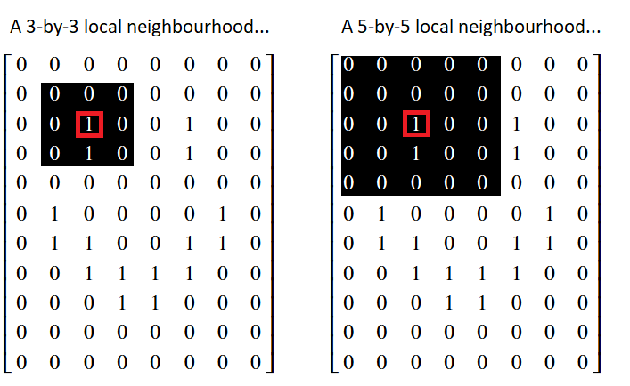
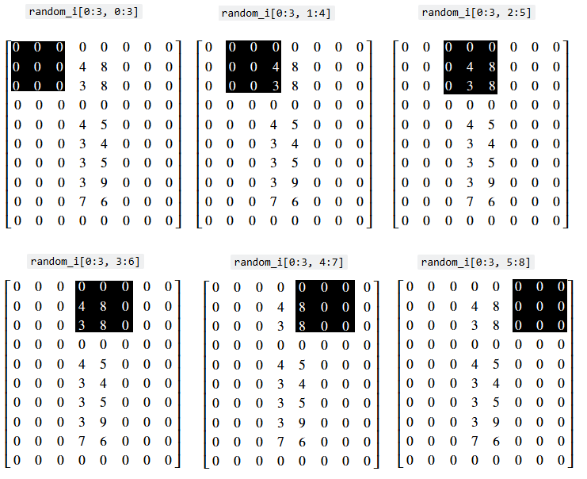
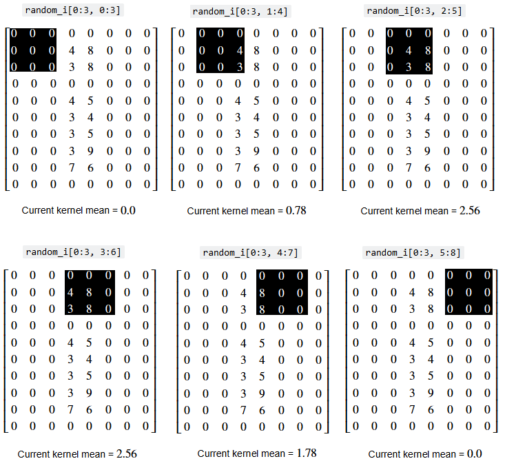
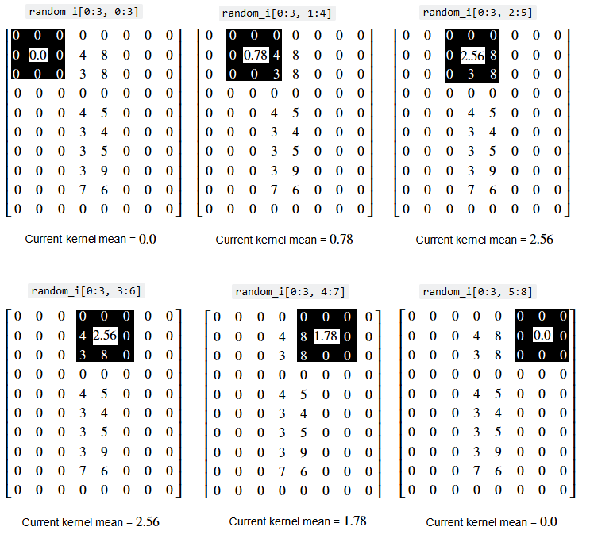
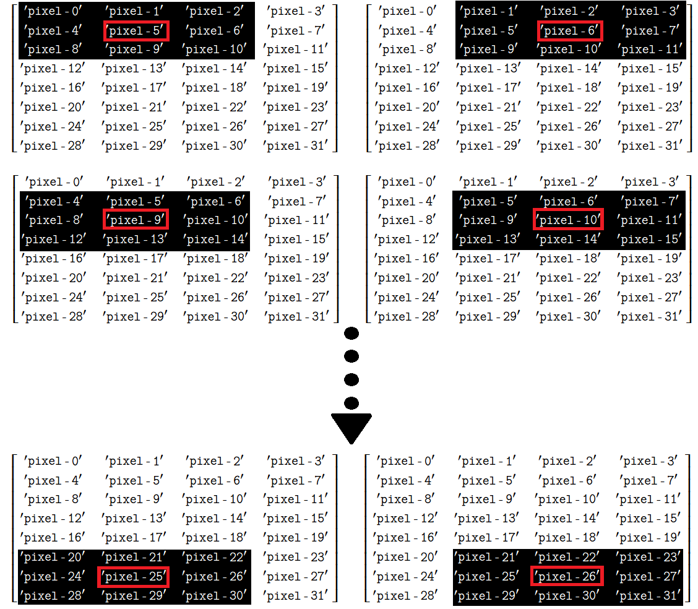
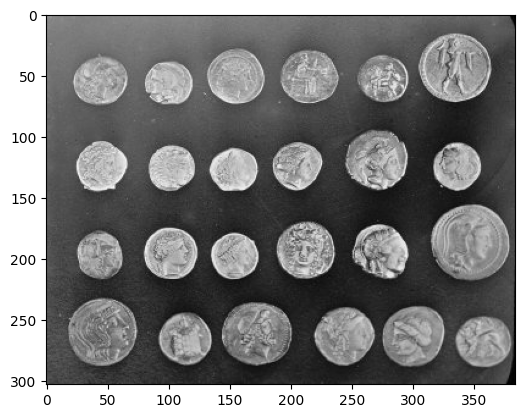
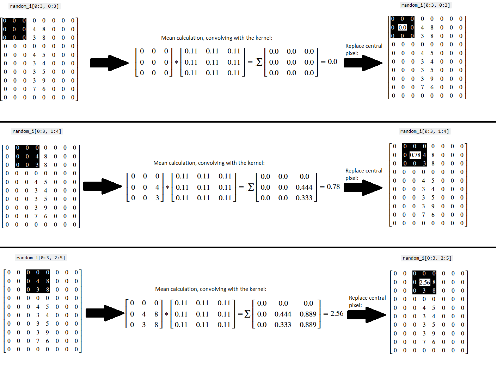
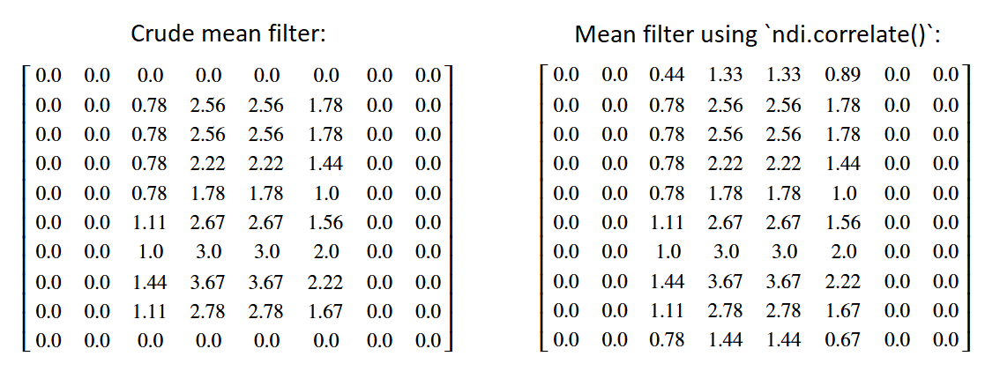
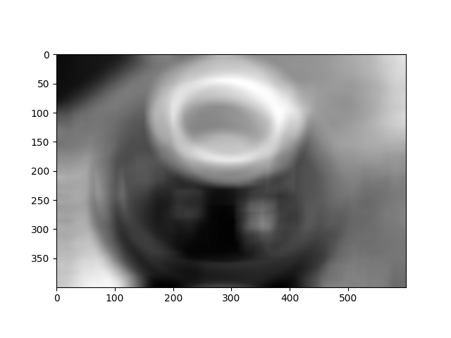
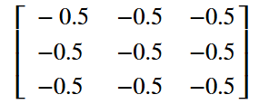

# Convolution filters I - the mean filter

## Kernels and pixel neighbourhoods


On the last page we filtered images based on a single threshold value, or based on multiple threshold values. Other filters work differently to this: they work by adjusting a given pixel's value based on the value of other pixels which surround it, in a specified area. The mean filter is one such filter that works in this manner.

The mean filter is a *local filter*, because it alters a given pixel's value based on the values of other pixels in the surrounding "local neighborhood". The image below shows the pixel values in the `smiley` image array that we created on an earlier [page](0_images_as_numpy_arrays). Two possible "local neighbourhoods" are shown for a given pixel, which is highlighted in red. One neighbourhood is 3-by-3, and the other is 5-by-5 - we could use either when using a local filter:



The values within a pixel's local neighbourhood will influence the change that a local filter makes to the central pixel. The `size` and `shape` of the "neighborhood" are up to the user. We can synonomously refer to the neighborhood as a "kernel", "footprint" or "structuring element". As we will see later, Sci-kit image favours the term "footprint". For now, we will use the terms "kernel" and "neighborhood" interchangeably to refer to some set of pixels that surround a given pixel.

The mean filter, as the name suggests, *averages* the pixel values within a kernel/neighbourhood. To see this in action, let's build a simple mean filter to filter an image array. First, we perform some imports:

```{python}
# Library imports.
import numpy as np
import matplotlib.pyplot as plt
import scipy.ndimage as ndi
import skimage as ski

# Set 'gray' as the default colormap
plt.rcParams['image.cmap'] = 'gray'

# Set NumPy precision to 2 decimal places
np.set_printoptions(precision=2)

#  Custom functions for illustrations, hints, and to quickly report image attributes.
from show_attributes import show_attributes
from hints import hint_strange_coffee
```

Next, we create the `random_i` image array:

```{python}
# Create a greyscale image array.
random_i = np.array([[0, 0, 0, 0, 0, 0, 0, 0],
                     [0, 0, 0, 4, 8, 0, 0, 0],
                     [0, 0, 0, 3, 8, 0, 0, 0],
                     [0, 0, 0, 0, 0, 0, 0, 0],
                     [0, 0, 0, 4, 5, 0, 0, 0],
                     [0, 0, 0, 3, 4, 0, 0, 0],
                     [0, 0, 0, 3, 5, 0, 0, 0],
                     [0, 0, 0, 3, 9, 0, 0, 0],
                     [0, 0, 0, 7, 6, 0, 0, 0],
                     [0, 0, 0, 0, 0, 0, 0, 0]])
print(random_i)
plt.imshow(random_i);
```

Let's use some indexing to go for a walk through the neighbourhoods (kernels) in this array. We will treat each `(3,3)` set of pixels as a separate neighbourhood. For now, we only walk through the neighborhoods at the "top" of the array. We will start our "walk" in the top-left corner of the array, so that each 3-by-3 slice is centered on a pixel in the second row of the image:

```{python}
# The first neighbourhood.
i_row_start, i_col_start = 0, 0
i_row_end, i_col_end = 3, 3
random_i[i_row_start:i_row_end, i_col_start:i_col_end]
```

```{python}
# The second neighbourhood.
i_row_start, i_col_start = 0, 1
i_row_end, i_col_end = 3, 4
random_i[i_row_start:i_row_end, i_col_start:i_col_end]
```

```{python}
# The third neighbourhood.
i_row_start, i_col_start = 0, 3
i_row_end, i_col_end = 3, 6
random_i[i_row_start:i_row_end, i_col_start:i_col_end]
```
Obviously, this "walk" is more efficient in a for loop:

```{python}
for i in np.arange(6):
    i_row_start, i_col_start = 0, i
    i_row_end, i_col_end = 3, i+3
    print(f"\nrandom_i[{i_row_start}:{i_row_end}, {i_col_start}:{i_col_end}]\n")
    print(random_i[i_row_start:i_row_end, i_col_start:i_col_end])
```

We can visualise the "walk" we have just taken, with prettier graphics - (you may want to right click on these images and open them in a new tab/window, for easier viewing):



Now, imagine we calculate the mean within each neighbourhood (kernel) - the mean of each kernel is shown below the image of each indexing operation:



...and now further imagine that we replace *central pixel value of the 3-by-3 kernel with the mean of all the values in the kernel*. The image below shows the central value being replaced with the mean of each kernel:



This is how the mean filter operates:

* We define our kernel (e.g. our pixel neighborhood size and shape).

* We center our kernel on a pixel.

* We then replace the value of the central pixel with the mean of the pixels in the neighborhood.

The illustrations above only show the kernel proceeding through the pixels at the "top" of the array. In reality, filtering operations are applied every pixel in the image. You can think of this as the kernel "walking" through the entire array, being centered on one pixel at a time.

Astute readers might ask "what happens near the edges of the array? If we center our kernel on a pixel in the last column or row, won't part of the kernel 'fall off' the edge of the array?'":


Indeed, we need a strategy for this. There are actually many options for how a kernel should behave at the edges of an image array - we could "pad" the kernel elements that fall outside of the image with 0 values, for instance. Or we could duplicate values from the pixels at the edge of the array, to fill in kernel elements that fall outside of the array.

**For now we will not worry about the edges, we just use the kernel only where it "fits" within the array.** In effect, this just ignores pixels near the edges of the image. Presently, most of these pixels at the edges of the image are 0, and there is some distance between the "i" and the image edges, so ignoring the pixels near the edge will not affect the "i" shape too much itself. The image below illustrates this concept, for a generic array:



The cell below defines a function that will apply this mean kernel, step-by-step in a for loop to the whole image array, only for pixel neighbourhoods where the kernel "fits" over the central pixel, without extending outside of the image:

```{python}
# A function to apply our crude mean kernel.
def three_by_three_mean_kernel(image):
    
    # Convert to float `dtype`.
    image = np.array(image, 
                     dtype=float)
    
    # Get the image shape.
    n_rows, n_cols = image.shape
    
    # Create an empty image array (for the result of the
    # filtering operation)
    filtered_image = np.zeros(image.shape)
    
    # Loop through the pixels and get the mean of each kernel.
    for i in np.arange(1, n_rows-1):
        for j in np.arange(1, n_cols-1):
            row_start = i-1
            col_start = j-1
            row_end = i+2
            col_end = j+2
            kernel = image[row_start:row_end, col_start:col_end].copy()
            filtered_image[i, j] = kernel.mean()           
    return filtered_image
```

Let's apply our crude mean filter to the image array, and compare it to the original image array:

```{python}
# Apply our mean filtering function.
mean_filtered_i = three_by_three_mean_kernel(random_i)

# Show the original array and the filtered array, from the 
# "raw" NumPy perspective.
print(f"Original:\n\n {random_i}")
print(f"\nCrude Mean filter:\n\n {mean_filtered_i}")

# Plot both arrays/
plt.subplot(1,2,1)
plt.imshow(random_i);
plt.title('Original')
plt.subplot(1,2,2)
plt.imshow(mean_filtered_i)
plt.title("Crude Mean Filter");
```

Ok, so we can see that some of the non-black (non-zero) pixel intensity values have been "spread around" to neighbouring pixels, which is unsurprising, given what we know about how this operation works. We have literally, for each given pixel, "averaged out" between the pixels in the 3-by-3 neighbourhood around the pixel. This is a very crude mean filter, intended to show the foundational principles of how filtering via a kernel works. There is a better, less crude way to implement a mean filter, however, to which we will turn in the next section.

::: {exercise-start}
:label: dont-be-mean
:class: dropdown
:::

For this exercise, you should build a function which filters an image using a 3-by-3 kernel, like we did above. Your function should "walk" the 3-by-3 kernel through an image array, but it can ignore edge pixels, as we did above. E.g. you can just alter central pixels where the kernel "fits", as in the image below:


However, your kernel should do something different to the mean kernel we implemented earlier. Your function will do something dark, something illegal (at least by the standards of `skimage` `dtype` conventions)...

It should replace the central pixel value with the *negative sum* of the values under the kernel (e.g. add the values under the kernel up, and then make the sum negative). You should apply this to the `coins` image from `ski.data`. Here is the original image:



Here is how your image should look, after applying the negative sum filter, with a 3-by-3 kernel:


This operation will create some illegal pixel values. You should `rescale_intensity()` to ensure your image has the follow (legal!) attributes:

```
Type: <class 'numpy.ndarray'>
dtype: float64
Shape: (303, 384)
Max Pixel Value: 1.0
Min Pixel Value: -1.0
```

**DO NOT ADJUST ANY OF THE FUNCTIONS USED ABOVE WHEN MAKING YOUR FUNCTION**. Try to do this from scratch, clearly thinking about what you need to do.

```{python}
# YOUR CODE HERE
def three_by_three_negative_sum_kernel():
    ...

# Load in the `coins` image.
coins = ski.data.coins()
show_attributes(coins)
plt.imshow(coins);
```

::: {exercise-end}
:::

::: {solution-start} dont-be-mean
:class: dropdown
:::

Whilst we told you not to adjust the function from above, obviously you function needs to do something similar to the function from above. So that was a rule for you, not for us ;)

Here we have adjusted the function to take the negative sum of the kernel elements, rather than the mean. We also `rescale_intensity()` in the final line, to ensure pixel values fall in a legal range, for the `float64` `dtype`:

```{python}
def three_by_three_negative_sum_kernel_solution(image):
    
    # Convert to float `dtype`.
    image = np.array(image, 
                     dtype=float)
    
    # Get the image shape.
    n_rows, n_cols = image.shape
    
    # Create an empty image array (for the result of the
    # filtering operation)
    filtered_image = np.zeros(image.shape)
    
    # Loop through the pixels and get the mean of each kernel.
    for i in np.arange(1, n_rows-1):
        for j in np.arange(1, n_cols-1):
            row_start = i-1
            col_start = j-1
            row_end = i+2
            col_end = j+2
            kernel = image[row_start:row_end, col_start:col_end].copy()
            filtered_image[i, j] = -kernel.sum()                          # LOOK HERE! We take the negative sum.
    return ski.exposure.rescale_intensity(filtered_image, out_range="float64") # Rescale to ensure legal pixel values.
```

Here we load in the `coins` image, to which to apply our new filter:

```{python}
# Load in and show the `coins` image.
coins_solution = ski.data.coins()
plt.imshow(coins_solution);
```

We then apply our filter, replacing the value of the central pixel in each kernel with negative sum of the value of all the pixels under the kernel:

```{python}
# Filter and show...
neg_sum_filter_coins = three_by_three_negative_sum_kernel_solution(coins_solution)
plt.imshow(neg_sum_filter_coins);
```

Here are the attributes of the somewhat ghostly, filtered image:

```{python}
show_attributes(neg_sum_filter_coins)
```

::: {solution-end}
:::


# Convolution

In normal practice, filtering operations which use kernels rely on [convolution](https://en.wikipedia.org/wiki/Convolution). In fact, one name for the kernel is "convolution kernel". In image processing, convolution is similar to the process we saw with our crude mean filter - we "walk" a kernel across our whole image, centering it on every pixel, and perform a computation which modifies the central pixel based on the other values in the kernel/neighbourhood.

Let's implement a true mean filter, using convolution. Obviously, we start with our kernel. First, we define its shape:

```{python}
# Define our kernel shape.
kernel_shape = (3, 3)
```

We can take the product of the elements in the shape tuple, to get the number of elements inside the kernel (in this case 3 * 3 = 9, so 9 elements in the 3-by-3 kernel):

```{python}
# Get our kernel size, e.g. the number of elements in the kernel.
kernel_size = np.prod(kernel_shape)

kernel_size
```

We can then construct our kernel, using `np.full()` which allows us to fill an array with a given value. In this case we will fill it with $\frac{1}{n}$, where $n$ is the number of elements in our kernel (9 kernel elements - so $\frac{1}{9}$ = 0.11):

```{python}
mean_kernel = np.full(shape=kernel_shape, 
                      fill_value=1/kernel_size)

mean_kernel
```

Our purpose here is to take the mean of the values under the kernel, so how does a 3-by-3 kernel filled with $\frac{1}{n}$ help us?

Well, this value can be used to find the mean (duh!)...we'll show this quickly using just four random values:

```{python}
nums = np.array([10, 21, 3, 45])
nums.mean()
```

If we multiply each value by $\frac{1}{n}$ and then take the sum of those values, we get...

```{python}
n = len(nums)

np.sum(nums * 1/n)
```

...the mean! And we can do exactly the same thing with the `mean_kernel` we made above. We can use the `scipy.ndimage.correlate()` function to achieve this with maximum efficiency (relative to the crude method we used above). This function involves ["moving a [...] kernel over [an] image and computing the sum of products at each location"](https://docs.scipy.org/doc/scipy/reference/generated/scipy.ndimage.correlate.html). This means we:

- Center the kernel on given array pixel in the original image.

- Multiply the array pixel values covered by the kernel with the elements in the kernel (in this case every kernel element value is $\frac{1}{9}$).

- Get the sum of those products (e.g. add them all together to produce a single value).

- Replace the central array pixel value in the original image with the single value we just computed.

Because we are using a mean kernel, this operation will, shockingly, return the mean of the kernel. This process is illustrated below for three kernel locations - (once more you may want to right click on these images and open them in a new tab/window, for easier viewing):



Now, let's apply this kernel convolution to every pixel in the image array:

```{python}
# A new import.
import scipy.ndimage as ndi

# Perform the convolution.
mean_filtered_random_i_via_sp = ndi.correlate(input=random_i, # Our input image array.
                                              weights=mean_kernel, # Our kernel to convolve the image with.
                                              output=float) # Output `dtype`

# Show the original image array, and the mean filtered image array
print(f"Original:\n\n {random_i}")
print(f"\nMean filter:\n\n {mean_filtered_random_i_via_sp}")
plt.subplot(1, 2, 1)
plt.imshow(random_i)
plt.title("Original")
plt.subplot(1, 2, 2)
plt.title('Mean Filtered')
plt.imshow(mean_filtered_random_i_via_sp);
```

The result is very similar to that obtained by our crude mean filter, only now it has been applied to *every* array pixel, where our crude filter simply ignored pixels at the edge of the image:

```{python}
# Show the result from our crude mean filter
print(f"\nCrude mean filter:\n\n {mean_filtered_i}")
print(f"\n\nMean filter via SciPy `correlate`:\n\n {mean_filtered_random_i_via_sp}")
```

<!-- #region -->
These two arrays are shown below side-by-side, and more nicely rendered, for easier comparison:



You can see that the values differ only near the top and bottom edges of the image. `ndi.correlate()` offers several options for dealing with pixels at the edge of the array (e.g. those pixels for which the kernel "falls off" the edge of the image). Here are the options, from the [documentation](https://docs.scipy.org/doc/scipy/reference/generated/scipy.ndimage.correlate.html), we can choose an option by specifying the `mode` argument to `ndi.correlate` (e.g. `mode = 'constant'` etc.):


> **mode** : *{‘reflect’, ‘constant’, ‘nearest’, ‘mirror’, ‘wrap’}, optional*
>
> The `mode` parameter determines how the input array is extended beyond its boundaries. Default is `'reflect'`. Behavior for each valid value is as follows:
>
> - **`reflect`** *(d c b a | a b c d | d c b a)*  
>   The input is extended by reflecting about the edge of the last pixel. This mode is also sometimes referred to as half-sample symmetric.
>
> - **`constant`** *(k k k k | a b c d | k k k k)*  
>   The input is extended by filling all values beyond the edge with the same constant value, defined by the `cval` parameter.
>
> - **`nearest`** *(a a a a | a b c d | d d d d)*  
>   The input is extended by replicating the last pixel.
>
> - **`mirror`** *(d c b | a b c d | c b a)*  
>   The input is extended by reflecting about the center of the last pixel. This mode is also sometimes referred to as whole-sample symmetric.
>
> - **`wrap`** *(a b c d | a b c d | a b c d)*  
>   The input is extended by wrapping around to the opposite edge.

Let's define a function so that we can apply the mean filter to any image, using the proper `scipy.ndimage.correlate()` machinery, so we no longer ignore edge pixels (poor pixels!):
<!-- #endregion -->

```{python}
def mean_filter(image_array, kernel_shape):
    kernel_size = np.prod(kernel_shape) # Get the kernel size (n).
    mean_kernel = np.full(kernel_shape, # Make the mean kernel in the desired shape... 
                          1/kernel_size)# ...each each element in the mean kernel is 1/n.
    return ndi.correlate(image_array, 
                        mean_kernel,
                        output=float)
```

We'll apply it to a greyscale `coffee` image, originally a colour image from `ski.data`:

```{python}
# Read in an image file.
coffee_grey =  ski.io.imread("images/coffee_grey.png", 
                             as_gray=True)
plt.imshow(coffee_grey);
```

But first, we will use `np.random.normal()` to add some normally distributed (Gaussian) noise to the image:

```{python}
# Add some noise to the pixel values in `coffee`.
noisy_coffee_grey = coffee_grey + np.random.normal(0,
                                                   2,
                                                   coffee_grey.shape)

plt.imshow(noisy_coffee_grey);
```

The mean filter can remove some of the noise, restoring the clarity of the image:

```{python}
# Mean filter the noisy coffee image, and show the result.
noisy_coffee_grey_mean_filtered = mean_filter(noisy_coffee_grey, (10, 10))
plt.figure(figsize=(20, 20))
plt.subplot(1, 3, 1)
plt.imshow(coffee_grey)
plt.title("Original")
plt.axis('off')
plt.subplot(1, 3, 2)
plt.title('Noisy')
plt.imshow(noisy_coffee_grey)
plt.axis('off')
plt.subplot(1, 3, 3)
plt.title('Mean Filtered')
plt.imshow(noisy_coffee_grey_mean_filtered)
plt.axis('off');
```

We can see that the image is clearer, the noise has been reduced and some of the signal has been restored.

Let's try out some different kernel sizes:

```{python}
# Mean filter, with various kernel sizes.
n_cols = 3
plt.figure(figsize=(12, 7))
plt.subplot(2, n_cols, 1)
plt.imshow(coffee_grey)
plt.title("Original")
plt.axis('off')
plt.subplot(2, n_cols, 2)
plt.title('Noisy')
plt.imshow(noisy_coffee_grey)
plt.axis('off')
for i in np.arange(3, int(n_cols*2)+1):
    plt.subplot(2, n_cols, i)
    kernel_shape = (i+(i*3), i+(i*3))
    plt.title(f'Mean Filtered\nKernel = ({i+(i*3)},{i+(i*3)})')
    plt.imshow(mean_filter(noisy_coffee_grey, kernel_shape))
    plt.axis('off')
plt.subplots_adjust()
plt.tight_layout();
```

As with many filtering operations, the effect of altering aspects of the filtering process (like a threshold value or kernel size), is very context-dependent. It may take many iterations before finding a "sweet spot", and where the sweet spot is may be somewhat subjective.


::: {exercise-start}
:label: strange-filter-coffee
:class: dropdown
:::

The nice thing about applying filtering via convolution kernels is that changing the kernel itself lets us implement a wide variety of functions, even strange ones. In this exercise, you will write a function called `strange_filter()`. You should apply it to `coffe_grey` to produce the following image:



For a given pixel value, when the value is multiplied by it's corresponding kernel element, the *absolute* value of the result should be *half as big as the absolute original pixel value*.

Write your function so that it can be used with kernels of different `shape`s, so you can work out what kernel `shape` you need to recreate the target image, by trial and error.

Your final image should have the following attributes (again, you may need to `rescale_intensity()` or take other steps to avoid illegal pixel values, for the `dtype`):

```
Type: <class 'numpy.ndarray'>
dtype: int8
Shape: (579, 867)
Max Pixel Value: 0
Min Pixel Value: -49
```

**DO *NOT* COPY THE `mean_filter()` FUNCTION FROM ABOVE AND MODIFY IT** - try to write a function from scratch, thinking carefully about what you need to do.

*Hint:* run the `hint_strange_coffee()` function for additional help.

```{python}
# YOUR CODE HERE
strange_coffee = coffee_grey.copy()

# Show `strange_coffee`.
plt.imshow(strange_coffee)
show_attributes(strange_coffee)
```

::: {exercise-end}
:::

::: {solution-start} strange-filter-coffee
:class: dropdown
:::

The solution here involves making a kernel where every kernel element has the value of $-\frac{1}{2}$ (e.g. -0.5). So, for a 3-by-3 kernel:



We define our `strange_filter()` function in the cell below:

```{python}
def strange_filter_solution(image_array, kernel_shape):
    kernel_size = np.prod(kernel_shape)
    strange_kernel = np.full(kernel_shape, -0.5)
    output_img = ndi.correlate(image_array, 
                               strange_kernel,
                               output="int8") # Avoid illegal pixel values.
    return output_img 
```

To get the exact target image, we use a kernel of `shape` (10, 10):

```{python}
# Apply the filter and show the result.
strange_filter_coffee = strange_filter_solution(coffee_grey, (10, 10))
show_attributes(strange_filter_coffee)
plt.imshow(strange_filter_coffee);
```

Kernels of other sizes will lead to different (albeit cool!) effects:

```{python}
# Apply the filter and show the result.
strange_filter_coffee_other = strange_filter_solution(coffee_grey, (3, 3))
plt.imshow(strange_filter_coffee_other);
```

This is quite a strange kernel to apply! But it shows us how easy it is to achieve radical filtering effects with some custom kernels...

::: {solution-end}
:::


# Mean filtering with `skimage`

We can implement a mean filter using the `ski.filters.rank.mean()` function. `skimage` prefers the term `footprint` to "kernel", but the meaning is the same. We supply a small matrix with which to "walk" through the image, centering the kernel on every pixel, and modifying that central pixel's value based on the values of the other pixels in it's neighbourhood, with the size and shape of the neighbourhood being defined by the kernel (`footprint`). 

Inspecting the `skimage` documentation will reveal that the format expected for the `footprint` should be ["the [pixel] neighborhood expressed as an ndarray of 1’s and 0’s."](https://scikit-image.org/docs/0.25.x/api/skimage.filters.rank.html#skimage.filters.rank.mean). We will uses `np.ones()` to generate an array in this format. We use a (9, 9) kernel to achieve a stronger visual effect:

```{python}
# A "footprint" (eg. kernel) to pass to `skimage`.
footprint_9_by_9 = np.ones( (9, 9) )

footprint_9_by_9
```

We will use it to filter the stalwart `camera` image:

```{python}
# Import and show the `camera` image.
camera = ski.data.camera()
plt.imshow(camera);
```

Below, we apply the mean filter, using the `footprint_9_by_9` array as the kernel:

```{python}
# Mean filter the `camera` image with `skimage`
mean_filtered_camera = ski.filters.rank.mean(camera,
                                             footprint=footprint_9_by_9)

# Plot both image to compare
plt.figure(figsize=(10, 4))
plt.subplot(1, 2, 1)
plt.title('Original')
plt.imshow(camera)
plt.subplot(1, 2, 2)
plt.title('Mean filtered\n(9,9) kernel')
plt.imshow(mean_filtered_camera);
```

# Filtering 3D images

We can filter a 3D colour image just by convolving our filtering kernel with each colour channel separately. Let's load a 3D image:

```{python}
# Load in and show an image.
astronaut = ski.data.astronaut()
show_attributes(astronaut)
plt.imshow(astronaut);
```

If we try to filter this image with our (3, 3) `mean_kernel` we will get an error:

```{python tags=c("raises-exception")}
# Oh dear.
astronaut_mean_filtered = ndi.correlate(astronaut, weights=mean_kernel)
```

As you can see, the error results from using a 2D kernel to filter a 3D image. A simple solution to this is just to apply the filter to each colour channel separately. This is done in the cell below, using a for loop to filter each channel, storing the channels separately in a dictionary, and then `np.stacking()` the individually filtered channels back into a 3D image:

```{python}
# A dictionary to store the individually filtered channels.
filtered_channels = {}

# Loop through and filter each channel individually, store
# the results in the dictionary.
for i in np.arange(astronaut.shape[2]):
    current_filtered_channel = ndi.correlate(astronaut[:, :, i],
                                             weights=mean_kernel)
    filtered_channels[i] = current_filtered_channel

# Stack back to 3D.
astronaut_mean_filtered = np.stack([filtered_channels[0],
                                    filtered_channels[1],
                                    filtered_channels[2]], 
                                   axis=2)

# Show the result.
plt.figure(figsize=(12, 6))
plt.subplot(1,2,1)
plt.title("Original")
plt.imshow(astronaut)
plt.subplot(1,2,2)
plt.title("Mean Filtered \n (3, 3) kernel")
plt.imshow(astronaut_mean_filtered)
plt.tight_layout();
```

This is straightforward to do with `skimage` as well; we also use the larger (9, 9) `footprint_9_by_9` kernel:

```{python}
# A dictionary to store the individually filtered channels.
filtered_channels = {}

# Loop through and filter each channel individually, store
# the results in the dictionary.
for i in np.arange(astronaut.shape[2]):
    current_filtered_channel = ski.filters.rank.mean(astronaut[:, :, i],   # Use `skimage` for the filtering.
                                                    footprint=footprint_9_by_9) # Use a larger kernel.
    filtered_channels[i] = current_filtered_channel

# Stack back to 3D.
astronaut_mean_filtered = np.stack([filtered_channels[0],
                                    filtered_channels[1],
                                    filtered_channels[2]], 
                                   axis=2)

# Show the result.
plt.figure(figsize=(12, 6))
plt.subplot(1,2,1)
plt.title("Original")
plt.imshow(astronaut)
plt.subplot(1,2,2)
plt.title("Mean Filtered with `ski.filters.rank.mean()` \n (9, 9) kernel")
plt.imshow(astronaut_mean_filtered)
plt.tight_layout();
```

We got a blurrier output image via `skimage` here, than in the manual convolution using `ndi.correlate()`. This is because we used a larger kernel for the `skimage` filtering, and so are averaging over larger pixel neighbourhoods.

Scikit-image will also handle this using a 3D kernel. Below we adjust our `footprint_9_by_9` kernel by `np.stack()`-ing it into 3D:

```{python}
# Stack to 3D.
footprint_9_by_9_3D = np.stack([footprint_9_by_9,
                                footprint_9_by_9,
                                footprint_9_by_9],
                                axis=2)

footprint_9_by_9_3D.shape
```

```{python}
# Mean filter the colour image, with `skimage`.
astronaut_mean_filtered_ski = ski.filters.rank.mean(astronaut,
                                                    footprint=footprint_9_by_9_3D)

# Show the result.
plt.figure(figsize=(12, 6))
plt.subplot(1,2,1)
plt.title("Original")
plt.imshow(astronaut)
plt.subplot(1,2,2)
plt.title("Mean Filtered (via Scikit-image)\n (9, 9) kernel")
plt.imshow(astronaut_mean_filtered_ski)
plt.tight_layout();
```

Pay attention here to the effect on the *colour* of the image. How is it different to filtering the colour channels separately?

You'll notice that the colours have changed substantially, relative to when we filtered each channel separately. This is because the 3D kernel is averaging across the colour channels. We may want this effect (it is somewhat retro), but if we do not want to affect the colour of the image, then generally filtering the channels separately is the way to go...


# Summary

This page has showed how to perform mean filtering, using `numpy`, `scipy` and `skimage`. On the [next page](6_gaussian_sharpening_edge), we will look at using different convolution kernels to get different filtering effects.

# References

Based on 3.3.5 onward from: https://lectures.scientific-python.org/packages/scikit-image/index.html

Based on: https://scikit-image.org/skimage-tutorials/lectures/1_image_filters.html

Reference: https://www.kdnuggets.com/numpy-for-image-processing

Reference: https://setosa.io/ev/image-kernels

Reference: https://wiki.imindlabs.com.au/ds/aml/4_problem_domains/1-image-processing/3_edge_detectors

Reference: https://www.geeksforgeeks.org/deep-learning/types-of-convolution-kernels

Reference: skimage tutorials (check versions), scipy lecture notes

Reference: https://jni.github.io/i2k-skimage-napari/lectures/1_image_filters.html
