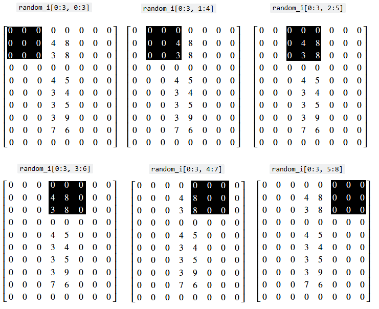
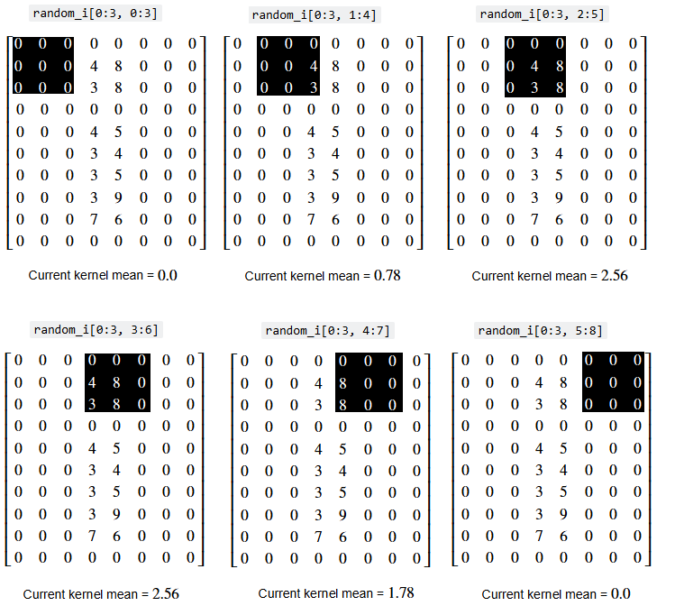

---
jupyter:
  jupytext:
    formats: ipynb,Rmd
    text_representation:
      extension: .Rmd
      format_name: rmarkdown
      format_version: '1.2'
      jupytext_version: 1.17.3
  kernelspec:
    display_name: Python 3 (ipykernel)
    language: python
    name: python3
---

# Convolution filters I - the mean filter

## Footprints and pixel neighborhoods


On the last page we filtered images based on a single threshold value, or based on multiple threshold values. Other filters work differently: they work by adjusting a given pixel's value based on the value of other pixels which surround it, in a specified area. The mean filter is one such filter.

The mean filter is a *local filter*, because it alters a given pixel's value based on the values of other pixels in the surrounding "local neighborhood". The image below shows the pixel values in the `smiley` image array that we created on an earlier [page](0_images_as_numpy_arrays). Two possible "local neighborhoods" are shown for a given pixel, which is highlighted in red. One neighborhood is 3-by-3, and the other is 5-by-5 — we could use either when using a local filter:


The values within a pixel's local neighborhood affect the value that a local
filter calculates when applied to given pixel. The `size` and `shape` of the
"neighborhood" are up to the user. We can also refer to the neighborhood as
a "footprint" or "structuring element". As we will see later, Scikit image
favors the term "footprint". For now, we will use the terms "footprint" and
"neighborhood" interchangeably to refer to some set of pixels that surround
a given pixel.

::: {note}

**Footprints are binary arrays defining neighborhood**

Above we've show footprints that are squares of different sizes, but in general a footprint is a binary array defining the voxels in the pixel neighborhood, with True (1) meaning in the neighborhood, and False (0) meaning not in the neighborhood.

For example, instead of a square, we could use a cross-shaped footprint like
this:

```python
x_shape = np.array([[False, True, False],
                    [True,  True,  True],
                    [False, True, False]])
```
:::

The mean filter, as the name suggests, *averages* the pixel values within
a footprint/neighborhood. To see this in action, let's build a simple mean
filter to filter an image array. First, we perform some imports, and change
some defaults.

```{python}
# Library imports.
import numpy as np
import matplotlib.pyplot as plt
import scipy.ndimage as ndi
import skimage as ski

# Set 'gray' as the default colormap
plt.rcParams['image.cmap'] = 'gray'

# Set NumPy precision to 2 decimal places
np.set_printoptions(precision=2)

#  Custom functions for illustrations, hints, and to quickly report image attributes.
from show_attributes import show_attributes
from hints import hint_strange_coffee
```

Next, we create the `random_i` image array:

```{python}
# Create a grayscale image array.
random_i = np.array([[0, 0, 0, 0, 0, 0, 0, 0],
                     [0, 0, 0, 4, 8, 0, 0, 0],
                     [0, 0, 0, 3, 8, 0, 0, 0],
                     [0, 0, 0, 0, 0, 0, 0, 0],
                     [0, 0, 0, 4, 5, 0, 0, 0],
                     [0, 0, 0, 3, 4, 0, 0, 0],
                     [0, 0, 0, 3, 5, 0, 0, 0],
                     [0, 0, 0, 3, 9, 0, 0, 0],
                     [0, 0, 0, 7, 6, 0, 0, 0],
                     [0, 0, 0, 0, 0, 0, 0, 0]])
print(random_i)
plt.imshow(random_i);
```

Let's use some indexing to go for a walk through the neighborhoods
(footprints) in this array. As above, we'll use a simple 3 by 3 pixel square
as the footprint — thus we treat each `(3,3)` set of pixels as
a separate neighborhood. For now, we only walk through the neighborhoods at
the "top" of the array. We will start our "walk" in the top-left corner of the
array, so that each 3-by-3 slice is centered on a pixel in the second row of
the image:

```{python}
# Pixel values in the first neighborhood.
i_row_start, i_col_start = 0, 0
i_row_end, i_col_end = 3, 3
random_i[i_row_start:i_row_end, i_col_start:i_col_end]
```

```{python}
# The second neighborhood.
i_row_start, i_col_start = 0, 1
i_row_end, i_col_end = 3, 4
random_i[i_row_start:i_row_end, i_col_start:i_col_end]
```

```{python}
# The third neighborhood.
i_row_start, i_col_start = 0, 3
i_row_end, i_col_end = 3, 6
random_i[i_row_start:i_row_end, i_col_start:i_col_end]
```

Obviously, this "walk" is more efficient in a for loop:

```{python}
for i in range(6):
    i_row_start, i_col_start = 0, i
    i_row_end, i_col_end = 3, i+3
    print(f"\nrandom_i[{i_row_start}:{i_row_end}, {i_col_start}:{i_col_end}]\n")
    print(random_i[i_row_start:i_row_end, i_col_start:i_col_end])
```

We can visualise the "walk" we have just taken, with prettier graphics — (you
may want to right click on these images and open them in a new tab/window, for
easier viewing):



Now, imagine we calculate the mean within each of these neighborhoods
(footprints) - the mean of the pixel values within each footprint is shown
below with the image of each indexing operation:



...and now further imagine that we replace the *central pixel value of the
3-by-3 footprint with the mean of all the values in the footprint*. The image
below shows the central value being replaced with the mean with each
footprint:


This is how the mean filter operates:

- Define our footprint (e.g. our pixel neighborhood size and shape).
- For each pixel:
  * Center our footprint on the given pixel.
  * Replace the value of the central pixel with the mean of the pixels in the
    neighborhood.

The illustrations above only show the footprint proceeding through the pixels
at the "top" of the array. In reality, filtering operations are applied to
every pixel in the image. You can think of this as the footprint "walking"
through the entire array, being centered on one pixel at a time.

Astute readers might ask "what happens near the edges of the array? If we center our footprint on a pixel in the last column or row, won't part of the footprint 'fall off' the edge of the array?'":


Indeed, we need a strategy for this. There are actually many options for how a footprint should behave at the edges of an image array - we could "pad" the footprint elements that fall outside of the image with 0 values, for instance. Or we could duplicate values from the pixels at the edge of the array, to fill in footprint elements that fall outside of the array.

**For now we will not worry about the edges, we just use the footprint only
where it "fits" within the array.**

In effect, this ignores pixels near the edges of the image. Presently, most of
these pixels at the edges of the image are 0, and there is some distance
between the pixel values containing the "i" and the image edges, so ignoring
the pixels near the edge will not affect the "i" shape too much itself. The
image below illustrates this concept, for a generic array:


The cell below defines a function that will apply this mean footprint,
step-by-step in a for loop, to the whole image array.  It does this only for
pixel neighborhoods where the footprint "fits" over the central pixel, without
extending outside of the image:

```{python}
# A function to apply our crude mean footprint.
def three_by_three_mean_footprint(image):

    # Convert to float `dtype`.
    image = np.array(image,
                     dtype=float)

    # Get the image shape.
    n_rows, n_cols = image.shape

    # Create an empty image array (for the result of the
    # filtering operation)
    filtered_image = np.zeros(image.shape)

    # Loop through the pixels and get the mean of each footprint.
    for i in range(1, n_rows-1):
        for j in range(1, n_cols-1):
            row_start = i-1
            col_start = j-1
            row_end = i+2
            col_end = j+2
            footprint = image[row_start:row_end, col_start:col_end].copy()
            filtered_image[i, j] = footprint.mean()
    return filtered_image
```

Let's apply our crude mean filter to the image array, and compare it to the original image array:

```{python}
# Apply our mean filtering function.
mean_filtered_i = three_by_three_mean_footprint(random_i)

# Show the original array and the filtered array, from the
# "raw" NumPy perspective.
print(f"Original:\n\n {random_i}")
print(f"\nCrude Mean filter:\n\n {mean_filtered_i}")

# Plot both arrays.
plt.subplot(1,2,1)
plt.imshow(random_i);
plt.title('Original')
plt.subplot(1,2,2)
plt.imshow(mean_filtered_i)
plt.title("Crude Mean Filter");
```

We can see that some of the non-black (non-zero) pixel intensity values have
been "spread around" to neighboring pixels, which is unsurprising, given what
we know about how this operation works. We have literally, for each given
pixel, "averaged out" between the pixels in the 3-by-3 neighborhood around the
pixel. This is a very crude mean filter, intended to show the foundational
principles of filtering via a footprint. There is a better, less crude way to
implement a mean filter, however, to which we will come to in the next
section.

::: {exercise-start}
:label: dont-be-mean
:class: dropdown
:::

For this exercise, you should build a function which filters an image using
a 3-by-3 footprint, like we did above. Your function should "walk" the 3-by-3
footprint through an image array, but it can ignore edge pixels, as we did
above. In other words, you can just alter central pixels where the footprint
"fits", as in the image below:


However, your footprint should do something different to the mean footprint we
implemented earlier. Your function will do something dark, something illegal
(at least by the standards of `skimage` `dtype` conventions)...

It should replace the central pixel value with the *negative sum* of the
values under the footprint (e.g. add the values under the footprint to give
the sum, and then make the sum negative). You should apply this to the `coins`
image from `ski.data`. Here is the original image:

```{python}
coins = ski.data.coins()
show_attributes(coins)
plt.imshow(coins)
```

Here is how your image should look, after applying the negative sum filter, with a 3-by-3 footprint:


This operation will create some non-standard floating point pixel values - in
the sense that they are not between -1 and 1. You should `rescale_intensity()`
to ensure your image has the follow (legal!) attributes:

```
Type: <class 'numpy.ndarray'>
dtype: float64
Shape: (303, 384)
Max Pixel Value: 1.0
Min Pixel Value: -1.0
```

**DO NOT ADJUST ANY OF THE FUNCTIONS USED ABOVE WHEN MAKING YOUR FUNCTION**. Try to do this from scratch, clearly thinking about what you need to do.

```{python}
# YOUR CODE HERE
def three_by_three_negative_sum_footprint():
    ...
```

::: {exercise-end}
:::

::: {solution-start} dont-be-mean
:class: dropdown
:::

Whilst we told you not to adjust the function from above, obviously you
function needs to do something similar to the function from above. So that was
a rule for you, not for us ;)

Here we have adjusted the function to take the negative sum of the footprint
elements, rather than the mean. We also `rescale_intensity()` in the final
line, to ensure pixel values fall in a typical range, for the `float64`
`dtype`:

```{python}
def three_by_three_negative_sum_footprint_solution(image):

    # Convert to float `dtype`.
    image = np.array(image,
                     dtype=float)

    # Get the image shape.
    n_rows, n_cols = image.shape

    # Create an empty image array (for the result of the
    # filtering operation)
    filtered_image = np.zeros(image.shape)

    # Loop through the pixels and get the mean of each footprint.
    for i in range(1, n_rows-1):
        for j in range(1, n_cols-1):
            row_start = i-1
            col_start = j-1
            row_end = i+2
            col_end = j+2
            footprint = image[row_start:row_end, col_start:col_end].copy()
            # Take the negative sum.
            filtered_image[i, j] = -footprint.sum()
    # Rescale to ensure legal pixel values.
    return ski.exposure.rescale_intensity(filtered_image, out_range="float64")
```

We reload in the `coins` image, to which to apply our new filter:

```{python}
# Load in and show the `coins` image.
coins_solution = ski.data.coins()
plt.imshow(coins_solution);
```

We then apply our filter, replacing the value of the central pixel in each footprint with negative sum of the value of all the pixels under the footprint:

```{python}
# Filter and show...
neg_sum_filter_coins = three_by_three_negative_sum_footprint_solution(
    coins_solution)
plt.imshow(neg_sum_filter_coins);
```

Here are the attributes of the somewhat ghostly, filtered image:

```{python}
show_attributes(neg_sum_filter_coins)
```

::: {solution-end}
:::


## Convolution

In normal practice, filtering operations which use footprints rely on
a mathematical operation called
[convolution](https://en.wikipedia.org/wiki/Convolution).

::: {note}

**Footprints and kernels**

At this point we introduce a new idea — that of a *kernel*. 

Remember that a footprint is a binary array defining the neighborhood that
defines which pixel values we consider as the neighborhood.  For mean
filtering, for example, we place the footprint over each pixel of the image,
to define the neighboring values of the pixel, then apply an operation
— taking the mean — to calculate the new pixel value.

A kernel is like a footprint array, but where the values of the array, instead
of being binary (0 or 1) contain the weights to apply to the corresponding
pixel in the neighborhood.

We generate the new filtered value by multiplying the kernel values by their
corresponding pixels, and summing the result.

This should be come clear as the page progresses.

:::

Convolution is similar to the process we saw with our crude mean filter.  However, instead of walking a footprint over the image, and applying some methematical operation to the values within the footprint — we use a *kernel*, which is a *footprint with weights* (see above).

As for footprints, we "walk" a kernel across our whole image, centering it on
every pixel, then apply the kernel weights to their corresponding pixel values, and sum to produce the new pixel value.

Let's implement a true mean filter, using convolution. Obviously, we start
with our kernel (a footprint with weights). First, we define the kernel shape:

```{python}
# Define our kernel shape.
kernel_shape = (3, 3)
```

We take the product of the shape tuple, to get the number of elements inside
the kernel (in this case 3 * 3 = 9, so 9 elements in the 3-by-3 kernel):

```{python}
# Get our kernel size, e.g. the number of elements in the kernel.
kernel_size = np.prod(kernel_shape)
kernel_size
```

We can then construct our kernel, using `np.full()` which allows us to fill an array with a given value. In this case we will fill it with $\frac{1}{n}$, where $n$ is the number of elements in our kernel (9 kernel elements - so $\frac{1}{9}$ = 0.11):

```{python}
mean_kernel = np.full(shape=kernel_shape,
                      fill_value=1/kernel_size)

mean_kernel
```

Our purpose here is to take the mean of the values under the kernel, so how
does a 3-by-3 kernel filled with $\frac{1}{n}$ help us?

Well, this value can be used to find the mean (duh!)...we'll show this quickly using just four random values:

```{python}
x = np.array([10, 21, 3, 45])
np.mean(x)
```

If we multiply each value by $\frac{1}{n}$ and then take the sum of those values, we get...

```{python}
n = len(x)
div_by_n = x * 1 / n
np.sum(div_by_n)
```

To belabor the point mathematically — write our vector (array) above as
$\vec{x}$.   Write the `sum` operation as $\sum$.  Then the mean of $\vec{x}$
is given by:

$$
\begin{align}
\frac{1}{n} \sum x_i \\
= \frac{1}{n} (x_1 + x_2 ... + x_n) \\
= \frac{1}{n} x_1 + \frac{1}{n} x_2 ... \frac{1}{n} x_n \\
= \sum \frac{x_i}{n}
\end{align}
$$

And we can do exactly the same thing with the `mean_kernel` we made above. We can use the `scipy.ndimage.correlate()` function to achieve this with maximum efficiency (relative to the crude method we used above). This function involves ["moving a [...] kernel over [an] image and computing the sum of products at each location"](https://docs.scipy.org/doc/scipy/reference/generated/scipy.ndimage.correlate.html). This means we:

- Center the kernel on given array pixel in the original image.
- Multiply the array pixel values covered by the kernel with the elements in
  the kernel (in this case every kernel element value is $\frac{1}{9}$).
- Get the sum of those products (e.g. add them all together to produce
  a single value).
- Replace the central array pixel value in the original image with the single
  value we just computed.

Because we are using a mean kernel, this operation will, shockingly, return
the mean of values under the kernel. This process is illustrated below for
three kernel locations - (once more you may want to right click on these
images and open them in a new tab/window, for easier viewing):


Now, let's apply this kernel convolution to every pixel in the image array:

```{python}
# A new import.
import scipy.ndimage as ndi

# Perform the convolution.
mean_filtered_random_i_via_sp = ndi.correlate(input=random_i,
                                              weights=mean_kernel,
                                              output=float) # Output `dtype`

# Show the original image array, and the mean filtered image array
print(f"Original:\n\n {random_i}")
print(f"\nMean filter:\n\n {mean_filtered_random_i_via_sp}")
plt.subplot(1, 2, 1)
plt.imshow(random_i)
plt.title("Original")
plt.subplot(1, 2, 2)
plt.title('Mean Filtered')
plt.imshow(mean_filtered_random_i_via_sp);
```

The result is very similar to that obtained by our crude mean filter, only now
it has been applied to *every* array pixel, including the edge pixels, where
our crude filter simply ignored pixels at the edge of the image:

```{python}
# Show the result from our crude mean filter
print(f"\nCrude mean filter:\n\n {mean_filtered_i}")
print(f"\n\nMean filter via SciPy `correlate`:\n\n {mean_filtered_random_i_via_sp}")
```

These two arrays are shown below side-by-side, and more nicely rendered, for easier comparison:


You can see that the values differ only near the top and bottom edges of the
image. `ndi.correlate()` offers several options for dealing with pixels at the
edge of the array (e.g. those pixels for which the kernel "falls off" the edge
of the image). Here are the options, from the
[documentation](https://docs.scipy.org/doc/scipy/reference/generated/scipy.ndimage.correlate.html),
we can choose an option by specifying the `mode` argument to `ndi.correlate`
(e.g. `mode = 'constant'` etc.):

```{python tags=c("hide-input")}
# Print the help for the mode parameter.
import re

print(re.search(r'\s+mode\s*:.*?(?=\s+cval\s*:)',
                ndi.correlate.__doc__,
                flags=re.MULTILINE | re.DOTALL)
      .group())
```

Let's define a function so that we can apply the mean filter to any image,
using the proper `scipy.ndimage.correlate()` machinery, so we no longer ignore
edge pixels (poor pixels!).   We'll define the kernel with a shape, giving the
shape of the footprint.

```{python}
def mean_filter(image_array, kernel_shape):
    footprint = np.ones(kernel_shape)
    n = np.sum(footprint)  # Number of pixels in footprint.
    mean_kernel = footprint / n
    return ndi.correlate(image_array,
                         mean_kernel,
                         output=float)
```

We'll apply it to a grayscale `coffee` image, originally a color image from `ski.data`:

```{python}
coffee_gray = ski.color.rgb2gray(ski.data.coffee())
plt.imshow(coffee_gray);
```

But first, we will use `np.random.normal()` to add some normally distributed
(Gaussian) noise to the image:

```{python}
# Add some noise to the pixel values in `coffee`.
rng = np.random.default_rng()
# Mean 0, std 2 normal random numbers.
noisy_coffee_gray = coffee_gray + rng.normal(0, 2, size=coffee_gray.shape)
plt.imshow(noisy_coffee_gray);
```

The mean filter can remove some of the noise, restoring the clarity of the image:

```{python}
# Mean filter the noisy coffee image, and show the result.
noisy_coffee_gray_mean_filtered = mean_filter(noisy_coffee_gray, (10, 10))
plt.figure(figsize=(20, 20))
plt.subplot(1, 3, 1)
plt.imshow(coffee_gray)
plt.title("Original")
plt.axis('off')
plt.subplot(1, 3, 2)
plt.title('Noisy')
plt.imshow(noisy_coffee_gray)
plt.axis('off')
plt.subplot(1, 3, 3)
plt.title('Mean Filtered')
plt.imshow(noisy_coffee_gray_mean_filtered)
plt.axis('off');
```

We can see that the image is clearer, the noise has been reduced and some of
the signal has been restored.

Let's try out some different kernel sizes:

```{python}
# Mean filter, with various kernel sizes.
n_cols = 3
plt.figure(figsize=(12, 7))
plt.subplot(2, n_cols, 1)
plt.imshow(coffee_gray)
plt.title("Original")
plt.axis('off')
plt.subplot(2, n_cols, 2)
plt.title('Noisy')
plt.imshow(noisy_coffee_gray)
plt.axis('off')
for i in range(3, int(n_cols*2)+1):
    plt.subplot(2, n_cols, i)
    kernel_shape = (i+(i*3), i+(i*3))
    plt.title(f'Mean Filtered\nKernel = ({i+(i*3)},{i+(i*3)})')
    plt.imshow(mean_filter(noisy_coffee_gray, kernel_shape))
    plt.axis('off')
plt.subplots_adjust()
plt.tight_layout();
```

As with many filtering operations, the effect of altering aspects of the
filtering process (like a threshold value or kernel size), is very
context-dependent. It may take many iterations before finding a "sweet spot",
and where the sweet spot is may be somewhat subjective.


::: {exercise-start}
:label: strange-filter-coffee
:class: dropdown
:::

The nice thing about applying filtering via convolution kernels is that
changing the kernel itself lets us implement a wide variety of functions, even
fairly strange ones. In this exercise, you will write a function called
`strange_filter()`. You should apply it to `coffee_gray` to produce the
following image:


The kernel we used, and that we want you to us, was one where the kernel value
was proportional to the Euclidean distance from the kernel center.  That is,
if $i$ is the first (row) index *of the kernel*, and *j* is the second
(column) index of the kernel, the kernel value at coordinate $i, j$ is given
by:

$$
\sqrt{(i - c_i)^2 + (j - c_j)^2)}
$$

where $c_i$ and $c_j$ are the coordinates of the center pixel in the kernel.

Notice this gives higher weight to pixels that are *further from the center*.

You might remember this kind of idea from the circular mask in the [mask
section](on-masks).  Look there for inspiration.

Write your function so that it can be used with kernels of different `shape`s, so you can work out what kernel `shape` you need to recreate the target image, by trial and error.

**DO *NOT* COPY THE `mean_filter()` FUNCTION FROM ABOVE AND MODIFY IT** - try to write a function from scratch, thinking carefully about what you need to do.

*Hint:* You will need a fairly large kernel to get the effect you want.

*Hint:* run the `hint_strange_coffee()` function for additional help.

```{python}
# YOUR CODE HERE
strange_coffee = coffee_gray.copy()

# Show `strange_coffee`.
plt.imshow(strange_coffee)
show_attributes(strange_coffee)
```

::: {exercise-end}
:::

::: {solution-start} strange-filter-coffee
:class: dropdown
:::

The solution here involves adapting the code you find in [the mask
section](on-masks), to build the kernel.  Let's start by building a function
to build the kernel for given kernel shape:

```{python}
def euclid_kernel(kernel_shape):
    # i and j coordinates in the kernel.
    i_coords, j_coords = np.meshgrid(np.arange(kernel_shape[0]),
                                     np.arange(kernel_shape[1]),
                                     indexing='ij')
    # Calculate distance for each pixel in kernel.
    c_i, c_j = (np.array(kernel_shape) - 1) / 2
    return np.sqrt((i_coords - c_i) ** 2 + (j_coords - c_j) ** 2)

# Show a 25 by 25 kernel.
plt.imshow(euclid_kernel((25, 25)))
```

We define our `strange_filter()` function in the cell below:

```{python}
def strange_filter_solution(image_array, kernel_shape):
    return ndi.correlate(image_array,
                         euclid_kernel(kernel_shape),
                         mode='reflect',  # The default.
                        )
```

To get the exact target image, we use a kernel of `shape` (50, 50):

```{python}
# Apply the filter and show the result.
strange_filter_coffee = strange_filter_solution(coffee_gray, (50, 50))
show_attributes(strange_filter_coffee)
plt.imshow(strange_filter_coffee);
```

```{python tags=c("remove-cell")}
# Regenerate and store the output image for page build, used above.
plt.imshow(strange_filter_coffee);
plt.savefig('images/coffee_strange_kernel.png')
```

**For reflection** — why does the filtered image look as it does?  See if you
can explain its features, compared to the original.

This is quite a strange kernel to apply! But it shows us how easy it is to achieve radical filtering effects with some custom kernels...

::: {solution-end}
:::


## Mean filtering with `skimage`

We can implement a mean filter using the `ski.filters.rank.mean()` function. `skimage` uses `footprint`s rather than kernels. We supply a small *footprint* array with which to "walk" through the image, centering the footprint on every pixel, and modifying that central pixel's value based on the values of the other pixels in its neighborhood, with the size and shape of the neighborhood being defined by the footprint.

Inspecting the `skimage` documentation will reveal that the format expected
for the `footprint` should be ["the [pixel] neighborhood expressed as an
ndarray of 1’s and
0’s."](https://scikit-image.org/docs/0.25.x/api/skimage.filters.rank.html#skimage.filters.rank.mean).
We will use `np.ones()` to generate an array in this format. We use a (9, 9)
kernel to achieve a stronger visual effect:

```{python}
# A "footprint" to pass to `skimage`.
footprint_9_by_9 = np.ones((9, 9))
footprint_9_by_9
```

We will use it to filter the stalwart `camera` image:

```{python}
# Import and show the `camera` image.
camera = ski.data.camera()
plt.imshow(camera);
```

Below, we apply the mean filter, using the `footprint_9_by_9` array as the
footprint.  At each pixel, Scikit-image will place the footprint over the
pixel, select the values in the image with a corresponding 1 (or True) in the
footprint, and apply the `mean` operation to those values.

```{python}
# Mean filter the `camera` image with `skimage`
mean_filtered_camera = ski.filters.rank.mean(camera,
                                             footprint=footprint_9_by_9)

# Plot both image to compare
plt.figure(figsize=(10, 4))
plt.subplot(1, 2, 1)
plt.title('Original')
plt.imshow(camera)
plt.subplot(1, 2, 2)
plt.title('Mean filtered\n(9,9) kernel')
plt.imshow(mean_filtered_camera);
```

## Filtering 3D images

We can filter a 3D color image by convolving our filtering kernel with each color channel separately. Let's load a 3D image:

```{python}
# Load in and show an image.
astronaut = ski.data.astronaut()
show_attributes(astronaut)
plt.imshow(astronaut);
```

If we try to filter this image with our (3, 3) `mean_kernel` we will get an error:

```{python tags=c("raises-exception")}
# Oh dear.
astronaut_mean_filtered = ndi.correlate(astronaut, weights=mean_kernel)
```

As you can see, the error results from using a 2D kernel to filter a 3D image. A simple solution to this is just to apply the filter to each color channel separately. This is done in the cell below, using a for loop to filter each channel, storing the channels separately in a dictionary, and then `np.stack()`-ing the individually filtered channels back into a 3D image:

```{python}
# A dictionary to store the individually filtered channels.
filtered_channels = {}

# Loop through and filter each channel individually, store
# the results in the dictionary.
for i in range(astronaut.shape[2]):
    current_filtered_channel = ndi.correlate(astronaut[:, :, i],
                                             weights=mean_kernel)
    filtered_channels[i] = current_filtered_channel

# Stack back to 3D.
astronaut_mean_filtered = np.stack([filtered_channels[0],
                                    filtered_channels[1],
                                    filtered_channels[2]],
                                   axis=2)

# Show the result.
plt.figure(figsize=(12, 6))
plt.subplot(1,2,1)
plt.title("Original")
plt.imshow(astronaut)
plt.subplot(1,2,2)
plt.title("Mean Filtered \n (3, 3) kernel")
plt.imshow(astronaut_mean_filtered)
plt.tight_layout();
```

This is straightforward to do with `skimage` as well; we also use the larger
(9, 9) `footprint_9_by_9` kernel:

```{python}
# A dictionary to store the individually filtered channels.
filtered_channels = {}

# Loop through and filter each channel individually, store
# the results in the dictionary.
for i in range(astronaut.shape[2]):
    current_filtered_channel = ski.filters.rank.mean(  # skimage filtering.
        astronaut[:, :, i],
        footprint=footprint_9_by_9) # Use a larger kernel.
    filtered_channels[i] = current_filtered_channel

# Stack back to 3D.
astronaut_mean_filtered = np.stack([filtered_channels[0],
                                    filtered_channels[1],
                                    filtered_channels[2]],
                                   axis=2)

# Show the result.
plt.figure(figsize=(12, 6))
plt.subplot(1,2,1)
plt.title("Original")
plt.imshow(astronaut)
plt.subplot(1,2,2)
plt.title("Mean Filtered with `ski.filters.rank.mean()` \n (9, 9) kernel")
plt.imshow(astronaut_mean_filtered)
plt.tight_layout();
```

We got a blurrier output image via `skimage` here, than in the manual
convolution using `ndi.correlate()`. This is because we used a larger kernel
for the `skimage` filtering, and so are averaging over larger pixel
neighborhoods.

Scikit-image will also handle this using a 3D kernel.

```{python}
footprint_9_by_9_3D = np.ones((9, 9, 3))
```

```{python}
# Mean filter the color image, with `skimage`.
astronaut_mean_filtered_ski = ski.filters.rank.mean(astronaut,
                                                    footprint=footprint_9_by_9_3D)

# Show the result.
plt.figure(figsize=(12, 6))
plt.subplot(1,2,1)
plt.title("Original")
plt.imshow(astronaut)
plt.subplot(1,2,2)
plt.title("Mean Filtered (via Scikit-image)\n (9, 9) kernel")
plt.imshow(astronaut_mean_filtered_ski)
plt.tight_layout();
```

Pay attention here to the effect on the *color* of the image. How is it
different to filtering the color channels separately?

You'll notice that the colors have changed substantially, relative to when we
filtered each channel separately. This is because the 3D kernel is averaging
*across the color channels*. We may want this effect (it is somewhat retro),
but if we do not want to mix the color channels of the image, then generally
filtering the channels separately is the way to go...


## Summary

This page has showed how to perform mean filtering, using `numpy`, `scipy` and
`skimage`. On the [next page](6_gaussian_sharpening_edge), we will look at
using different convolution kernels to get different filtering effects.


## References

* Gulati, J. (2024) *NumPy for Image Processing*. KDnuggets. Available from:
  <https://www.kdnuggets.com/numpy-for-image-processing>
* <https://setosa.io/ev/image-kernels>
* [Types of convolution
  kernels](https://www.geeksforgeeks.org/deep-learning/types-of-convolution-kernels).

Adapted from:

* [Scientific Python Lecture Notes - image
  processing](https://lectures.scientific-python.org/advanced/image_processing)
* [Scientific Python Lecture Notes: scikit-image](https://lectures.scientific-python.org/packages/scikit-image/index.html)

