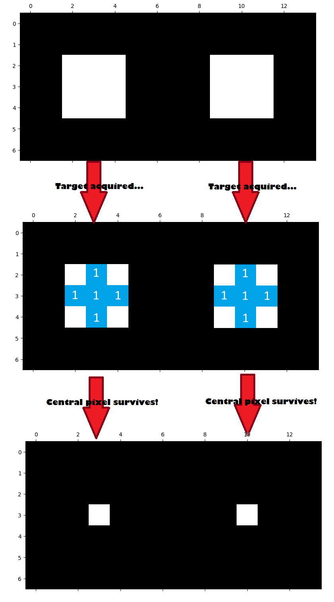
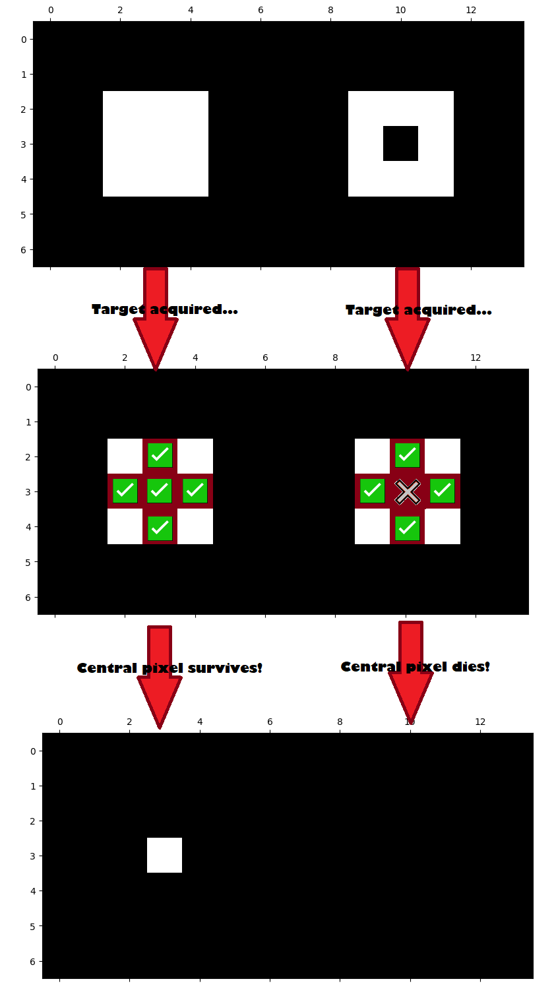
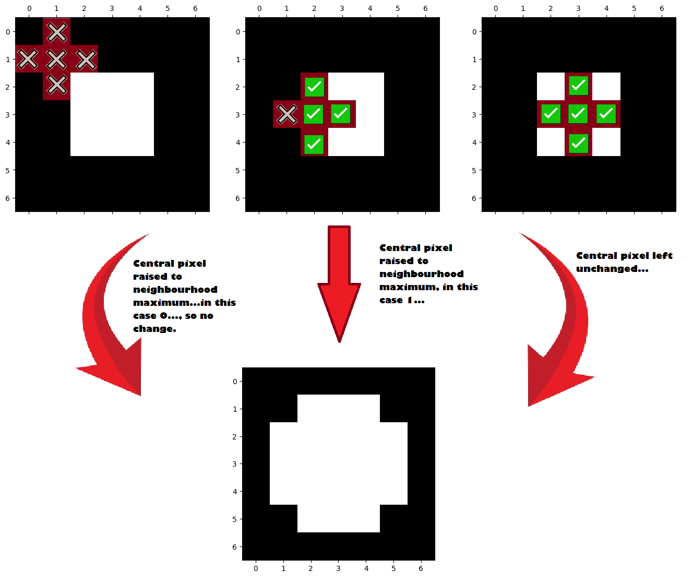
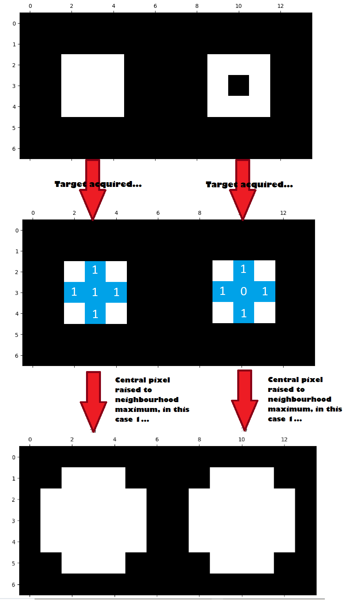
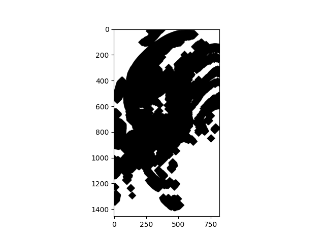

---
jupyter:
  jupytext:
    formats: ipynb,Rmd
    text_representation:
      extension: .Rmd
      format_name: rmarkdown
      format_version: '1.2'
      jupytext_version: 1.17.3
  kernelspec:
    display_name: Python 3 (ipykernel)
    language: python
    name: python3
---

# Morphology

[Morphology](https://en.wikipedia.org/wiki/Mathematical_morphology) is the
mathematical study of shapes and has numerous applications in image processing.
As such, Scikit-image has a dedicated module (`ski.morphology`) for associated
functions.

We have already encountered footprints and kernels
on [earlier](4_threshold_filters) [pages](5_mean_filter). A footprint is
a binary array defining a certain shape - you can think of it as a "template"
— which is used to define the "neighborhood" of pixels which an image
processing operation affects.  As you remember, a *kernel* is a footprint
containing *weights*.  We might consider kernels as specialized footprints.

::: {note}

**Footprints and structuring elements**

You will see other tutorials refer to *footprints* as *[structuring
elements](https://en.wikipedia.org/wiki/Structuring_element)* or *structural
elements*.  We stick to "footprint" here for compatibility with the
Scikit-image terminology, but a footprint is identical in meaning to
structuring/structural element.

:::

When applying our familiar mean filter, a (say) (3, 3) footprint can be
applied as a square which affects 9 pixels - we might alter the image by
centering this footprint over every pixel, and replacing each pixel with the
mean of the other pixels in its "neighborhood", for instance:


You will also recall that we need a strategy for pixels at the edge of the
image, where we center the footprint on a pixel where part of the footprint
"falls off" the edge of the image:


Options here including "padding" the empty footprint locations with a repeated
value (like 0), or just duplicating the existing pixels at the edge of the
image.

We have seen footprints and kernels applied during filtering operations,
courtesy of the `ski.filters` module. Morphological operations also make use of
footprints. As you remember, footprints (but not kernels) are binary (contain
only True / False or 0 / 1).


## Morphology and footprints

The fundamental operations of morphological image processing are [erosion](https://en.wikipedia.org/wiki/Erosion_(morphology)) and
[dilation](https://en.wikipedia.org/wiki/Dilation_(morphology)).

As you are about to see, basic morphological operations work on shapes within
images by:

* Choosing a footprint of a specific shape. This footprint acts as a ["probe"](https://biapol.github.io/Image-data-science-with-Python-and-Napari-EPFL2022/day2d_image_segmentation/03_Morphological_operations.html), which scans the image for the footprint shape, centering on each pixel. The relationship between the probe and a given region of the image determines whether (and what) changes will be applied to that region.  
    
* Common changes applied via this probe are:
  * the `minimum` function, to do an operation called *erosion* or
  * the `maximum` function, to do an operation called *dilation* or
  * some combination of these.

The primary new thing we see in morphology, compared to our previous filters,
is an increased interest in the *shape* defined by the binary *footprint*.
Regions of the image are altered based upon that shape, and so the specific
shape of the footprint has a large impact on the result of morphological 
operations. In addition, the morphological operations covered on this page
introduce `minimum` and `maximum` functions to use in footprint / function filters.

Using filters and crafted footprints allows us to tune our filtering to the
shape (...or, well,
[*morphology*](https://www.cs.auckland.ac.nz/courses/compsci773s1c/lectures/ImageProcessing-html/topic4.htm)) of features within the image.


## Erosion is footprint / function filtering with `minimum`

Let us leap ahead to show you the morphological operation of [erosion](
https://en.wikipedia.org/wiki/Erosion_(morphology)).

As we said above, erosion is the application of a footprint / function filter,
where the function is "minimum".

```{python}
import skimage as ski
import numpy as np
import matplotlib.pyplot as plt

# A custom function for displaying image attributes.
from skitut import show_attributes

# A custom function to show original and altered images side-by-side.
from skitut import show_both

# Set 'gray' as the default colormap
plt.rcParams['image.cmap'] = 'gray'
```

The morphology (shape) part of erosion, is the choice of a footprint to identify the shape you are interested in, within the image.

For example, consider this image — the blue channel of an image from the Hubble Space Telescope:

```{python}
# Blue channel of Hubble image, as uint8
hubble_blue = ski.data.hubble_deep_field()[:, :, 2]
# As uint8 integer image type.
hubble_blue_ubyte = ski.util.img_as_ubyte(hubble_blue)
plt.imshow(hubble_blue_ubyte);
```

There are a small number of bright, large stars in this field, and a much larger number of smaller stars.

We might want to keep the larger disk-shaped objects in this image (brighter stars), and suppress the smaller objects.

We can do this by first specifying a disk as our footprint — identifying the shape of the local neighborhood:

```{python}
# Our footprint is a disk of radius 5 pixels.
disk_5 = ski.morphology.disk(radius=5)
disk_5
```

```{python}
# Footprint as image.
plt.imshow(disk_5);
```

This will be our footprint when applying a `minimum` function, from `ski.filter.rank`, like this:

```{python}
hubble_eroded = ski.filters.rank.minimum(hubble_blue_ubyte, disk_5)
plt.imshow(hubble_eroded);
```

This is the algorithm for *erosion*, one of the two basic operations in
morphology (the other being *dilation*).

You will see above, the minimum filtering with the disk footprint has the effect of keeping areas which are disks of the given size or bigger, and suppressing areas which have objects of smaller size.  The next section explains how this works, using binary images as examples.

We have said that *erosion* is the process of applying a footprint / function filter, where the function is *minimum* (as above).  Just to show this is the case, here we use the `ski.morphology.erosion` function to apply the same operation, and get exactly the same result:

```{python}
hubble_eroded_again = ski.morphology.erosion(hubble_blue_ubyte, disk_5)
# We get exactly the result we got by applying the minimum filter above.
np.all(hubble_eroded_again == hubble_eroded)
```

With that example, let us return to a discussion of the erosion (footprint
/ minimum) algorithm.


## Footprints as template shapes

Because morphological operations are part of image processing, they involve
the modification of array pixel values. In morphological operations, the
footprint guides changes to pixel values *depending upon the match/relationship between the
shape of the footprint and the shape of the pixels in the "neighborhood" of
the footprint*.

The footprint is centered once on every pixel in an image, and this central
pixel is modified (or not) depending upon the match/relationship between the shape of the
footprint and the shape described by the pixel values in that neighborhood.

::: {note}

**Footprints and centering**

We asserted above that we center the footprint on each pixel in the image, and
this by far the most common procedure.  However, you can ask Scikit-image or
Scipy `ndimage` to offset the footprint centering by a given number of pixels.  See the corresponding help for the Scikit-image and `ndimage` functions for detail on how to do this.

:::


## Erosion on a binary image

It can be easier to think of erosion (and dilation) in terms of their effects on simple binary (True / False, 1 / 0) images.

```{python}
# Make a binary square.
square = np.array([[0, 0, 0, 0, 0, 0, 0],
                   [0, 0, 0, 0, 0, 0, 0],
                   [0, 0, 1, 1, 1, 0, 0],
                   [0, 0, 1, 1, 1, 0, 0],
                   [0, 0, 1, 1, 1, 0, 0],
                   [0, 0, 0, 0, 0, 0, 0],
                   [0, 0, 0, 0, 0, 0, 0]], dtype=np.uint8)
plt.imshow(square);
```

Let's get fancy and ostentatious now, and invest in some diamonds, by which we
mean, let's use `ski.morphology.diamond()` to construct a new footprint:

```{python}
# Create a `diamond` footprint.
# Changing `radius` will change the size of the diamond.
diamond = ski.morphology.diamond(radius=1)
diamond
```

```{python}
plt.matshow(diamond);
```

Using `ski.morphology.diamond(radius=1)` gives us a diamond shaped footprint of
`shape` (3, 3). We'd call it a "cross" but "diamond" is the canonical term...
Be assured that it will look more diamond-like (diamond-y?) when set to
a bigger `radius`...:

```{python}
diamond.shape
```

As you read above, erosion proceeds by applying the following algorithm at each pixel of the image.

1. Placing the footprint over the pixel and
1. Selecting the pixel values under the footprint (where the footprint is
   1 / True) and
1. Setting the output value at the given pixel to the minimum of the selected
   values.

Here we erode our binary square using `ski.morphology.erosion()`.  We could
equivalently have used `ski.filter.rank.minimum`.  In either case, we use the
`footprint` argument to specify our footprint:

```{python}
# Erode our image.
eroded_square = ski.morphology.erosion(square,
                                       footprint=diamond)
# Show the result.
eroded_square
```

```{python tags=c("hide-input")}
plt.imshow(eroded_square);
```

What has happened here? We can think of our `diamond` footprint as being a bit
like a weird [crosshair/reticle](https://en.wikipedia.org/wiki/Reticle) of
a gun. In a morphological operation, we "target" the crosshair on a given
array pixel. 

When we apply the footprint to each pixel in the image, call the pixels under
the footprint — *the pixel neighborhood*. Because we are eroding, the central pixel will be *lowered to the value of the lowest pixel in its neighborhood*. 

In our specific case the *pixel neighbourhood* is the pixels in the image which fall
under the "crosshair" shape of the footprint. E.g. the image
pixels under the elements of the footprint which equal 1:

```{python}
# Here is our footprint...
diamond
```

Because we are eroding, and because our `square` array contains only 1s and 0s, 
the output pixels will be 1 *only if* all pixels in the local
neighborhood are 1, and 0 otherwise.  The image below shows the `diamond`
footprint being applied to three different central pixels. We we use blue squares to represent the footprint, with white text showing what value is in the image array at that location. 


Let's repeat this erosion process with two `square` arrays `concatenate`d
together.

What do you think will happen when we erode them using the `diamond`
footprint? Try to predict before you check:

```{python}
# `concatenate` two `square` arrays.
two_squares = np.concatenate([square, square], axis=1)
plt.imshow(two_squares);
```

```{python}
# Perform the erosion.
eroded_two_squares = ski.morphology.erosion(two_squares, diamond)
eroded_two_squares
```

```{python}
# Plot the result of the erosion.
plt.imshow(eroded_two_squares);
```

What happened here? Well, only two pixels have 1 as their neighbourhood minimum - 
the pixels at the center of each white square. This illustration below
shows what happened:




All other "neighborhoods" had at least one 0 in them, and so their central pixels were lowered to 0, resulting in 1-to-0 changes if the central pixel had a value of 1. 

One way to think of this is that the erosion footprint is "searching" for areas of the image which "match" its shape. For a central pixel with a value of 1 to "survive", all the values in its neighbourhood must also be 1. In this instance, therefore the neighbourhood "matches" the footprint - the neighbourhood has 1's everywhere the footprint has 1's. If at least one value in the neighbourhood does not match the shape of the 1's in the footprint (e.g. there is a 0 under the "crosshair") 

Let's alter our image array slightly, to see how this affects the erosion operation with our `diamond` footprint. We will place a black array pixel inside the right-hand white square:

```{python}
# A modified array.
square_the_circle = np.array([[0, 0, 0, 0, 0, 0, 0, 0, 0, 0, 0, 0, 0, 0],
                               [0, 0, 0, 0, 0, 0, 0, 0, 0, 0, 0, 0, 0, 0],
                               [0, 0, 1, 1, 1, 0, 0, 0, 0, 1, 1, 1, 0, 0],
                               [0, 0, 1, 1, 1, 0, 0, 0, 0, 1, 0, 1, 0, 0],
                               [0, 0, 1, 1, 1, 0, 0, 0, 0, 1, 1, 1, 0, 0],
                               [0, 0, 0, 0, 0, 0, 0, 0, 0, 0, 0, 0, 0, 0],
                               [0, 0, 0, 0, 0, 0, 0, 0, 0, 0, 0, 0, 0, 0]],
                               dtype="uint8")

plt.imshow(square_the_circle);
```

Before looking at the output of the cell below, try to think carefully about
how you think this will affect the erosion operation, using the (3, 3)
`diamond` footprint. Picture what will happen on the black pixel in the center
of the right-hand square.

Scroll down to the output of the cell below to see if your prediction was
correct:

```{python}
eroded_square_the_circle = ski.morphology.erosion(square_the_circle, diamond)
plt.imshow(eroded_square_the_circle);
```

Ok, so now the whole right-hand square got taken out. Brutal.

Why did this happen? The cell below illustrates, using green ticks for
"matches" between the footprint and the pixel "neighborhood", and red X's for
"clashes" between the footprint and the pixel "neighborhood".

Remember that any "clash" means the central pixel "dies" (gets set to 0);
a "match" means the central pixel "survives" (gets set to 1).



Think of erosion as searching for, and maintaining, areas matching the
footprint shape, while suppressing areas not of that shape.


## Dilation

The other foundational operation in morphological image processing is
*dilation*.

Dilation is nothing but a footprint / function filter, where the function is
`maximum` rather than `minimum`.

Dilation works in the same way as erosion, or any other footprint / function
filter, in terms of centering a footprint on each pixel, to select the pixel local neighborhood.  It takes the maximum of the local pixel values. Wherever the footprint "lands" the central pixel will be raised to the neighbourhood maximum.

Let's dilate the `square` array to illustrate:

```{python}
# Show the `square` array.
square
```

```{python}
plt.imshow(square);
```

Next we use `ski.morphology.dilation()` to dilate the image.   We could,
equivalently, use the `ski.filter.rank.maximum` function. Again, we will use
`diamond` as our footprint:

```{python}
# Perform the dilation.
dilated_square = ski.morphology.dilation(square,
                                         footprint=diamond)
dilated_square
```

```{python}
plt.imshow(dilated_square);
```

Again, here we use blue squares to represent the footprint, with white text showing what value is in the array at that location. Remember, *dilation will raise the central pixel to the neighbourhood maximum*.

So, if the values under the footprint are all 0, the central pixel will remain as 0. If there is a single 1 under the footprint, then the central value will be raised to 1:




What do you think will happen if we dilate the `square_the_circle` array image
shown below, using the `diamond` footprint?

Try to predict before checking:

```{python}
# Show the array.
square_the_circle
```

```{python}
plt.imshow(square_the_circle);
```

Let's see how good your prediction was:

```{python}
# Dilate the `square_the_circle` array, and show the result.
dilated_square_the_circle = ski.morphology.dilation(square_the_circle,
                                                    footprint=diamond)
plt.imshow(dilated_square_the_circle);
```

Why did this happen? The image below explains:




For erosion, all of the central pixels in the right-hand square get
*lowered* to their neighborhood minimum, in this case 0, and so they "die" and
fade into the black background.

For dilation, central pixels get *raised* to the neighborhood maximum,
which in this case is 1. So the black central pixel is brightened to white.

Think of dilation as extending bright areas with the footprint shape.

[Another way of thinking of this](https://scikit-image.org/docs/0.25.x/auto_examples/applications/plot_morphology.html) is:

* *Erosion enlarges dark regions and shrinks bright regions.*
* *Dilation enlarges bright regions and shrinks dark regions.*


## Morphology using more complex images

Let's apply some of this to more complex images. Fittingly, we will use
a terrifying picture of
a [Xenomorph](https://en.wikipedia.org/wiki/Xenomorph), which at the time of
writing Wikipedia defines as "a fictional endoparasitoid extraterrestrial
species that serves as the main antagonist of the Alien and Alien vs. Predator
franchises". Yikes.

```{python}
# Photo by Stockcake
# - https://stockcake.com/i/alien-head-close-up_1354662_1093149
xenomorph = ski.io.imread("images/xenomorph.jpg", as_gray=True)
# Convert to binary.
xenomorph = ski.util.img_as_bool(xenomorph).astype(int)

# Show the "raw" array.
xenomorph
```

```{python}
plt.imshow(xenomorph);
```

```{python}
# Show the attributes of `xenomorph`.
show_attributes(xenomorph)
```

Scary, especially as a binary image, but not quite as scary as the `smiley` image we [made](0_images_as_numpy_arrays) that still haunts our dreams.

True to form, eroding this image using the `diamond` footprint increases the
size of dark regions:

```{python}
# Erode the xenomorph.
xeno_binary_ero_rad_1_diamond = ski.morphology.erosion(xenomorph,
                                                       footprint=diamond)

# Show the result.
show_both(xenomorph, xeno_binary_ero_rad_1_diamond, "Eroded");
```

Whilst dilation increases the size of bright regions (creating a truly, truly
terrifying image):

```{python}
# Dilate the xenomorph.
xeno_binary_dilate_rad_1_diamond = ski.morphology.dilation(xenomorph,
                                                           footprint=diamond)

# Show the result.
show_both(xenomorph, xeno_binary_dilate_rad_1_diamond, "Dilated");
```

We can alter the size of the footprint to change the nature of the effect. The
exact change will be heavily dependent on the image array we are processing.
Here we create a diamond with `radius=6`:

```{python}
# Create and show a larger diamond footprint.
diamond_6 = ski.morphology.diamond(radius=6)
diamond_6
```

```{python}
plt.imshow(diamond_6);
```

Applied to the `xenomorph` image in an erosion operation, this has some radical
results:

```{python}
xeno_binary_ero_rad_6_diamond = ski.morphology.erosion(xenomorph,
                                                       footprint=diamond_6)
show_both(xenomorph,
          xeno_binary_ero_rad_6_diamond,
          "Eroded \n(13, 13) Diamond SE");
```

There are fewer areas for this large footprint where the all the values (and
therefore the minimum value) is high.  Therefore, erosion leaves less central
pixels with relatively high values, than for a smaller footprint of the same
shape.  For all the pixels where the local neighborhood includes at least one
low-value pixel, the erosion output is low-value, so the darker regions have
expanded substantially more than when we used a smaller `diamond`, which gave
more "matches".

Dilation, again has the opposite effect of increasing brighter regions around regions that are already bright:

```{python}
# Dilate the xenomorph with the `radius = 6` diamond.
xeno_binary_dilate_rad_6_diamond = ski.morphology.dilation(xenomorph,
                                                           footprint=diamond_6)
show_both(xenomorph,
          xeno_binary_dilate_rad_6_diamond,
          "Dilated \n(13, 13) Diamond SE");
```

We can also change the shape of the footprint - here we create a rectangle
(Ok, a square) of `shape` (3, 3):

```{python}
# A square footprint.
square_SE = ski.morphology.footprint_rectangle((3, 3))
square_SE
```

This new footprint is the same `shape` as the kernels we used on the
[filtering page](5_mean_filter). Below we use it to erode the xenomorph image:

```{python}
# Erode the xenomorph (with the square footprint).
xeno_binary_ero_square = ski.morphology.erosion(xenomorph,
                                                footprint=square_SE)
show_both(xenomorph,
          xeno_binary_ero_square,
          "Eroded \n(3,3) Square SE");
```

Dilation with this new footprint once more enlarges brighter regions, again
with horrific results:

```{python}
# Dilate the xenomorph, with the new footprint.
xeno_binary_dilate_square = ski.morphology.dilation(xenomorph,
                                                    footprint=square_SE)
show_both(xenomorph, xeno_binary_dilate_square, "Dilated \n(3,3) Square SE");
```

Changing the shape or size of the footprint will change the local pixel
neighborhood, and therefore the degree and location of changes to the
bright/dark regions, for both erosion and dilation. We are essentially looking
for features of a certain shape (the shape of our footprint) in the image, and
then dilating (increasing to neighborhood maximum) / eroding (decreasing to
neighborhood minimum) on that basis.

::: {exercise-start}
:label: block-xeno
:class: dropdown
:::

Try to recreate the following image by processing `xenomorph`, using only
`skimage` morphological operations, as well as operations from the other
tutorials, from `numpy`, `scipy` and `skimage`:



Look at the shape, the *morphology* of the features in the image - what shape
and size footprint do you think you need? Do you think you need dilation or
erosion?

For comparison, here is the original binarized image:

```{python}
plt.imshow(xenomorph);
```

```{python}
# YOUR CODE HERE
img = ...
```

::: {exercise-end}
:::

::: {solution-start} block-xeno
:class: dropdown
:::

We promised earlier that the `diamond` footprint would get more diamond-like
when it is larger. To complete this exercise, you need `big_diamond` with
`radius = 30`:

```{python}
# Expensive!
big_diamond = ski.morphology.diamond(radius=30)
plt.imshow(big_diamond);
```

Dilating with this `big_diamond` will give you the right outline, but the
wrong colors:

```{python}
# Solution, part 1:
xeno_big_diamond = ski.morphology.dilation(xenomorph,
                                           footprint=big_diamond)
plt.imshow(xeno_big_diamond);
```

To get the target image, we need to `invert` the colors:

```{python}
# Solution, part 2:
inverted_xeno_big_diamond = ski.util.invert(xeno_big_diamond)
plt.imshow(inverted_xeno_big_diamond);
```

```{python tags=c("remove-cell")}
# This is not part of the solution, but here we save the resulting solution
# image to display in the exercise introduction above.
plt.imshow(inverted_xeno_big_diamond)
plt.savefig('images/xeno_ex_1.png')
```

::: {solution-end}
:::


## Erosion and dilation on greyscale images

For most of this tutorial we have used binary images to show erosion and
dilation, but as you know the algorithm, it will be obvious how erosion and
dilation apply to greyscale images.

Erosion is the application of a footprint / minimum filter, so bright regions
matching the footprint shape will continue to be bright, but other regions,
including those at the edge of bright regions, will become dark (as they
acquire the minimum of the local neighborhood).  You have already seen erosion
with a radius 6 disk applied to the Hubble Space Telescope image above.  Let's
apply the `diamond_6` footprint to this image.

```{python}
# The original image (blue channel of Hubble image).
plt.imshow(hubble_blue_ubyte);
plt.title('Input image');
```

```{python}
# The footprint we will use.
plt.imshow(diamond_6)
plt.title('Footprint');
```

```{python}
# Eroded image.
# We used the equivalent ski.filters.rank.minimum call previously.
hubble_eroded = ski.morphology.erosion(hubble_blue_ubyte, diamond_6)
plt.imshow(hubble_eroded)
plt.title('Eroded image');
```

We can also apply dilation.  Here pixels with *any* bright pixel in the local
neighborhood become bright, so small bright objects will become larger.

```{python}
# Dilated image.
hubble_dilated = ski.morphology.dilation(hubble_blue_ubyte, diamond_6)
plt.imshow(hubble_dilated)
plt.title('Dilated image');
```

Notice that you can think of erosion is dilation of the dark areas in the
image, and dilation as erosion of the dark areas.


## Opening and closing

[Opening](https://en.wikipedia.org/wiki/Opening_(morphology)) and
[closing](https://en.wikipedia.org/wiki/Closing_(morphology) are two other
important morphological operations.

Opening is the result of:

* Applying erosion to an image and then
* Applying dilation to the result.

Closing is the result of

* Applying dilation to an image and then
* Applying erosion to the result.

Some reflection might reveal what kind of effects these will have.

For *opening*, we are first trimming the image down to objects matching the
footprint, and then expanding the remaining objects.

```{python}
# Recalculate the eroded Hubble image.
hubble_eroded = ski.morphology.erosion(hubble_blue_ubyte, diamond_6)
# Calculate the opened image by dilating the eroded image.
hubble_opened = ski.morphology.dilation(hubble_eroded, diamond_6)
plt.imshow(hubble_opened)
plt.title('Hubble image, opened');
```
We asserted that opening was erosion followed by dilation, but you will want
confirmation of this:

```{python}
# Is ski.morphology.opening actually the same as dilation on erosion?
np.all(ski.morphology.opening(hubble_blue_ubyte, diamond_6) == hubble_opened)
```

Closing has the effect of first expanding bright objects with the footprint
shape (by dilation), followed by trimming those expanded objects (with
erosion):

```{python}
# Recalculate the dilated Hubble image.
hubble_dilated = ski.morphology.dilation(hubble_blue_ubyte, diamond_6)
# Calculate the closing image by eroded the dilated image.
hubble_closed = ski.morphology.erosion(hubble_dilated, diamond_6)
plt.imshow(hubble_closed)
plt.title('Hubble image, closed');
```

```{python}
# Is ski.morphology.closing actually the same as erosion on dilation?
np.all(ski.morphology.closing(hubble_blue_ubyte, diamond_6) == hubble_closed)
```

As you can see, in this particular case, the closed image is rather similar to
the original, but this will depend, as usual, on the shape and size of the
footprint in relation to the objects in the image.

```{python}
plt.imshow(hubble_blue_ubyte)
plt.title('Hubble original image');
```

## Skeletonizing an image

In keeping with the horror theme of the `xenomorph` image, and the legacy of
the [`smiley`](0_images_as_numpy_arrays) array, let's look at the
`ski.morpholoy.skeletonize()` function.

This takes a binary image and finds its "skeleton" - e.g. the centerline of shapes in the image, and marks it out with a [single pixel-wide set of lines](https://scikit-image.org/docs/0.25.x/auto_examples/applications/plot_morphology.html#skeletonize):

```{python}
# Skeletonize the xenomorph (skeletonomorph?)
skeletonized_xenomorph = ski.morphology.skeletonize(xenomorph)
plt.imshow(skeletonized_xenomorph);
```

We can also do this with less nightmarish results, to other images, such as the
much more friendly `horse` from `ski.data`:

```{python}
# Import the `horse` image from `ski.data`
horse = ski.data.horse()
plt.imshow(horse);
```

```{python}
show_attributes(horse)
```

```{python}
# Skeletonize `horse`.
skeleton_horse = ski.morphology.skeletonize(horse == 0) # The image must be binary numeric, not Boolean, to `skeletonize`.
plt.imshow(skeleton_horse);
```

Ok, maybe that is still quite nightmarish...


## Summary

On this page we have looked at fundamental morphological operations in
`skimage`, and particularly *erosion* and *dilation*.


## References

Based on:

* [Scientific Python Lectures on morphological
  operations](https://scikit-image.org/skimage-tutorials/lectures/3_morphological_operations.html).
* [This Napari-based
  tutorial](https://biapol.github.io/Image-data-science-with-Python-and-Napari-EPFL2022/day2d_image_segmentation/03_Morphological_operations.html).
