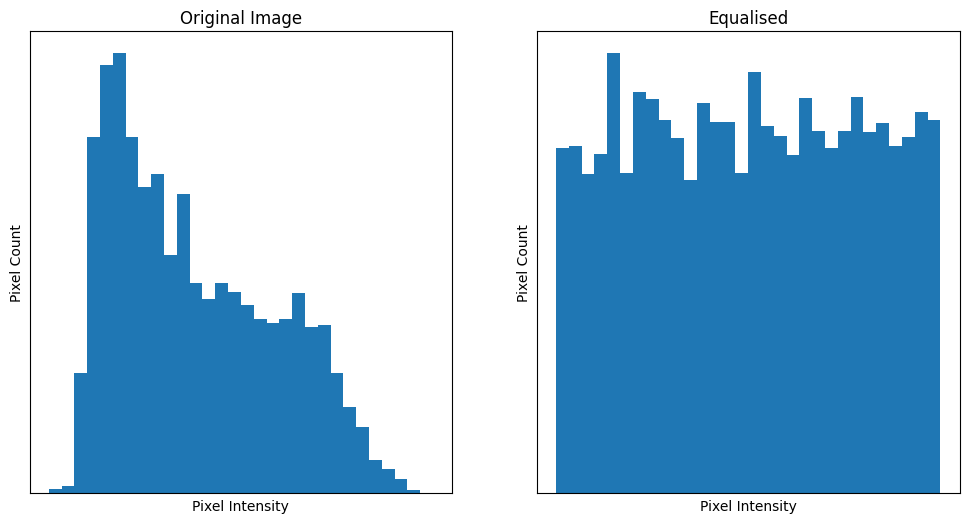

```{python}
# Library imports.
import numpy as np
import matplotlib.pyplot as plt
import scipy.ndimage as ndi
import skimage as ski
from mpl_toolkits.mplot3d import Axes3D

# Set 'gray' as the default colormap
plt.rcParams['image.cmap'] = 'gray'

# Set NumPy precision to 2 decimal places
np.set_printoptions(precision=2)

#  A custom function to quickly report image attributes.
from show_attributes import show_attributes
```

# Non-local filters

Whilst the median filter does not use convolution, it is still a local filter. Other filters use neither convolution nor a local pixel neighbourhood. These filters are called *non-local filters*. They have their name because they filter all of the pixels in an image based on characteristics of a specific region of the image, or based upon characteristics of the entire image. As a result, a non-local filter might modify a given pixel's value in accordance with a region of the image which is nowhere near its "local neighbourhood".

One foundational non-local filter is a [*histogram equalisation filter*](https://en.wikipedia.org/wiki/Histogram_equalization). This filter modifies pixels based on the histogram of the entire image. Essentially, this process "smoothes out" the histogram into a even "hill", so that there is less variance between the pixel intensities. The image below illustrates this principle:



We will demonstrate this filter with the `eagle` image from `ski.data`:

```{python}
# Load in the `eagle` image.
eagle = ski.data.eagle()
show_attributes(eagle)
plt.imshow(eagle);
```

As we know, we can use the `.ravel()` array method to flatten this 2D image to 1D, and then inspect a histogram of the pixel intensities:

```{python}
# Flatted to 1D.
one_D_eagle = eagle.ravel()

# Show a histogram.
plt.hist(eagle.ravel(), bins=128)
plt.xlabel('Pixel Intensity')
plt.ylabel('Pixel Count');
```

There are several steps in equalising the histogram:

-

-

-

-

For the X step, we need to normalize the *counts* of the histogram, such that they sum to 1. We can deconstruct the histogram into its [counts and bin intervals](4_threshold_filters) using `np.histogram()`. So each adjacent pair of values in `bin_intervals` tells us the start and end point of that bin, and `counts` contains the number of pixels falling within each bin. We also calculate the center of each bin e.g. the midpoint between the start and end points:

```{python}
# Centers and bin intervals, from the histogram of the flattened `eagle` image.
counts, bin_intervals = np.histogram(one_D_eagle,
                                     bins=256)

# Calculate the bin centers.
bin_centers = (bin_intervals[1:] + bin_intervals[:-1]) / 2

# Show the `counts` and `bin_centers`.
print(f"\nCounts:\n {counts}")
print(f"\nBin centers:\n {bin_centers}")
```

We can normalise the `counts` by dividing each individual count by the total number of pixels in the image. Note that we could also do this using the optional `density=True` argument to `np.histogram()`, but we do it manually to show what the actual operations involve:

```{python}
# Centers and bin intervals, from the histogram of the flattened `eagle` image.
n_pixels = len(one_D_eagle)
counts_normed = counts/n_pixels
plt.plot(bin_centers, counts_normed)
plt.xlabel('Pixel Intensity')
plt.ylabel('Pixel Probability');
```

```{python}
# Do the `counts` sum to 1?
print(f"\nCounts Normalized sum:\n {counts_normed.sum()}")
```

To equalise the histogram, meaning we want it to be roughly uniform across the pixel intensities, first we calculate the cumulative distribution (`cdf`) of the histogram. For each bin, the cumulative distribution adds up the number of pixels that are in that bin and in all of the lower bins (e.g. the bins closer to 0 on the $x$-axis). Essentially it is a running total of the `counts` as we move from left to right across the $x$-axis:

```{python}
# Get the cumulative distribution of the pixel intensities.
cdf = counts.cumsum() 

# Show a plot of the cumulative distribution.
plt.plot(bin_centers, cdf)
plt.xlabel('Pixel Intensity')
plt.ylabel('Cumulative Sum');
```

Because the `cdf` array contains a running count of the pixel intensities, cumulatively across the bins, the value at the final index location in `cdf` is the total number of pixels in the image. The cell below verifies this:

```{python}
cdf[-1] == n_pixels
```

We can normalise the running count by dividing by element in `cdf` by the total number of pixels (`n_pixels`). This expresses each count as a proportion of the total number of pixels:

```{python}
# Normalise `cdf`.
cdf = cdf / n_pixels 

plt.plot(bin_centers, cdf)
plt.xlabel('Pixel Intensity')
plt.ylabel('Cumulative Proportion');
```

The final value in `cdf` is now 1, indicating that the final bin and all of the lower bins together contain 100% of the pixels in the image:

```{python}
cdf[-1]
```

The next step requires some thought, to follow what is going on. We want to "map" the pixel values in the flattend `one_D_eagle` array to the values in the `cdf`. 

We can do this, for the current `eagle` image, by using the `one_D_eagle` pixel intensity values as *indexes* for the `cdf` array. This might seem like a hack, so lets break it down.


```{python}
cdf.shape
```

```{python}
one_D_eagle.max()
```

```{python}
# Equalise the histogram of `eagle`.
equalised_hist = cdf[one_D_eagle]
```

What this has done is replaced each original pixel intensity value with the corresponding value from the cumulative distribution (`cdf`). This has the effect of, well, equalising the histogram. The original histogram and the equalised histogram, along with the corresponding images, are shown below:

```{python}
# Reshape to 2D.
eagleback_to_2D = equalised_hist.reshape(eagle.shape)

# Generate the plot.
plt.figure(figsize=(12, 6))
plt.subplot(2, 2, 1)
plt.imshow(eagle)
plt.title('Original Image')
plt.subplot(2, 2, 2)
plt.title('Original Histogram')
plt.hist(eagle.ravel(), bins=128)
plt.subplot(2, 2, 3)
plt.imshow(eagleback_to_2D)
plt.title('Equalised Image')
plt.subplot(2, 2, 4)
plt.title('Equalised Histogram')
plt.hist(eagleback_to_2D.ravel(), bins=40);
```

Easy in `skimage`:

```{python}
eagle = ski.data.eagle()
eagle_equalized = ski.exposure.equalize_hist(eagle)

plt.figure(figsize=(10, 10))
plt.subplot(1, 2, 1)
plt.imshow(eagle)
plt.subplot(1, 2, 2)
plt.imshow(eagle_equalized);
```

```{python}
plt.figure(figsize=(14, 7))
plt.subplot(2, 2, 1)
plt.imshow(eagle)
plt.subplot(2, 2, 2)
plt.hist(eagle.ravel(), bins=128)
plt.subplot(2, 2, 3)
plt.imshow(eagle_equalized);
plt.subplot(2, 2, 4)
plt.hist(eagle_equalized.ravel(), bins=40)
plt.tight_layout();
```

# Summary

This page has showed how to use convolution kernels to filter images, using `numpy`, `scipy` and `skimage`.


# References

3.3.5 onward from: https://lectures.scientific-python.org/packages/scikit-image/index.html

Based on: https://scikit-image.org/skimage-tutorials/lectures/1_image_filters.html

Histogram equalisation adapted from: https://www.janeriksolem.net/histogram-equalization-with-python-and.html

Histogram equalisation: https://medium.com/jungletronics/histogram-equalization-34149fc299a6

Reference: https://www.kdnuggets.com/numpy-for-image-processing

Reference: https://setosa.io/ev/image-kernels

Reference: https://wiki.imindlabs.com.au/ds/aml/4_problem_domains/1-image-processing/3_edge_detectors

Reference: https://www.geeksforgeeks.org/deep-learning/types-of-convolution-kernels

Reference: skimage tutorials (check versions), scipy lecture notes

Reference: https://jni.github.io/i2k-skimage-napari/lectures/1_image_filters.html
